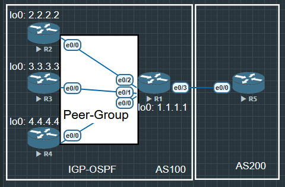

## BGP 对等体组

- 在BGP中, 很多邻居的更新策略相同(例如, 它们采用相同的过滤方法). 在Cisco IOS路由器上, 可将更新策略相同的邻居**划分到一个对等体组中, 以简化配置**
- 更重要的是提高更新的效率和改善性能, BGP路由器的对等体众多时, 强烈建议采用这种方法/

BGP动态对等体
- 可以使用BGP侦听指定网段的BGP连接请求并动态建立BGP对等体, 减少网络维护的工作量-主要用于IBGP


- BGP对等体组是一组采用相同更新策略的BGP邻居.
- 可以定义对等体组, 将策略应用于对等体组, 并将各个邻居加入到对等体组中, 而不用分别给每个邻居定义相同的策略.

与为每个邻居定义相同的策略相比, 使用对等体组的效率更高, 因为对于每个对等体, 更新只生成一次, 而不是为每个邻居路由器分别生成. 然而, 为对等体组的每个成员复制更新.



```
R1(config)#router bgp 100
R1(config-router)#bgp router-id 1.1.1.1
R1(config-router)#neighbor BGPGROUP peer-group
R1(config-router)#neighbor BGPGROUP remote-as 100
R1(config-router)#neighbor BGPGROUP update-source lo0
R1(config-router)#neighbor BGPGROUP next-hop-self
R1(config-router)#neighbor BGPGROUP password abc
R1(config-router)#neighbor BGPGROUP route-reflector-client //设置为路由反射客户端 RR
R1(config-router)#neighbor 2.2.2.2 peer-group BGPGROUP
R1(config-router)#neighbor 3.3.3.3 peer-group BGPGROUP
R1(config-router)#neighbor 4.4.4.4 peer-group BGPGROUP
R1(config-router)#neighbor 15.1.1.5 remote-as 200

R1(config-router)#neighbor 4.4.4.4 peer-group BGPGROUP // 可以预先扩展, 等以后这个路由器有了就能直接加入了
```

```
R2(config)#router bgp 100
R2(config-router)#bgp router-id 2.2.2.2
R2(config-router)#neighbor 1.1.1.1 remote-as 100
R2(config-router)#neighbor 1.1.1.1 update-source lo0
R2(config-router)#neighbor 1.1.1.1 password abc
// 其他路由器同理
```

如果不输入密码在R1上就会提示

```
*Sep  1 16:50:13.302: %TCP-6-BADAUTH: No MD5 digest from 2.2.2.2(179) to 1.1.1.1(41341) tableid - 0
```

在互相建立邻居要加入对等体组, 如果设置有密码必须要在对应的路由器上输入密码才能加入.

## BGP 动态邻居 Dynamic Neighbor

通过配置BGP动态对等体, 可以使BGP侦听指定网段的BGP连接请求并动态建立对等体, 减少网络维护的工作量

应用环境

- **在BGP网络中, 当多个对等体经常发生变动时(Hub&Spoke场景)**, 如果采用静态配置对等体的方式, 则需频繁地在本端进行增加或删除对等体的配置, 维护工作量很大.
- 此时可以配置BGP动态对等体功能, **使BGP侦听指定网段的BGP连接**请求并动态建立BGP对等体, **同时将这些对等体加入到同一个对等体组中**. 这样当对等体发生变动时, 无需在本端进行增加或删除BGP对等体的配置, 减少网络维护的工作量


```
R1(config-if)#router bgp 100
R1(config-router)#bgp router-id 1.1.1.1
R1(config-router)#neighbor BGPGROUP peer-group
R1(config-router)#neighbor BGPGROUP remote-as 100
R1(config-router)#neighbor BGPGROUP update-source lo0
R1(config-router)#neighbor BGPGROUP next-hop-self
R1(config-router)#neighbor BGPGROUP route-reflector-client
R1(config-router)#neighbor BGPGROUP password abc
// 配置BGP对等体

R1(config-router)#bgp listen range 0.0.0.0/0 peer-group BGPGROUP
//动态监听所有网段的BGP连接, 并使用对等体BGPGROUP的配置

R1(config-router)#bgp listen limit 1000
//R1侦听指定网段BGP连接请求可选项, 监听邻居最大10000, 默认0. 

```

其他路由器只需要正常与R1建立BGP邻居.

```
R2(config-if)#router bgp 100
R2(config-router)#bgp router-id 2.2.2.2
R2(config-router)#neighbor 1.1.1.1 remote-as 100
R2(config-router)#neighbor 1.1.1.1 update-source lo0
R2(config-router)#neighbor 1.1.1.1 password abc
```

这个时候R5是无法与R1建立正常邻居的, 因为R1设置了监听全网段0.0.0.0, 它默认这个网段中所有邻居都是 BGP 100的, 但是R5是BGP 200, 所以无法建立邻居, 需要R1重新设置监听网段避开R5.

需要现在R1上与R5建立邻居后, 再由R5建立与R1的邻居

```
R1(config)#router bgp 100
R1(config-router)#neighbor 15.1.1.5 remote-as 200

```

```
R5(config)#router bgp 200
R5(config-router)#neighbor 15.1.1.1 remote-as 100

```

在 show ip bgp summary 中

```
R1#show ip bgp su
BGP router identifier 1.1.1.1, local AS number 100
BGP table version is 1, main routing table version 1

Neighbor        V           AS MsgRcvd MsgSent   TblVer  InQ OutQ Up/Down  State/PfxRcd
*2.2.2.2        4          100      35      36        1    0    0 00:26:57        0
*3.3.3.3        4          100      25      23        1    0    0 00:19:01        0
*4.4.4.4        4          100      25      23        1    0    0 00:19:27        0
15.1.1.5        4          200       7       7        1    0    0 00:03:24        0
* Dynamically created based on a listen range command
Dynamically created neighbors: 3, Subnet ranges: 1

BGP peergroup BGPGROUP listen range group members:
  0.0.0.0/0

Total dynamically created neighbors: 3/(1000 max), Subnet ranges: 1

```

其他都一样 MsgRcvd/Msgsent 报文收发, TblVer 同步版本号, InQ/OutQ 输入输出是否有积压, Up/Down 持续时间, State/PfxRcd 路由

新的东西是有的邻居前面有"*", 这表示是通过BGP listen 动态创建的邻居, 都属于AS 100 这个iBGP.

R5没有*, 说明这是一个手工创建的静态邻居 AS 200 eBGP

Dynamically create neighbor 和 Subnet ranges 表明有多少个动态邻居和多少条监听范围(最大10000, 默认100)