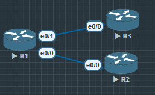

OSPF收敛速度较慢, 所以在链路故障时需要结合BFD更快完成收敛, 但是BGP比OSPF更慢, 所以BGP也需要和BFD进行结合

Bidirectional Forwarding Detection 双向转发检测



```
R1(config)#int e0/0
R1(config-if)#bfd interval 2000 min_rx 2000 multiplier 3
```

**interval 2000**, 本端发送BFD报文间隔时间2000毫秒, 2秒

**min_rx**, 本端希望从对端接收到最小报文间隔2000毫秒

**multiplier**, 容忍丢包次数3次, 也就是3个周期6秒内没收到BFD报文, 判定邻居Down

BFD是成对设置, 所以在对端接口也需要设置BFD

```
R2(config)#int e0/0
R2(config-if)#bfd interval 2000 min_rx 2000 multiplier 3
```

在端口上设置好BFD后, 并不能直接启用, 需要在各个协议中开启BFD功能.

```
//OSPF

R1(config)#router ospf 110
R1(config-router)#router-id 1.1.1.1
R1(config-router)#bfd ?
  all-interfaces  Enable BFD on all interfaces

R1(config-router)#bfd all-interfaces

//EIGRP

R1(config)#router eigrp 90
R1(config-router)#bf
R1(config-router)#bfd ?
  all-interfaces  Enable BFD on all interfaces
  interface       Enable BFD on specific interface

// rip

R1(config)#router rip
R1(config-router)#bfd ?
  all-interfaces  Enable BFD on all interfaces

```

在BGP中开启BFD

```
R1 上
R1(config)#router bgp 100
R1(config-router)#neighbor 12.1.1.2 remote-as 200
R1(config-router)#neighbor 12.1.1.2 fall-over ?
  bfd        Use BFD to detect failure
  route-map  Route map for peer route
  <cr>

R1(config-router)#neighbor 12.1.1.2 fall-over bfd

R2 上
R2(config)#router bgp 200
R2(config-router)#bg router-id 2.2.2.2
R2(config-router)#neighbor 12.1.1.1 remote-as 100
R2(config-router)#neighbor 12.1.1.1 fall-over ?
  bfd        Use BFD to detect failure
  route-map  Route map for peer route
  <cr>
R2(config-router)#neighbor 12.1.1.1 fall-over bfd
```

因为BGP需要手动建立邻居, 所以BFD功能需要单独挨个开启

## BFD验证

```
R1# show bfd ?
  drops      Display packets dropped 
  //显示被丢弃的 BFD 报文统计（比如报文格式错误、接口不匹配、邻居不存在等）。
    用于排查 BFD 建立失败或异常时的报文情况。

  map        BFD map entry DB
  //显示 BFD 与上层协议（BGP、OSPF、EIGRP 等）的映射关系。
    比如某个 BFD 会话被哪一个 BGP 邻居引用，哪个接口关联了 BFD。
    常用于确认某个邻居是否真的在使用 BFD。

  neighbors  BFD neighbors
  //最常用的命令。
    显示当前 BFD 会话邻居的详细状态：
        邻居 IP 地址
        本地/远端会话 ID
        状态（Up/Down/AdminDown/Init）
        定时器参数（Tx Interval、Rx Interval、Multiplier）
        检测时间（Detect Time）
    相当于 “BFD 的详细会话表”。
    
  summary    BFD summary
  //类似于 show ip bgp summary 那样的摘要版

R1# show bfd neighbors

IPv4 Sessions
NeighAddr                              LD/RD         RH/RS     State     Int
12.1.1.2                                1/1          Up        Up        Et0/0
```


PS 其他常见考点与技巧

```
router bgp 200
neighbor 12.1.1.1 route-map FILTER out
//针对邻居出方向调用路由策略FILTER进行过滤

正则表达式
ip as-path access-list 5 deny_200$
ip as-path access-list permit .*
//(针对AS-path的路由进行过滤), 拒绝始发于AS 200的BGP路由, 其他的AS-Path路由放行

router bgp 100
neighbor 12.1.1.2 filter-list 5 in
ip as-path access-list 4 permit _300$
//使用aspath访问控制列表匹配某个AS结尾的路由

route-map FILTER deny 10
    match as-path 4
route-map FILTER permit 20
//写路由策略, 匹配上AS-Path访问控制列表4的路由deny掉, 其余的路由放行

router bgp 100
neighbor 13.1.1.3 route-map FILTER in
//针对邻居调用路由策略

Local AS(FAKE AS)
//让BGP有两个AS号, 甚至更多, 是一种临时性的过渡解决方案, 常用于BGP的网络割接