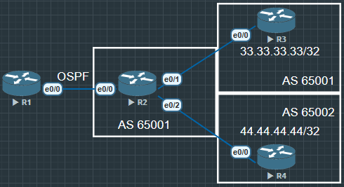

# BGP重分布到IGP

将BGP路由重发布到IGP时, **默认不重发布iBGP路由**, 只重发布EBGP路由, **需要使用 "bgp redistribute-internal" 来让iBGP路由顺利被重发布**.

注意, 在MPLS VPN环境中的PE没有这个限制



R3与R4把环回路由宣告进BGP, 查看R2的路由表, 路由学习正常, 一个是IBGP路由, 另一个是EBGP路由

```
R2#show ip bgp
BGP table version is 3, local router ID is 2.2.2.2
Status codes: s suppressed, d damped, h history, * valid, > best, i - internal,
              r RIB-failure, S Stale, m multipath, b backup-path, f RT-Filter,
              x best-external, a additional-path, c RIB-compressed,
              t secondary path,
Origin codes: i - IGP, e - EGP, ? - incomplete
RPKI validation codes: V valid, I invalid, N Not found

     Network          Next Hop            Metric LocPrf Weight Path
 *>i  33.33.33.33/32   3.3.3.3                  0    100      0 i
 *>   44.44.44.44/32   24.1.1.4                 0             0 65002 i
```

在OSPF中重分布BGP的路由

```
R2(config)#router ospf 110
R2(config-router)#redistribute bgp 65001 subnets
```

在R1中查看OSPF的路由可以看到 R2传递过来的路由只会有EBGP 44.44.44.44, 不会有iBGP的 33.33.33.33

```
R1#show ip route ospf
......
      2.0.0.0/32 is subnetted, 1 subnets
O        2.2.2.2 [110/11] via 12.1.1.2, 01:12:13, Ethernet0/0
      44.0.0.0/32 is subnetted, 1 subnets
O E2     44.44.44.44 [110/1] via 12.1.1.2, 00:00:24, Ethernet0/0
```

如果需要在OSPF中重分布BGP中的IBGP路由, 需要在BGP中设置一条命令让其他协议能重分布iBGP路由"bgp redistribute-internal"

```
R2(config)#router bgp 65001
R2(config-router)#bgp redistribute-internal
```

现在可以看到R1已经学习到R2 BGP 65001 中的iBGP路由了

```
R1#show ip route ospf
......
      2.0.0.0/32 is subnetted, 1 subnets
O        2.2.2.2 [110/11] via 12.1.1.2, 01:21:06, Ethernet0/0
      33.0.0.0/32 is subnetted, 1 subnets
O E2     33.33.33.33 [110/1] via 12.1.1.2, 00:01:31, Ethernet0/0
      44.0.0.0/32 is subnetted, 1 subnets
O E2     44.44.44.44 [110/1] via 12.1.1.2, 00:02:07, Ethernet0/0
```

# IGP重分布到BGP

将IGP重分布进BGP时则没有太多注意事项, **唯一需要注意的时OSPF协议, 默认情况下, 只会将OSPF中区域内O以及区域间O IA的路由重新发布进BGP**.

如果要重分布OSPF的**OE1/2外部路由**, 则重分布时**需要增加关键字, match external 1 external 2**


在R1上增加一条OE2和一条O的OSPF路由

```
R1(config)#int lo1
R1(config-if)#ip address 192.168.1.1 255.255.255.255
R1(config-if)#ip o 110 a 0

R1(config)#ip route 100.100.100.0 255.255.255.0 null 0
// null0 表示下一跳直接丢掉
R1(config)#router ospf 110
R1(config-router)#redistribute static subnets
```

```
R2(config)#router bgp 65001
R2(config-router)#redistribute ospf 110
```

在R4上可以看到, BGP没有OSPF 110中之前加入的OE路由 "100.100.100.0"

```
R4#show ip bgp
......
     Network          Next Hop            Metric LocPrf Weight Path
 *>   1.1.1.1/32       24.1.1.2                11             0 65001 ?
 *>   2.2.2.2/32       24.1.1.2                 0             0 65001 ?
 *>   3.3.3.3/32       24.1.1.2                11             0 65001 ?
 *>   12.1.1.0/24      24.1.1.2                 0             0 65001 ?
 *>   23.1.1.0/24      24.1.1.2                 0             0 65001 ?
 *>   33.33.33.33/32   24.1.1.2                               0 65001 i
 *>   44.44.44.44/32   0.0.0.0                  0         32768 i
 *>   192.168.1.1/32   24.1.1.2                11             0 65001 ?
```

------------------------------------------------------------------------------

```
R2(config)#router bgp 65001
R2(config-router)#redistribute ospf 110 match external 1 external 2
```

只重分布OSPF的外部路由 E1, E2 进BGP

```
R4#show ip bgp
......

     Network          Next Hop            Metric LocPrf Weight Path
 *>   33.33.33.33/32   24.1.1.2                               0 65001 i
 *>   44.44.44.44/32   0.0.0.0                  0         32768 i
 *>   100.100.100.0/24 24.1.1.2                20             0 65001 ?
```

------------------------------------------------------------------------------

```
R2(config)#router bgp 65001
R2(config-router)#redistribute ospf 110 match internal external 1
```

只重分布OSPF内部路由和E1进BGP

```
R4#show ip bgp
......
     Network          Next Hop            Metric LocPrf Weight Path
 *>   1.1.1.1/32       24.1.1.2                11             0 65001 ?
 *>   2.2.2.2/32       24.1.1.2                 0             0 65001 ?
 *>   3.3.3.3/32       24.1.1.2                11             0 65001 ?
 *>   12.1.1.0/24      24.1.1.2                 0             0 65001 ?
 *>   23.1.1.0/24      24.1.1.2                 0             0 65001 ?
 *>   33.33.33.33/32   24.1.1.2                               0 65001 i
 *>   44.44.44.44/32   0.0.0.0                  0         32768 i
 *>   192.168.1.1/32   24.1.1.2                11             0 65001 ?
```

------------------------------------------------------------------------------

```
R2(config)#router bgp 65001
R2(config-router)#redistribute ospf 110 match nssa-external 1 nssa-external 2
```

只重分布 OSPF NSSA路由进BGP

```
R4#show ip bgp
......
     Network          Next Hop            Metric LocPrf Weight Path
 *>   1.1.1.1/32       24.1.1.2                11             0 65001 ?
 *>   2.2.2.2/32       24.1.1.2                 0             0 65001 ?
 *>   3.3.3.3/32       24.1.1.2                11             0 65001 ?
 *>   12.1.1.0/24      24.1.1.2                 0             0 65001 ?
 *>   23.1.1.0/24      24.1.1.2                 0             0 65001 ?
 *>   33.33.33.33/32   24.1.1.2                               0 65001 i
 *>   44.44.44.44/32   0.0.0.0                  0         32768 i
 *>   192.168.1.1/32   24.1.1.2                11             0 65001 ?
```

当从EBGP重分布进OSPF时, OSPF external LSA的tag字段会及继承外部BGP的AS号

