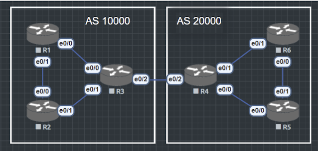

BGP（Border Gatway Protocol）是一种外部网关协议（External Gatway Protocol），由此可以知道网关协议可以分为外部网关协议（EGP）和内部网关协议（Internal Gatway Protocol），熟知的内部网关协议（IGP）有OSPF，EIGRP。

## 为什么要有BGP

OSPF，EIGRP等IGP路由协议在组织机构网络内部广泛应用，随着网络规模的扩大网络中路由数量的增长，IGB没办法管理大规模的网络，所以诞生了Autonomous System(AS)自治系统。

**AS指的是在同一个组织管理下，使用统一路由策略的设备集合。**

不同的AS域通过不同的AS号(AS_Path)区分。AS号分为16 bit和32 bit两种，IANA负责分发AS号。

在不同AS域之间就要使用EGP来通信，BGP就是如今使用的最多的EGP协议。

相较传统的IGP协议：
1. GP基于TCP179，只要能够建立TCP连接即可建立BGP；
2. 传统 IGP-OSPF、EIGRP-使用 IP 直接封装报文，通常需要自己处理可靠性，如 OSPF 需要 LS Acknowledgment）。
3. BGP 使用 TCP 端口 179 作为传输层协议，只要 TCP 连接成功，BGP 就可以稳定地建立邻居关系，不需要额外的报文确认机制。）

可以把BGP理解为一个Application：

- BGP 不生成任何路由，只搬运路由信息，相当于一个路由信息的“快递员”。
- IGP（OSPF/ISIS） 会通过算法计算最优路径并生成路由。
- BGP 自己不会去发现新网络，而是依靠管理员手动配置或从其他 BGP 邻居学习到的路由信息进行传递。

可以把 BGP 理解为一个基于 TCP 的应用，类似于 HTTP 服务器传递网页，它只关心“哪些路由存在”，不关心怎么计算路径. 只传递路由信息，不会暴露AS内的拓扑信息；

在 OSPF/IS-IS 这些 IGP 协议中，每个路由器都会知道整个网络的拓扑结构，并使用 SPF/Dijkstra 算法计算最优路径。

BGP 只传递可达性信息，它不会公布 AS 内部的详细拓扑，外部 AS 只知道某个前缀可以从某个 AS 进入，而不会知道 AS 内部的链路细节。

示例：
- OSPF：如果你有 3 台路由器 R1、R2、R3 互联，OSPF 的所有设备都会知道彼此的连通情况。
- BGP：AS 100 只会告诉 AS 200 “我可以访问 192.168.1.0/24”，但不会告诉AS 200 这段网络内部的拓扑情况。

触发式更新，而不是周期性更新

IGP（如 OSPF、RIP）通常需要定期发送路由更新

RIP 每 30 秒发送一次更新（即使网络没变化）。

OSPF/IS-IS 需要定期刷新 LSA/LSP 信息。

BGP 只在路由变化时触发更新，不会周期性地发送完整路由表：
1. 如果网络没有变化，BGP 设备之间只会发送 Keepalive 消息（默认 60 秒）。
2. 如果某个路由消失，BGP 只会通知受影响的邻居，而不是重新发送所有路由。
3. BGP 不计算路径，只靠策略选路

OSPF、IS-IS 依赖 SPF/Dijkstra 算法来计算最短路径。

BGP 不计算最短路径，而是使用策略（Path Selection）选择最佳路径：

例如基于 AS-PATH、Local Preference、MED、Community 等属性来决定使用哪条路径。   

- 举个例子：
    1. OSPF 选择路径 = 计算最短路径（链路代价最低）。
    2. BGP 选择路径 = 看哪条路径的 AS-PATH 更短，或者哪条路径的 Local Preference 更高。
    3. AS之间需要直接链路，或通过VPN协议构造逻辑直连（GRE Tunnel）进行邻居建立。
    4. AS之间可能是不同的机构、公司，相互间无法完全信任，使用IGP可能存在暴露AS内部的网络信息。
    5. 整个网络扩大，路由器数量庞大，路由表规模太大，路由收敛变慢，设备性能销号太大。
    6. 为此在AS之间使用BGP进行路由传递。

IANA（Internet Assigned Number Authority 因特网地址分配组织）IAB（Internet Architecture Board 因特网体系委员会）的下设组织。IANA授权NIC（Network information Center 网络信息中心）和其他组织负责IP地址和域名分配，同时IANA负责维护TCP/IP协议族所采用的协议标识符数据库，包括AS自治系统号。

长度16 bit的AS表示为 1-65535，其中64512-65535为私有AS号，0不可使用

长度 32 bit的AS表示为 1-4294967294，其中 4200000000-4294967294为私有AS，0不可用。

AS号 1 – 65535 = 2^16，0不能用

64512 – 65535为私网AS号，一共1024个

一般用不到32bit的AS号，用16bit的AS