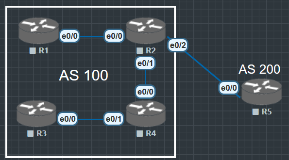

# BGP路由表

```
R2#show ip bgp
BGP table version is 3, local router ID is 2.2.2.2
Status codes: s suppressed, d damped, h history, * valid, > best, i - internal,
              r RIB-failure, S Stale, m multipath, b backup-path, f RT-Filter,
              x best-external, a additional-path, c RIB-compressed,
              t secondary path,
Origin codes: i - IGP, e - EGP, ? - incomplete
RPKI validation codes: V valid, I invalid, N Not found

     Network          Next Hop            Metric LocPrf Weight Path
 *>i  11.11.11.11/32   1.1.1.1                  0    100      0 i
 *>   22.22.22.22/32   0.0.0.0                  0         32768 i
R2#
```
看到BGP table version is 3, BGP 路由表中路由更新的“内部版本号”，也就是说，这是 BGP 自己维护的“路由表变动次数”。

- network 路由的目的网络地址以及网络掩码
- nextHop 下一跳地址
- 如果存在同个目的地多条路由, 则路由都将进行罗列, 但是每个目的地只有会有一条优选路由

`show ip bgp ipv4-address {mask | mask-length}`

查看BGP路由详细的详细展示

```
R1#show ip bgp 22.22.22.22 255.255.255.255
BGP routing table entry for 22.22.22.22/32, version 3
Paths: (1 available, best #1, table default)
  Not advertised to any peer
  Refresh Epoch 1
  Local
    2.2.2.2 from 2.2.2.2 (2.2.2.2)
      Origin IGP, metric 0, localpref 100, valid, internal, best
      rx pathid: 0, tx pathid: 0x0
R1#show ip bgp 22.22.22.22 255.255.255.255 | ?
  append    Append redirected output to URL (URLs supporting append operation
            only)
  begin     Begin with the line that matches
  count     Count number of lines which match regexp
  exclude   Exclude lines that match
  format    Format the output using the specified spec file
  include   Include lines that match
  redirect  Redirect output to URL
  section   Filter a section of output
  tee       Copy output to URL

R1#show ip bgp 22.22.22.22 255.255.255.255 |
```

- '*' 可用的路由(不一定最优) 
- 's' 被一致的路由条目, 例如总了路由汇总, 抑制了明细
- 'd' 被惩罚(dampening)的路由, 路由收到了惩罚, 虽然该路由当前可能正常, 但是在惩罚结束前不会被通告
- 'H' 被惩罚(dampening)的路由, 路由可能出现了故障(down), 有历史信息, 但没有最佳路由
- 'r' 路由没有被装在RIB表中, 例如由于AD值等原因导致
- 'S' stale 过期路由
- '>' BGP计算出的最优路由
- ' '/'i' 为空表示路由从EBGP另据获取, 为i表示从IBGP学习到
*IBGP的AD为200, EBGP的Ad为20*

```
R1#show ip route bgp
Codes: L - local, C - connected, S - static, R - RIP, M - mobile, B - BGP
       D - EIGRP, EX - EIGRP external, O - OSPF, IA - OSPF inter area
       N1 - OSPF NSSA external type 1, N2 - OSPF NSSA external type 2
       E1 - OSPF external type 1, E2 - OSPF external type 2
       i - IS-IS, su - IS-IS summary, L1 - IS-IS level-1, L2 - IS-IS level-2
       ia - IS-IS inter area, * - candidate default, U - per-user static route
       o - ODR, P - periodic downloaded static route, H - NHRP, l - LISP
       a - application route
       + - replicated route, % - next hop override, p - overrides from PfR

Gateway of last resort is not set

      22.0.0.0/32 is subnetted, 1 subnets
B        22.22.22.22 [200/0] via 2.2.2.2, 00:13:03
```

与OSPF, EIGRP等协议不同, BGP的会话时基于TCP建立的. 建立BGP对等体关系的两台路由器并不要求直连.(默认是需要直连, 需要手工修改mulithdp)


BGP存在两种对等体关系: EBGP 和 IBGP

1. EBGP(External BGP), 位于不同自治系统的BGP路由器之间的BGP对等体关系. 两台路由器之间需要建立EBGP对等体关系, 必须满足两个条件
  - 两个路由器所属AS不同(不同AS号)
  - 在配置EBGP时, Peer命令所指定的对等体IP地址要求路由可达, 并且TCP连接能够正确建立

2. IBGP(Internal BGP), 位于相同自治系统的BGP路由器之间的BGP邻接关系
  - IBGP的AD管理距离为200, 对于域内会优先使用IGP协议选路
  - EBGP的AD管理距离为20, 对于域间则会优先选择BGP协议选路

所以从AD来看, BGP是一种专门用于各个域间的路由协议

# BGP路由的生成

不同于IGP路由协议, BGP自身并不会发现并计算产生路由, BGP将IGP路由表中的路由注入到BGP路由表中, 并通过update报文传递给BGP对等体.

BGP注入路由的方式又两种
1. network
2. Redistribute

与IGP协议相同, BGP支持根据已有的路由条目进行聚合, 生成聚合路由.

**BGP不生产路由, 只做路由的搬运工. 但是如果一个AS中有10000条路由, 要搬运多久?**

## Network 注入路由



通过Network方式注入路由
1. AS100内的BGP路由器已经通过IGP协议OSPF学习到了两条路由 '10.1.0.0/24' 和 '10.2.0.0/24', 在BGP进程内通过**network**命令注入这两条路由, 这两条路由将会出现在本地的BGP路由表中.

注意: Network方式注入的路由表**必须是已经存在于IP路由表中的路由条目**, 否则不会被成功注入到BGP路由表中.

## Redistribute 方式注入路由

Network 方式注入路由虽然是精确注入, 但是只能一条条配置逐条注入到IP路由表中的路由, 如果注入的条目很多配置命令将会非常复杂, 为此可以使用Redistribute方式,
1. 直连路由
2. 静态路由
3. OSPF路由
4. EIGRP路由

等协议的路由注入到BGP路由表中

```
R2(config)#router bgp 100
R2(config-router)#redistribute ospf 110
```

使用重分布将OSPF的路由分布进BGP

```
R5#show ip bgp
BGP table version is 16, local router ID is 5.5.5.5
Status codes: s suppressed, d damped, h history, * valid, > best, i - internal,
              r RIB-failure, S Stale, m multipath, b backup-path, f RT-Filter,
              x best-external, a additional-path, c RIB-compressed,
              t secondary path,
Origin codes: i - IGP, e - EGP, ? - incomplete
RPKI validation codes: V valid, I invalid, N Not found

     Network          Next Hop            Metric LocPrf Weight Path
 *>   1.1.1.1/32       25.1.1.2                11             0 100 ?
 *>   2.2.2.2/32       25.1.1.2                 0             0 100 ?
 *>   3.3.3.3/32       25.1.1.2                21             0 100 ?
 *>   4.4.4.4/32       25.1.1.2                11             0 100 ?
 *>   11.11.11.11/32   25.1.1.2                11             0 100 ?
 *>   12.1.1.0/24      25.1.1.2                 0             0 100 ?
 *>   22.22.22.22/32   25.1.1.2                 0             0 100 ?
 *>   24.1.1.0/24      25.1.1.2                 0             0 100 ?
 *>   33.33.33.33/32   25.1.1.2                21             0 100 ?
 *>   34.1.1.0/24      25.1.1.2                20             0 100 ?
 *>   44.44.44.44/32   25.1.1.2                11             0 100 ?
 *>   192.168.1.1/32   25.1.1.2                11             0 100 ?
 *>   192.168.1.2/32   25.1.1.2                11             0 100 ?
 *>   192.168.1.10/32  25.1.1.2                11             0 100 ?
 *>   192.168.1.11/32  25.1.1.2                11             0 100 ?
```

## BGP聚合路由(summary汇总)

可以看到BGP不会自动汇总路由, 需要使用命令'aggregate-address 192.168.1.0 255.255.255.0 summary-only'来手动汇总路由

```
R5(config)#router bgp 200
R5(config-router)#aggregate-address 192.168.1.0 255.255.255.0 summary-only

R5#show ip bgp
BGP table version is 21, local router ID is 5.5.5.5
Status codes: s suppressed, d damped, h history, * valid, > best, i - internal,
              r RIB-failure, S Stale, m multipath, b backup-path, f RT-Filter,
              x best-external, a additional-path, c RIB-compressed,
              t secondary path,
Origin codes: i - IGP, e - EGP, ? - incomplete
RPKI validation codes: V valid, I invalid, N Not found

     Network          Next Hop            Metric LocPrf Weight Path
 *>   1.1.1.1/32       25.1.1.2                11             0 100 ?
 *>   2.2.2.2/32       25.1.1.2                 0             0 100 ?
 *>   3.3.3.3/32       25.1.1.2                21             0 100 ?
 *>   4.4.4.4/32       25.1.1.2                11             0 100 ?
 *>   11.11.11.11/32   25.1.1.2                11             0 100 ?
 *>   12.1.1.0/24      25.1.1.2                 0             0 100 ?
 *>   22.22.22.22/32   25.1.1.2                 0             0 100 ?
 *>   24.1.1.0/24      25.1.1.2                 0             0 100 ?
 *>   33.33.33.33/32   25.1.1.2                21             0 100 ?
 *>   34.1.1.0/24      25.1.1.2                20             0 100 ?
 *>   44.44.44.44/32   25.1.1.2                11             0 100 ?
 *>   192.168.1.0      0.0.0.0                            32768 i
 s>   192.168.1.1/32   25.1.1.2                11             0 100 ?
 s>   192.168.1.2/32   25.1.1.2                11             0 100 ?
 s>   192.168.1.10/32  25.1.1.2                11             0 100 ?
 s>   192.168.1.11/32  25.1.1.2                11             0 100 ?
```

可以看到BGP虽然汇总了路由, 但是还是会显示明细路由, 在明细路由前有个小写的's', 表示被压制.

与众多IGP协议相同, BGP同样支持路由的手工聚合, 在BGP配置视图中使用*aggregate-address*命令可以执行BGP路由手工聚合, 在BGP已经学习到相应明细路由情况下, 设备会向BGP注入指定的聚合路由.