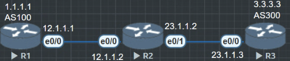

# BGP对等提关系
与OSPF、EIGRP等协议不同，BGP的会话是基于TCP建立的，建立BGP对等体系关系的的两台路由器并不要求必须直连。

BGP存在两种对等体系类型：EBGP和IBGP：
- EBGP（External BGP）：位于不同自制体系的BGP路由器之间的BGP的对等体关系。两台	路由器之间要建立EBGP对等体关系，必须满足两个要求：
1. 两个路由器所属AS不同（即AS号不同）
2. 配置EBGP时，Peer命令所指定的对等体IP地址要求路由可达，并且TCP直连能够正确建立.

- IBGP （Internal BGP）：位于相同自治系统的BGP之间的BGP邻居关系。

简单说如果两个AS号不同就是EBGP，相同就是IBGP。只要路由可达就意味着TCP179可以连接就能跨设备建立邻居，但是通过默认路由是不行的。

BGP虽然能跨设备建立邻居关系,但是默认严格执行TTL, 如果没有手工指定默认必须直连(一跳)才能成功建立邻居.
```
R1(config)#ip route 3.3.3.3 255.255.255.255 12.1.1.2
// 不建议写默认路由, 最好使用静态路由, 不然到时候建不起邻居, 但是又ping的通, 查错查的脑壳疼. debug ip tcp transactions, debug ip bgp
R1(config-router)#bgp router-id 1.1.1.1
R1(config-router)#neighbor 3.3.3.3 remote-as 300
R1(config-router)#neighbor 3.3.3.3 update-source lo0
```

```
R3(config)#ip route 1.1.1.1 255.255.255.255 23.1.1.2
R3(config)#router bgp 300
R3(config-router)#bgp router-id 3.3.3.3
R3(config-router)#neighbor 1.1.1.1 remote-as 100
R3(config-router)#neighbor 1.1.1.1 update-source lo0
```
现在把环境搭建好以后R1和R3是可以互通的, 但是bgp的邻居关系虽然已经制定了, 但是依旧是建立不起来的, 因为BGP默认严格执行TTL, 默认需要直连才能建立邻居.

```
R1#ping 3.3.3.3
Type escape sequence to abort.
Sending 5, 100-byte ICMP Echos to 3.3.3.3, timeout is 2 seconds:
!!!!!
Success rate is 100 percent (5/5), round-trip min/avg/max = 1/1/1 ms

R3#show ip bgp summary
BGP router identifier 3.3.3.3, local AS number 300
BGP table version is 1, main routing table version 1

Neighbor        V           AS MsgRcvd MsgSent   TblVer  InQ OutQ Up/Down  State/PfxRcd
1.1.1.1         4          100       0       0        1    0    0 never    Idle
```
在R1和R3的BGP里, 手工指定允许接受最大两跳的邻居.
```
R1(config-router)#neighbor 3.3.3.3 ebgp-multihop 2
R3(config-router)#neighbor 1.1.1.1 ebgp-multihop 2
```

有时候建立连接会比较慢
这种时候可以软重置一下bgp或者检查一下tcp 179的连接
```
R1#clear ip bgp * soft

R3#telnet 1.1.1.1 179 /source-interface loopback 0
```
现在BGP的邻居已经成功建立了.
```
R1#show ip bgp summary
BGP router identifier 1.1.1.1, local AS number 100
BGP table version is 1, main routing table version 1

Neighbor        V           AS MsgRcvd MsgSent   TblVer  InQ OutQ Up/Down  State/PfxRcd
3.3.3.3         4          300      19      19        1    0    0 00:14:58        0
```

### 关于使用环回接口作为BGP邻居

在普通EBGP的环境中, 是不建议使用环回接口作为邻居的, 但是:
1. 跨多跳的 EBGP 链路（有多个中间设备转发）
2. 使用 VPN、GRE Tunnel、MPLS 等逻辑隧道通信
3. 双链路冗余结构（防止单条物理链断开即邻居掉线）
4. 作为实验练习或者对等结构清晰可控

这些时候建议使用环回接口建立邻居.在普通场景下，EBGP 建议使用物理接口地址建立邻居（更简单、更直观）；
只有在多跳、逻辑隧道或特定设计需求下，才使用环回接口建 EBGP 邻居，并需要额外配置。

在IBGP里就没有EBGP这么麻烦只要AS号相同就可以直接建立邻居，但是不能直接跨设备建立邻居。建立IBGP邻居尽量使用环回接口，因为环回接口稳定

TCP更新源地址
缺省情况下，BGP使用报文出接口作为TCP连接的本地接口。
在部署IBGP对等体关系时，建议使用Loopback地址作为更新源地址。Loopback接口非常稳定，而且可以借助AS内的IBGP和冗余拓扑来保证可靠性。
如果更新源地址错误，将影响IBGP的邻居关系建立。
在部署EBGP对等体关系时，通常使用直连接口的ip地址作为源地址，如果使用Loopback接口建立EBGP对等体关系，则应注意更新源地址和EBGP多跳问题。
需要注意，用于建立BGP对等体的源地址，不可以再network宣告进BGP。否则会带来BGP邻居关系的震荡（华为则直接不传递）
bgp用环回接口建立邻居关系的额外规则
1. 静态路由
2. ip源头
3. 设置多跳数 不然默认255


# EBGP 建邻方式对比：物理接口 vs 环回接口

## 🧭 概述

在 BGP 中，EBGP 邻居通常默认要求直连（TTL=1）。虽然默认使用物理接口地址建邻，但也可以通过配置支持使用环回接口作为邻居地址。

---

## 🔄 建邻方式对比

| 项目 | 使用物理接口建立邻居 | 使用环回接口建立邻居 |
|------|-----------------------|-----------------------|
| 邻居地址 | 对端物理接口 IP（如 12.1.1.2） | 对端 Loopback 地址（如 3.3.3.3） |
| 是否直连 | 是，TTL=1 默认有效 | 否，必须配置多跳 |
| 必须命令 | 无 | `ebgp-multihop` + `update-source` |
| 路由要求 | 默认路由或直连即可 | 必须能访问对方 Loopback |
| TTL 要求 | 默认 TTL=1，自动满足 | 需手动放宽 TTL（如 ebgp-multihop 2） |
| 接口 flap 影响 | 物理接口断开即邻居 down | loopback 不受物理接口 flap 影响，邻居稳定 |
| 应用场景 | 简单拓扑、直连网络 | 多跳路径、运营商部署、冗余设计 |
| 管理复杂度 | 简单 | 略复杂，需更多配置 |

---

## ✅ 示例配置对比

### ▶ 使用物理接口建立 EBGP 邻居

#### R1（AS 100）

```cisco
router bgp 100
 bgp router-id 1.1.1.1
 neighbor 12.1.1.2 remote-as 300