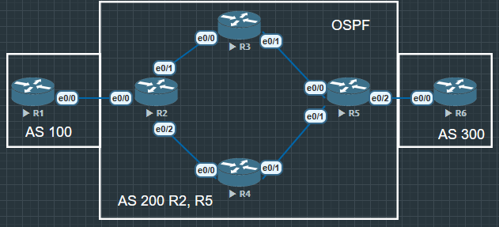
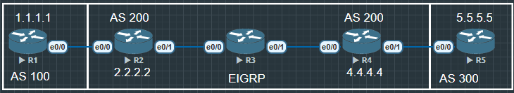
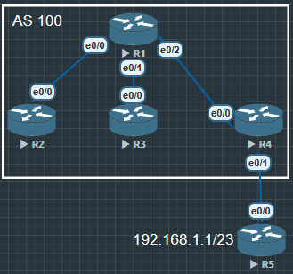
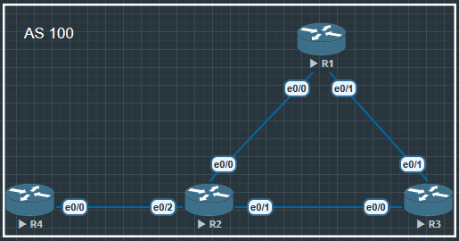
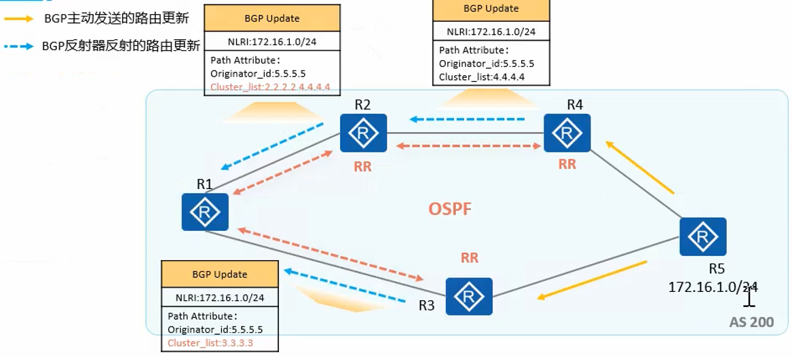
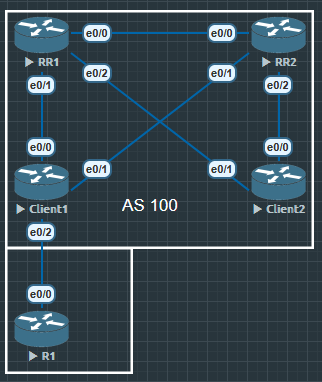
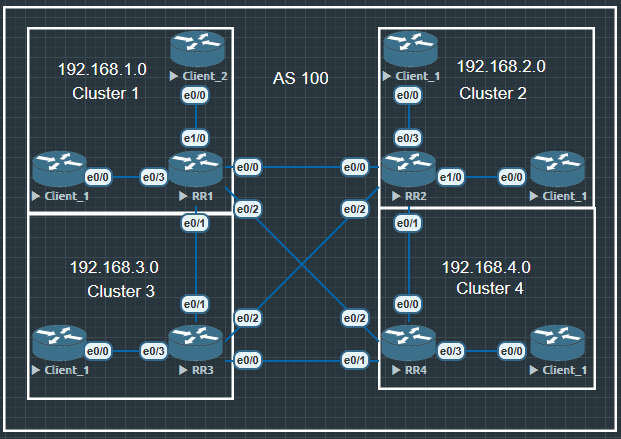
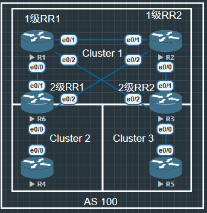
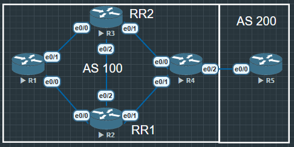

# BGP transfer



- 因为BGP基于TCP 179可以跨设备建立邻居
- 所以在AS内跨设备建立IBGP邻居后, 转发层面由于**路由迭代**问题, 依然会经过非BGP路由器转发
- 虽然控制层面BGP路由传递正常, 但是转发层面数据被丢弃, 这种现象被称为**BGP路由黑洞**(BGP Black Hole Routing)

BGP 黑洞（Black Hole）路由是一种利用 BGP 协议实现的“有目的丢弃流量”的机制。
它允许运营商或企业通过 BGP 将特定目的地址通告出去，并让网络设备静默丢弃发往这些地址的流量。

简而言之：

BGP 黑洞 = 宣布一条可达的路由，但故意把流量丢弃掉，不返回错误，也不响应。

🎯 为什么要用 BGP 黑洞？
主要应用于 DoS / DDoS 攻击缓解，例如：

某个 IP 正在被攻击(如 192.0.2.1), 你不希望攻击流量占满链路,于是通过 BGP 把这段 IP 通告出去并标记为“黑洞”. 所有邻居、边缘路由器都直接丢弃发往该地址的流量

保护骨干链路、核心路由器不受高压攻击流量影响

🛠️ BGP 黑洞的常见实现方式：
1. 标记特定 community 来触发黑洞
2. 路由到 Null0（静默丢弃）



R1, R2, R4, R5 都是BGP spearker, R2, R3, R4又在EIGRP90中, 虽然BGP可以跨路由建立设别, 但是R3没有路由到达R1和R5不能到达彼此, 这就是BGP的路由黑洞

```
R2#show ip bgp
BGP table version is 4, local router ID is 2.2.2.2
Status codes: s suppressed, d damped, h history, * valid, > best, i - internal,
              r RIB-failure, S Stale, m multipath, b backup-path, f RT-Filter,
              x best-external, a additional-path, c RIB-compressed,
              t secondary path,
Origin codes: i - IGP, e - EGP, ? - incomplete
RPKI validation codes: V valid, I invalid, N Not found

     Network          Next Hop            Metric LocPrf Weight Path
 *>   1.1.1.1/32       12.1.1.1                 0             0 100 i
 * i  5.5.5.5/32       45.1.1.5                 0    100      0 300 i
```

```
R4#show ip bgp
BGP table version is 2, local router ID is 4.4.4.4
Status codes: s suppressed, d damped, h history, * valid, > best, i - internal,
              r RIB-failure, S Stale, m multipath, b backup-path, f RT-Filter,
              x best-external, a additional-path, c RIB-compressed,
              t secondary path,
Origin codes: i - IGP, e - EGP, ? - incomplete
RPKI validation codes: V valid, I invalid, N Not found

     Network          Next Hop            Metric LocPrf Weight Path
 * i  1.1.1.1/32       12.1.1.1                 0    100      0 100 i
 *>   5.5.5.5/32       45.1.1.5                 0             0 300 i
```

## BGP跨设备传递路由

IBGP无法直接跨设备传递路由, 但是EBGP可以跨设备传递路由, EBGP可以跨设备直接传递路由, 没有Split Horizon限制.

默认情况下, EBGP需要直连
- EBGP报文中**默认TTL=1**, 所以EBGP邻居通常需要直连.
- 如果EBGP邻居不是直连的, 需要使用**EBGP-Multihop命令**, 否则TCP握手无法完成, BGP无法建立.


这个拓扑图中解决路由无法传递,解决有两种办法
1. R2, R3, R4, 建立BGP邻居
2. 通过标签转发路由 (**???**)

### 小插曲 next hop self 


在这个拓扑里, 如果R2的e0/0和R4的e0/1没有在OSPF中,那么R3有1.1.1.1 和 5.5.5.5 的路由但是不会优选

```
R3#show ip bgp
BGP table version is 7, local router ID is 3.3.3.3
Status codes: s suppressed, d damped, h history, * valid, > best, i - internal,
              r RIB-failure, S Stale, m multipath, b backup-path, f RT-Filter,
              x best-external, a additional-path, c RIB-compressed,
              t secondary path,
Origin codes: i - IGP, e - EGP, ? - incomplete
RPKI validation codes: V valid, I invalid, N Not found

     Network          Next Hop            Metric LocPrf Weight Path
 * i  1.1.1.1/32       12.1.1.1                 0    100      0 100 i
 * i  5.5.5.5/32       45.1.1.5                 0    100      0 200 i
```

因为R2的e0/0和R4的e0/1并没有在BGP中, 这时候R3要优选这条路由就需要在R2和R4上使用命令 next hop self 让R2知道 下一跳就是自己.

```
R2(config)#router bgp 300
R2(config-router)#neighbor 3.3.3.3 next-hop-self
```

```
R4(config)#router bgp 300
R4(config-router)#neighbor 3.3.3.3 next-hop-self
```

```
R3#show ip bgp
BGP table version is 9, local router ID is 3.3.3.3
Status codes: s suppressed, d damped, h history, * valid, > best, i - internal,
              r RIB-failure, S Stale, m multipath, b backup-path, f RT-Filter,
              x best-external, a additional-path, c RIB-compressed,
              t secondary path,
Origin codes: i - IGP, e - EGP, ? - incomplete
RPKI validation codes: V valid, I invalid, N Not found

     Network          Next Hop            Metric LocPrf Weight Path
 *>i  1.1.1.1/32       2.2.2.2                  0    100      0 100 i
 *>i  5.5.5.5/32       4.4.4.4                  0    100      0 200 i
```
这时候R3就已经有优选了.

### 中转AS中的IBGP的BGP路由黑洞
1. GER 隧道
2. RR 路由反射

由于水平分割的原因, 为了保证中转AS200所有的BGP路由器都能学习到完整的BGP路由, 就必须在ASP内配置**IBGP Full mesh全互联**, 然而实现IBGP全互联存在诸多短板
- 路由器需维护大量的TCP以及BGP连接, 非常占用设备资源, 尤其在路由器数量较多时, 公式为 n*(n-1)/2
- AS内BGP网络的可扩展性较差
- 配置复杂

所以可以采用路由反射器 RR

## 路由反射器

引入路由反射器之后存在三种角色
1. RR(Route Reflector) 路由反射器
2. Client 客户机
3. Non-Client 非客户机

RR会将学习到的路由反射出去, 从而使得IBGP路由在AS内传播无需建立IBGP全互联.

**将一台BGP路由器指定为RR-Client客户端后, 该BGP路由器自动成为RR路由反射器**

**至于Client客户端本身, 无需做任何配置**, 它并不知晓网络中存在RR路由反射器


之前解决了R3中路由优选的问题, 但是因为BGP的规则是只会把路由传递给自己的邻居, 所以R2会把路由传递给R3, 同样R4也会把自己有的路由传递给R3, 但是R3不会把收到的路由再传递出去, 所以R2没有5.5.5.5, R4不会有1.1.1.1. 所以这时候需要用到路由反射器

```
R3(config)#router bgp 300
R3(config-router)#neighbor 2.2.2.2 route-reflector-client
R3(config-router)#neighbor 4.4.4.4 route-reflector-client
```

这两条命令是告诉R2和R4, R3是路由反射器. 现在R2和R4都会有1.1.1.1 和 5.5.5.5 这两条路由了.

### 路由反射器的规则

- RR会将从RR客户端收到的路由反射给RR客户端和非客户端
- RR会将从非客户端收到的路由反射给RR客户端
- RR不会将非客户端收到的路由反射给非客户端(非非不传)



R4从R5学到的路由192.168.1.1会传递给R1, 把R1设为路由反射器, 把R2设为客户机其余R3与R4均为非客户机, 根据路由反射器的规则, 可能会觉得R3也会学习到这条路由, 其实R3并不会收到这条路由. 

要明确R1只是一个反射器, 所以这条路由其实是R4发出来的. 现在只有R2是客户端, 非客户端和客户端可以互传路由, 但是R3和R4都是非客户端, 非非不传所以R3学习不到这条路由

```
R1(config)#router bgp 100
R1(config-router)#neighbor 3.3.3.3 route-reflector-client
```

必须要把R3或者R4加入到客户端之后, R3才能学习到这条路由.

```
R3#show ip bgp 192.168.1.1
BGP routing table entry for 192.168.1.1/32, version 2
Paths: (1 available, best #1, table default)
Flag: 0x100
  Not advertised to any peer
  Refresh Epoch 2
  500
    4.4.4.4 (metric 21) from 1.1.1.1 (1.1.1.1)
      Origin IGP, metric 0, localpref 100, valid, internal, best
      Originator: 4.4.4.4, Cluster list: 1.1.1.1
      rx pathid: 0, tx pathid: 0x0
```

在反射的路由中能看到有特殊的路径属性, Originator_ID(起源地址)和 Cluster_list(路径地址)

### RR(Route Reflector) 场景下的路由防环

**为什么被反射的路由会插入两项新的路径属性?**

RR的设定是的IBGP水平分割原则失效, 这就可能导致环路的产生, 为此RR会为反射后的BGP路由添加两个特殊路径属性来避免环路
1. Originator_ID 始发者ID
2. Cluster_list 簇列表
**Originator_ID 和 Cluster_list 都是可选非过渡属性**

#### Originator ID-RR客户之间的防环

RR将一条BGP路由进行反射时会在反射出去的路由中增加Originator_ID, 其值为本地AS中通告该路由的BGP路由器Router ID

若AS内存在多个RR, 则Originator_ID属性由第一个RR创建, 并且不被后续RR(如果有)所更改.

当BGP路由器收到一条携带Originator_ID属性的IBGP路由, 并且Originator_ID属性值与自身的Router ID相同, 则它会忽略该条路由的更新.

Originator ID这个属性防环原理非常像EBGP的AS号防环, 只不过EBGP用的时AS号, 而RR用的时Router ID

当BGP路由器收到一条携带Originator ID属性的IBGP路由, 并且Originator ID属性值与自身Router ID相同, 则它会忽略关于该条路由的更新, BGP路由表中不会再收到从R1反射回的路由.

##### 路由反射簇(Cluster)

**路由反射簇包括反射器RR及其Client**. 一个AS内允许存在多个路由反射簇

**每个簇都有唯一的簇ID(Cluster ID, 缺省时为RR的BGP Router ID)**

当一条路由被反射器反射后, 该RR(该簇)的Cluster_ID就会被添加至路由的Cluster_list属性中.

当RR收到一条携带Cluster_list属性的BGP路由, 且该属性值中包含该簇的Cluster_ID时, RR认为该条路由存在是从本RR反射出去的又从其他RR反射回来了, 形成了环路, 因此将忽略关于该条路由的更新.

##### Cluster list簇列表-RR之间的防环



R4发给R2路由时, 经过反射给R3时除了添加Originator ID之外还会添加Cluster list 2.2.2.2 和 1.1.1.1 **(R2是第一个RR)**

```
R3#show ip bgp 192.168.1.1
BGP routing table entry for 192.168.1.1/32, version 2
Paths: (1 available, best #1, table default)
Flag: 0x100
  Not advertised to any peer
  Refresh Epoch 2
  Local
    4.4.4.4 (metric 21) from 1.1.1.1 (1.1.1.1)
      Origin IGP, metric 0, localpref 100, valid, internal, best
      Originator: 4.4.4.4, Cluster list: 1.1.1.1, 2.2.2.2
      rx pathid: 0, tx pathid: 0x0
```

R2将路由传递给R1, R1再把路由传递给R3, R3再把路由传递给R2的时候, R2会发现在Cluster ID中已经有自己的Router ID了, 所以会丢弃掉路由避免形成环路.

###### Cluster list BGP选路原则之一



除了RR间的防环, 簇列表还有一个选路的功能, 在本例中R4反射给R2的路由cluster_list是4.4.4.4, R2再反射给R1后, cluster list 变更为2.2.2.2 4.4.4.4, Cluster list 长度为2, 而R3反射给R1的路上Cluster list中为3.3.3.3 CLuster list长度仅为1

因此排除其他选路规则的前提下(next hop metric修改相同值), R1会优选R3传来的路由.

##### 常见组网: 备份RR组网



为增加网络可靠性, 防止RR单点故障对网络造成影响, 有时需要在一个集群中配置一个以上的RR.

转发路径上的路由器与所有RR均建立IBGP关系, 任意一个RR均有完整的BGP路由

- RR1 和 RR2 在同意给集群内, 配置了相同的Cluster ID
- 单级 RR 组网路由反射原理 (图示以RR1的反射路劲为例):

1. 当客户机client1 从 EBGP 对等体收到一条更新路由, 它将通过 IBGP 向 RR1 和 RR2 通告这条路由.
2. RR1 和 RR2 在接收到该更新路由后, 将本地Cluster ID 添加到 Cluster List 前面, 然后向其他的客户机(Client2)反射, 同时相互反射.
3. RR1 和 RR2 在接收该反射路由后, 检查 Cluster List, **发现自己的 Cluster ID 已经包含在 Cluster List 中**. 于是 RR1 和 RR2 丢弃该更新路由, 从而降低 BGP 的内存占用.

```
bgp router x.x.x.x
bgp cluster-id x.x.x.x
```

```
RR1#show run | sec bgp
router bgp 100
 bgp router-id 1.1.1.1
 bgp cluster-id 1.1.1.1
 bgp log-neighbor-changes
 neighbor 3.3.3.3 remote-as 100
 neighbor 3.3.3.3 update-source Loopback0
 neighbor 3.3.3.3 route-reflector-client
 neighbor 4.4.4.4 remote-as 100
 neighbor 4.4.4.4 update-source Loopback0
```

```
RR2# show run | sec bgp
router bgp 100
 bgp router-id 2.2.2.2
 bgp cluster-id 1.1.1.1
 bgp log-neighbor-changes
 neighbor 3.3.3.3 remote-as 100
 neighbor 3.3.3.3 route-reflector-client
 neighbor 4.4.4.4 remote-as 100
RR2#
```

##### 常见组网: 多集群RR组网(1)-同级RR



一个AS中可以存在多个集群, 各个集群的RR之间建立BGP对等体.

当RR所处的网络层相同时, 可以将不同集群的RR全互联, 形成**同级RR**

- 一个骨干AS可能被分成多个集群, 各个集群的RR互为非客户机关系, 并建立IBGP全互联
- 此时虽然每个客户机只与所在集群的RR建立IBGP连接, 但所有RR和客户机都能收到全部路由信息
- 如图所示: 四个RR分别处于 cluster_1, cluster_2, cluster_3, cluster_4 中, 它们之间互相建立IBGP连接, 而每个客户机只与所在集群内的RR建立IBGP连接

##### 常见组网: 多集群RR组网(2)-分级RR

一个AS中可以存在多个集群, 各个集群之间建立IBGP对等体.

当RR所处的网络层不同时, 可以将较低网络层次的RR配成客户机, 形成**分级RR**



在实际的RR部署中, 常用的是分级RR的场景.

如图所示, AS100内部分为三个集群:
1. 其中 Cluster 1 内的四台设备是核心路由器, 采用备份RR的形式保证可靠性. Cluster 1 部署了两个1级RR, **其余两台路由器作为1级RR的客户机**

2. Cluster 2 和 Cluster 3 中分别部署了一个2级RR, **而2级RR同时也是1级RR的客户机**, 两个2级RR之间无需建立IBGP连接关系.

##### 单集群问题



为了在基于RR的架构中提供所期望的冗余, **正确的集群划分是非常重要的**

场景描述:
1. 如图AS 100采用备份RR组网, RR1和RR2使用相同的Cluster ID, 两台RR为R1访问R5提供了冗余链路.
2. R4通告了R5的路由后, 两台RR向R1通告, 并互相之间通告. **由于RR1和RR2有相同的CLuster ID, 因此RR之间的更新消息会被丢弃**.

IBGP会话失效导致冗余失效
1. **假设R3和R4之间的IBGP会话失效**(如配置错误), 由于R3忽略R2通告的R5路由, 因此R1访问R5就没有了冗余链路, 无法通过R3, R2进行转发 ???

##### 多集群设计