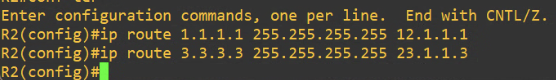
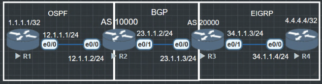

**BGP（Border Gatway Protocol**是一种外部网关协议（External Gatway Protocol），由此可以知道网关协议可以分为外部网关协议（EGP）和内部网关协议（Internal Gatway Protocol），被人熟知的内部网关协议（IGP）有OSPF，EIGRP。

为什么要有EGP
OSPF，EIGRP等IGP路由协议在组织机构网络内部广泛应用，随着网络规模的扩大网络中路由数量的增长，IGB没办法管理大规模的网络，所以诞生了Autonomous System 自治系统。
AS指的是在同一个组织管理下，使用统一路由策略的设备集合。
不同的AS域通过不同的AS号区分。AS号分为16 bit和32 bit两种，IANA负责分发AS号。

在不同AS域之间就要使用EGP来通信，BGP就是如今使用的最多的EGP协议。
相较传统的IGP协议：
1. BGP基于TCP179，只要能够建立TCP连接即可建立BGP；
- (传统 IGP（如 OSPF、EIGRP)使用 IP 直接封装报文，通常需要自己处理可靠性(如 OSPF 需要 LS Acknowledgment).
-  BGP 使用 TCP 端口 179 作为传输层协议，只要 TCP 连接成功，BGP 就可以稳定地建立邻居关系，不需要额外的报文确认机制。
</br> 可以简单的把BGP理解为一个Application

2. BGP 并不生成路由，而是只负责搬运路由信息，相当于一个路由信息的“快递员”
- IGP（OSPF/ISIS） 会通过算法计算最优路径并生成路由。
- BGP 自己不会去发现新网络，而是依靠管理员手动配置或从其他 BGP 邻居学习到的路由信息进行传递。
- 可以把 BGP 理解为一个基于 TCP 的应用，类似于 HTTP 服务器传递网页，它只关心“哪些路由存在”，不关心怎么计算路径只传递路由信息，不会暴露AS内的拓扑信息；
- 在 OSPF/IS-IS 这些 IGP 协议中，每个路由器都会知道整个网络的拓扑结构，并使用 SPF/Dijkstra 算法计算最优路径。
- BGP 只传递可达性信息，它不会公布 AS 内部的详细拓扑，外部 AS 只知道某个前缀可以从某个 AS 进入，而不会知道 AS 内部的链路细节。
</br> 

3. 示例:
- OSPF：如果你有 3 台路由器 R1、R2、R3 互联，OSPF 的所有设备都会知道彼此的连通情况。
- BGP：AS 100 只会告诉 AS 200 “我可以访问 192.168.1.0/24”，但不会告诉AS 200 这段网络内部的拓扑情况。
</br>

4. BGP是触发式更新，而不是周期性更新
- IGP（如 OSPF、RIP）通常需要定期发送路由更新
- RIP 每 30 秒发送一次更新（即使网络没变化）。
- OSPF/IS-IS 需要定期刷新 LSA/LSP 信息。
- BGP 只在路由变化时触发更新，不会周期性地发送完整路由表：
- 如果网络没有变化，BGP 设备之间只会发送 Keepalive 消息（默认 60 秒）。
- 如果某个路由消失，BGP 只会通知受影响的邻居，而不是重新发送所有路由, BGP 不计算路径，只靠策略选路
- OSPF、IS-IS 依赖 SPF/Dijkstra 算法来计算最短路径。
</br>

5. BGP 不计算最短路径，而是使用策略（Path Selection）选择最佳路径：
- 例如基于 AS-PATH、Local Preference、MED、Community 等属性来决定使用哪		条路径。
举个例子：
- OSPF 选择路径 = 计算最短路径（链路代价最低）。
- BGP 选择路径 = 看哪条路径的 AS-PATH 更短，或者哪条路径的 Local Preference 更高。


AS之间需要直接链路，或通过VPN协议构造逻辑直连（GRE Tunnel）进行邻居建立。
AS之间可能是不同的机构、公司，相互间无法完全信任，使用IGP可能存在暴露AS内部的网络信息。
整个网络扩大，路由器数量庞大，路由表规模太大，路由收敛变慢，设备性能销号太大。
为此在AS之间使用BGP进行路由传递。

IANA（Internet Assigned Number Authority 因特网地址分配组织）IAB（Internet Architecture Board 因特网体系委员会）的下设组织。IANA授权NIC（Network information Center 网络信息中心）和其他组织负责IP地址和域名分配，同时IANA负责维护TCP/IP协议族所采用的协议标识符数据库，包括AS自治系统号。

长度16 bit的AS表示为 1-65535，其中64512-65535为私有AS号，0不可使用
长度 32 bit的AS表示为 1-4294967294，其中 4200000000-4294967294为私有AS，0不可用。
AS号 1 – 65535 = 2^16，0不能用
64512 – 65535为私网AS号，一共1024个
一般用不到32bit的AS号，用16bit的AS

## BGP发展

1980年代出现EGP，1989年出现BGP-1，现在使用的是BGP4+支持多种地址族（BGP4只能支持IPv4，但是BGP4+可以支持IPv6，还有VPNv4，VPNv6，L2VPN）

BGP是一种实现AS之间的路由可达，并选择最佳路由（优选）的矢量路由协议。

特点
- BGP使用TCP作为其传输层协议（port 179），使用触发式路由更新，而不是周期性路由更新。
- 路由器之间会话基于TCP连接而建立
- BGP能够承载大批量的路由协议信息，能够支撑大规模网络。
- BGP提供了丰富的路由策略，能够灵活的进行路由选路，并能直到对等体按策略发布路由。
- BGP能够支撑MPLS/VPN的应用，传递客户VPN路由。
- BGP提供了路由聚合和路由衰减功能用于防止路由震荡，通过这两项功能有效地提高了网络稳定性。
	
运行BGP的路由器称为**BGP speaker**，或**BGP路由器**
两个建立BGP会话对策路由器互为等体（Peer），BGP对等体之间交换BGP路由表。
BGP路由器只发送增量的BGP路由更新，或进行触发式更新（不会周期性更新）。
BGP能够承载大批量的路由前缀，可在大规模网络中应用。

## BGP安全性
常见BGP攻击主要有两种
- 建立非法BGP邻居关系，通过非法路条目，干扰正常路由表
- 发送大量非法BGP报文，路由收到上送CPU，导致CPU利用率升高

## BGP认证
BGP使用认证和GTSM（Generalized TTL Security Mechanism 通过TTL 安全保护机制）两个方法保证BGP对等体间的交互安全。

BGP认证分为MD5认证和Keychain认证，对BGP对等体关系进行认证可以预防非法BGP邻居建立。


其中Keychain是华为的技术。
BGP认证需要硬重置才可以使密码生效，如果BGP会话先行建立再去设置密码就没有意义了。

## BGP的GTSM
BGP的GTSM功能检测IP报文头部中的TTL（Time-to-live）值是否存在一个预先设置好的特定范围内，并对不符合TTL值范围的报文进行丢弃，这样就避免了网络攻击者模拟“合法”BGP报文攻击设备。
*要求 BGP 邻居之间发送的 IP 包 TTL 值必须为 255，接收方只接受 TTL 值为 255 的数据包。因为同一个子网内的直接邻居在发送数据包时 TTL 是 255，如果是远端伪造者伪装成邻居发起攻击，TTL 必然会在经过路由器转发时减少，从而低于 255，被 GTSM 拦截。*

```router bgp 65001``` </br> ```neighbor 192.0.2.1 ttl-security hops 1```

'ttl-security hops 1' 表示期望邻居距离是 1 跳（即直连），此时系统自动将 TTL 设为 255，接收端也只接受 TTL 为 255 的包。

如果设置 hops 2，则接受 TTL 值为254或255都能被接受。

ttl-security hops N 意味着允许 TTL 值在 [256-N, 255] 范围内的数据包，增强了对 BGP 邻居连接的 TTL 安全性验证

## 跨设备建立邻居
BGP除了可以像其他网络协议一样能够和直连的设备建立邻居意外，还可以跨设备指定邻居，当然必要前提是要有能到达该设备的路由。


首先在路由器上写上静态路由到达1.1.1.1 和3.3.3.3
```R1(config)#ip route 3.3.3.3 255.255.255.255 12.1.1.2
R2(config)#ip route 1.1.1.1 255.255.255.255 12.1.1.1
R2(config)#ip route 3.3.3.3 255.255.255.255 23.1.1.3
R3(config)#ip route 1.1.1.1 255.255.255.255 23.1.1.2
```

配置R1:
```R1(config)#router bgp 100
R1(config-router)#bgp router-id 1.1.1.1
R1(config-router)#bgp log-neighbor-changes // 显示邻居关系的日志信息, 也不需要, 有这条命了当邻居关系 up huo down 都会在日志里提示.
R1(config-router)#neighbor 3.3.3.3 remote-as 200
R1(config-router)#neighbor 3.3.3.3 ebgp-multihop 2
R1(config-router)#neighbor 3.3.3.3 update-source loopback 0
```

配置R3:
```R3(config)#router bgp 200
R3(config-router)#bgp router-id 3.3.3.3
R3(config-router)#bgp log-neighbor-changes
R3(config-router)#neighbor 1.1.1.1 remote-as 100
R3(config-router)#neighbor 1.1.1.1 ebgp-multihop 2
R3(config-router)#neighbor 1.1.1.1 update-source loopback 0

```

```R1#show ip bgp summary
BGP router identifier 1.1.1.1, local AS number 100
BGP table version is 1, main routing table version 1

Neighbor        V           AS MsgRcvd MsgSent   TblVer  InQ OutQ Up/Down  State/PfxRcd
3.3.3.3         4          200       4       4        1    0    0 00:00:37        0
```
BGP跨设备邻居建立成功 neighbor x.x.x.x ebgp-multihop x //意义为允许x跳之内的EBGP建立邻居连接. 默认情况下EBGP的邻居必须是直连, BGP对TTL要求严格.



```R1(config-if)#router ospf 110
R1(config-router)#router-id 1.1.1.1
R1(config-router)#network 12.1.1.1 255.255.255.255 area 0
R1(config-router)#network 1.1.1.1 255.255.255.255 area 0
```

```R2(config)#router ospf 110
R2(config-router)#network 12.1.1.2 255.255.255.255 area 0

R2(config)#router bgp 10000
R2(config-router)#bgp router-id 2.2.2.2
R2(config-router)#neighbor 23.1.1.3 remote-as 20000
```

```R3(config-if)#router bgp 20000
R3(config-router)#bgp router-id 3.3.3.3
R3(config-router)#neighbor 23.1.1.2 remote-as 10000
*Jun  9 10:56:29.357: %BGP-5-ADJCHANGE: neighbor 23.1.1.2 Up //邻居建立成功

```
使用命令 show ip bpg summary, 可以看到 State/PfxRcd 的值为0 说明现在BGP并没有传递任何路由
使用命令 show ip bgp 也为空

```R3(config)#router eigrp 90
R3(config-router)#eigrp router-id 3.3.3.3
R3(config-router)#network 34.1.1.3 0.0.0.0
```

```R4(config)#router eigrp 90
R4(config-router)#eigrp router-id 4.4.4.4
R4(config-router)#network 34.1.1.4 0.0.0.0
R4(config-router)#network 4.4.4.4 0.0.0.0
```
现在环境搭建完毕. 现在来**在BGP宣告路由**.

```R2(config)#router bgp 10000
R2(config-router)#network 1.1.1.1 mask 255.255.255.255
```
```R3(config)#router bgp 20000
R3(config-router)#network 4.4.4.4 mask 255.255.255.255
```

这个时候 show ip bgp 就能看到我们宣告进去的路由了
R2#show ip bgp
BGP table version is 3, local router ID is 2.2.2.2
Status codes: s suppressed, d damped, h history, * valid, > best, i - internal,
              r RIB-failure, S Stale, m multipath, b backup-path, f RT-Filter,
              x best-external, a additional-path, c RIB-compressed,
              t secondary path,
Origin codes: i - IGP, e - EGP, ? - incomplete
RPKI validation codes: V valid, I invalid, N Not found

     Network          Next Hop            Metric LocPrf Weight Path
 *>   1.1.1.1/32       12.1.1.1                11         32768 i
 *>   4.4.4.4/32       23.1.1.3            409600             0 20000 i

‘*’ 表示可用路由
‘>’ 表示最优路由

在show ip bgp summary 中
R3#show ip bgp summary
BGP router identifier 3.3.3.3, local AS number 20000
BGP table version is 3, main routing table version 3
2 network entries using 288 bytes of memory
2 path entries using 168 bytes of memory
2/2 BGP path/bestpath attribute entries using 320 bytes of memory
1 BGP AS-PATH entries using 24 bytes of memory
0 BGP route-map cache entries using 0 bytes of memory
0 BGP filter-list cache entries using 0 bytes of memory
BGP using 800 total bytes of memory
BGP activity 2/0 prefixes, 2/0 paths, scan interval 60 secs

Neighbor        V           AS MsgRcvd MsgSent   TblVer  InQ OutQ Up/Down  State/PfxRcd
23.1.1.2        4        10000      18      18        3    0    0 00:12:32        1

State/PfxRcd 已经有路由了

虽然现在到1.1.1.1和4.4.4.4都已经有路由了,但是目前R1和R4还是不能互相访问的,因为BGP的路由并没有重分布进 OSPF 和 EIGRP, 因为现实环境中BGP的路由也不可能重分布进去的, 因为截止到2025年BGP路由已经有110万条了.

所以作为解决办法就是把R2和R3当作R1和R4的出口路由器, R1和R4使用默认路由来访问外部网络.
```R2(config-router)#redistribute ?
  application     Application
  bgp             Border Gateway Protocol (BGP)
  connected       Connected
  eigrp           Enhanced Interior Gateway Routing Protocol (EIGRP)
  isis            ISO IS-IS
  iso-igrp        IGRP for OSI networks
  lisp            Locator ID Separation Protocol (LISP)
  maximum-prefix  Maximum number of prefixes redistributed to protocol
  mobile          Mobile routes
  odr             On Demand stub Routes
  ospf            Open Shortest Path First (OSPF)
  ospfv3          OSPFv3
  rip             Routing Information Protocol (RIP)
  static          Static routes
  vrf             Specify a source VRF
```
当然在redistribute 中有bgp的选项,但是正常情况下是不会这么做的.