# BGP路径属性

任何一条BGP路由都拥有多个路径属性.

当路由器将BGP路由通告给它的对等体时, 一并通告的还有路由所携带的各个路径属性.

BGP的路径属性将影响路由优选.

## 路径属性分类
|公认必遵|公认任意|可选过渡|可选非过度|
|:-----:|:-----:|:-------|:--------|
|Origin|Local_Prefence|Aggregator|MED|
|AS_Path|Atomic_aggregate-address|Aggregator|Cluster-List|
|Next_hop|address||Originator-ID|
||||*Weight|

BGP路径属性分为两大类, 一大类叫做**公认属性 well-know**, 一大类叫**可选属性Optional**

公认属性是所有BGP路由器都必须能够识别的属性
1. 公认属性又分为两小类:
    - 公认必遵(Well-Know Mandatory), 必须包括在每个update消息里
    - 公认任意(Well-Know Discretionary), 可能包括在某些update消息里, 也可以不包括

可选属性不需要都被BGP路由器所识别
2. 可选属性也可以分为两小类:
    - 可选过渡(Optional Transitive), BGP设备不识别此类属性依然会接收该类属性并通告给其他对等体.
    - 可选非过渡(Optional Non-transitive), BGP设备不识别此类属性会忽略该属性, 且不会通告给其他对等体.

## Weight 介绍
 - Weight(权重值)是思科设备的私有属性, 取值范围:0 - 65535, 该值越大, 则路由越优先.
 - 路由器本地始发的路由*默认权重值为32768*, 从其他BGP邻居学习到的为*0*
 - Weight 只能在路由器本地配置, 而且只影响本设备的路由优选. **该属性不会传递给任何BGP对等体**
 - 该属性仅在本地有效. 当BGP路由表中存在到相同目的地的路由时, 将优先选择 Weight 值高的路由
 - Weight 值是思科BGP的**第一条选路规则

 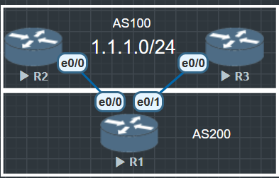

 在R1上部署路由策略(import策略), 将R2传递1.1.1.0/24的 weight 值设为300, 将R3传递的1.1.1.0/24的 weight 值设为200, 如此一来关于 1.1.1.0/24, R1肯定会优选R2传递的路由

 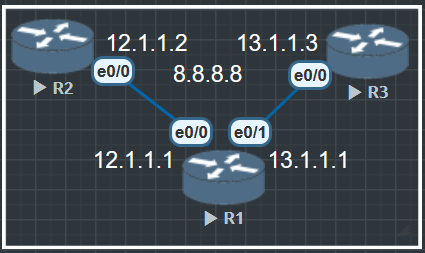

 R2与R3都传递一条8.8.8.8的路由给R1, 各项数值都相同, weight为0, R1选取R2作为路劲

 ```
 R1#show ip bgp
BGP table version is 2, local router ID is 1.1.1.1
Status codes: s suppressed, d damped, h history, * valid, > best, i - internal,
              r RIB-failure, S Stale, m multipath, b backup-path, f RT-Filter,
              x best-external, a additional-path, c RIB-compressed,
              t secondary path,
Origin codes: i - IGP, e - EGP, ? - incomplete
RPKI validation codes: V valid, I invalid, N Not found

     Network          Next Hop            Metric LocPrf Weight Path
 * i  8.8.8.8/32       3.3.3.3                  0    100      0 i
 *>i                   2.2.2.2                  0    100      0 i
```

现在在R1上把R3的 weight 改为100

```
R1(config)#router bgp 100
R1(config-router)#neighbor 3.3.3.3 weight 100

R1#clear ip bgp * soft
R1#show ip bgp
BGP table version is 4, local router ID is 1.1.1.1
Status codes: s suppressed, d damped, h history, * valid, > best, i - internal,
              r RIB-failure, S Stale, m multipath, b backup-path, f RT-Filter,
              x best-external, a additional-path, c RIB-compressed,
              t secondary path,
Origin codes: i - IGP, e - EGP, ? - incomplete
RPKI validation codes: V valid, I invalid, N Not found

     Network          Next Hop            Metric LocPrf Weight Path
 *>i  8.8.8.8/32       3.3.3.3                  0    100    100 i
 * i                   2.2.2.2                  0    100      0 i

```

软重置一下BGP, 可以看到由于修改了weight, R1选路路径变为了R3. **Weight仅对本地有效**


## Local Preference 本地优先级

- Local Preference 本地优先级属性, 是**公认任意属性**, 可用于告诉AS内的路由器, **哪条路径是离开本AS的首选路径**.
- Local Preference 属性越大则BGP路由越优, 缺省的Local Preference值为100.
- **该属性只能被传递给IBGP对等体**, 而不能传递给EBGP对等体. (**即本地优先级属性仅在AS内具有意义**而不能出AS外)

## 使用路由策略修改本地优先级 (Local Preference)

```
R3(config)#ip prefix-list ?
  WORD             Name of a prefix list
  sequence-number  Include/exclude sequence numbers in NVGEN

R3(config)#ip prefix-list lo0 permit 8.8.8.8/32

R3(config)#route-map LOCALP permit 10
R3(config-route-map)#match ip address prefix-list lo0
R3(config-route-map)#set local-preference 200

R3(config)#router bgp 100
R3(config-router)#bgp router-id 3.3.3.3
R3(config-router)#neighbor 13.1.1.1 remote-as 100
R3(config-router)#neighbor 13.1.1.1 route-map LOCALP out
R3(config-router)#network 8.8.8.8 mask 255.255.255.255

R1#show ip bgp
BGP table version is 2, local router ID is 1.1.1.1
Status codes: s suppressed, d damped, h history, * valid, > best, i - internal,
              r RIB-failure, S Stale, m multipath, b backup-path, f RT-Filter,
              x best-external, a additional-path, c RIB-compressed,
              t secondary path,
Origin codes: i - IGP, e - EGP, ? - incomplete
RPKI validation codes: V valid, I invalid, N Not found

     Network          Next Hop            Metric LocPrf Weight Path
 *    8.8.8.8/32       12.1.1.2                 0             0 200 i
 *>i                   13.1.1.3                 0    200      0 i
R1#
```
仅对IBGP有效, 如果在EBGP里使用路由策略修改出站路由本地优先值, 不会有任何影响.

## AS_Path

AS Path是一种**公认必遵**属性, 是前往目标网络的路由经过的AS号列表

1. 确保路由在EBGP对等体之间传递无环
2. 另外也作为路由优选的衡量标准之一

路由在被通告给EBGP对等体时, 路由器会在该路由的AS_Path中追加上本地的AS号之前, **路由被通告给IBGP对等体时, AS_Path不会发生改变.**

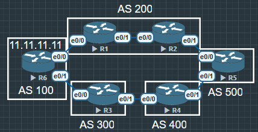

```
R5#show ip bgp
BGP table version is 3, local router ID is 5.5.5.5
Status codes: s suppressed, d damped, h history, * valid, > best, i - internal,
              r RIB-failure, S Stale, m multipath, b backup-path, f RT-Filter,
              x best-external, a additional-path, c RIB-compressed,
              t secondary path,
Origin codes: i - IGP, e - EGP, ? - incomplete
RPKI validation codes: V valid, I invalid, N Not found

     Network          Next Hop            Metric LocPrf Weight Path
 *>   11.11.11.11/32   25.1.1.2                               0 200 100 i
 *                     45.1.1.4                               0 400 300 100 i
```

AS_Path的重要作用之一就是影响BGP路由的优选, R5同时从R2与R4学习到去往11.11.11.11的BGP路由, 在其他条件相同的情况下, R5会优选R2通告的路由, 因为该条路由的AS_Path属性值较短, 也就是AS号的个数更少.(*BGP路由每经过一个AS, 长度算1, AS内IBGP邻居传递算0*)

AS_Path 类似RIP中的跳数, 其实BGP本质仍然是距离矢量协议, 只不过BGP的路由带的是路径属性.

AS_Path 还有4种类型
- 有序
- 无序
- 联邦有序
- 联邦无序

AS_Path无序和汇总有关

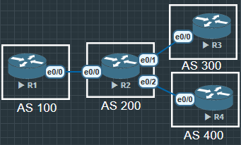

R3与R4 都宣告了11.11.11.11和111.111.111.111.
```
R2#show ip bgp
BGP table version is 3, local router ID is 2.2.2.2
Status codes: s suppressed, d damped, h history, * valid, > best, i - internal,
              r RIB-failure, S Stale, m multipath, b backup-path, f RT-Filter,
              x best-external, a additional-path, c RIB-compressed,
              t secondary path,
Origin codes: i - IGP, e - EGP, ? - incomplete
RPKI validation codes: V valid, I invalid, N Not found

     Network          Next Hop            Metric LocPrf Weight Path
 *    11.11.11.11/32   24.1.1.4                 0             0 400 i
 *>                    23.1.1.3                 0             0 300 i
 *    111.111.111.111/32
                       24.1.1.4                 0             0 400 i
 *>                    23.1.1.3                 0             0 300 i
```

BGP默认是不会汇总的, 所以在R2中产生了4条BGP路由. 因为如果R2会自动汇总再传递给R1, 网络复杂情况下R1很有可能与R3和R4连接, 那么这几条路由又传回了始发路由器就产生了环路. 所以无论怎样都会保留路径的AS号, 在show ip bgp 里的 Path 中 AS号可能不会按照序列排列, 这就是无序AS

## AS_Path 防止环路

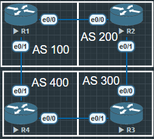

```
R1#show ip bgp
BGP table version is 2, local router ID is 1.1.1.1
Status codes: s suppressed, d damped, h history, * valid, > best, i - internal,
              r RIB-failure, S Stale, m multipath, b backup-path, f RT-Filter,
              x best-external, a additional-path, c RIB-compressed,
              t secondary path,
Origin codes: i - IGP, e - EGP, ? - incomplete
RPKI validation codes: V valid, I invalid, N Not found

     Network          Next Hop            Metric LocPrf Weight Path
 *>   11.11.11.11/32   0.0.0.0                  0         32768 i

R2#show ip bgp
BGP table version is 2, local router ID is 2.2.2.2
Status codes: s suppressed, d damped, h history, * valid, > best, i - internal,
              r RIB-failure, S Stale, m multipath, b backup-path, f RT-Filter,
              x best-external, a additional-path, c RIB-compressed,
              t secondary path,
Origin codes: i - IGP, e - EGP, ? - incomplete
RPKI validation codes: V valid, I invalid, N Not found

     Network          Next Hop            Metric LocPrf Weight Path
 *    11.11.11.11/32   23.1.1.3                               0 300 400 100 i
 *>                    12.1.1.1                 0             0 100 i

R3#show ip bgp
BGP table version is 2, local router ID is 3.3.3.3
Status codes: s suppressed, d damped, h history, * valid, > best, i - internal,
              r RIB-failure, S Stale, m multipath, b backup-path, f RT-Filter,
              x best-external, a additional-path, c RIB-compressed,
              t secondary path,
Origin codes: i - IGP, e - EGP, ? - incomplete
RPKI validation codes: V valid, I invalid, N Not found

     Network          Next Hop            Metric LocPrf Weight Path
 *    11.11.11.11/32   23.1.1.2                               0 200 100 i
 *>                    34.1.1.4                               0 400 100 i


R4#show ip bgp
BGP table version is 2, local router ID is 4.4.4.4
Status codes: s suppressed, d damped, h history, * valid, > best, i - internal,
              r RIB-failure, S Stale, m multipath, b backup-path, f RT-Filter,
              x best-external, a additional-path, c RIB-compressed,
              t secondary path,
Origin codes: i - IGP, e - EGP, ? - incomplete
RPKI validation codes: V valid, I invalid, N Not found

     Network          Next Hop            Metric LocPrf Weight Path
 *>   11.11.11.11/32   14.1.1.1                 0             0 100 i
```

R1从R4收到的BGP路由更新中AS_Path属性值为 400, 300, 200, 100, R1检查AS_Path列表, 发现存在自身AS号100, 那么就不接受该路由, 从而防止了EBGP之间路由环路产生.

其中也能看到有的是*AS_Seqence(有序)*和*AS_Set(无序)*, 默认类型为AS_Sequence, 如果经过手工汇总的路由, 则为AS_Set, 显示为大括号{}

### 汇总路由 Aggregation
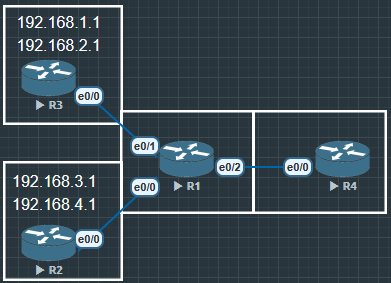

```
R4#show ip bgp
BGP table version is 5, local router ID is 4.4.4.4
Status codes: s suppressed, d damped, h history, * valid, > best, i - internal,
              r RIB-failure, S Stale, m multipath, b backup-path, f RT-Filter,
              x best-external, a additional-path, c RIB-compressed,
              t secondary path,
Origin codes: i - IGP, e - EGP, ? - incomplete
RPKI validation codes: V valid, I invalid, N Not found

     Network          Next Hop            Metric LocPrf Weight Path
 *>   192.168.1.1/32   14.1.1.1                               0 100 200 i
 *>   192.168.2.1/32   14.1.1.1                               0 100 200 i
 *>   192.168.3.1/32   14.1.1.1                               0 100 300 i
 *>   192.168.4.1/32   14.1.1.1                               0 100 300 i
```

没有汇总的BGP路由

```
R1(config)#router bgp 100
R1(config-router)#aggregate-address 192.168.0.0 255.255.0.0 summary-only
```

在R1上使用命令汇总路由

```
R4#show ip bgp
BGP table version is 10, local router ID is 4.4.4.4
Status codes: s suppressed, d damped, h history, * valid, > best, i - internal,
              r RIB-failure, S Stale, m multipath, b backup-path, f RT-Filter,
              x best-external, a additional-path, c RIB-compressed,
              t secondary path,
Origin codes: i - IGP, e - EGP, ? - incomplete
RPKI validation codes: V valid, I invalid, N Not found

     Network          Next Hop            Metric LocPrf Weight Path
 *>   192.168.0.0/16   14.1.1.1                 0             0 100 i
```

在汇总后, 明细被抑制了, 可以看到AS Path只显示了100, 没有原始的AS号了.

```
R1(config)#router bgp 100
R1(config-router)#$ddress 192.168.0.0 255.255.0.0 summary-only as-set
```

当在汇总命令上加上一个**as set**

```
R4#show ip bgp
BGP table version is 20, local router ID is 4.4.4.4
Status codes: s suppressed, d damped, h history, * valid, > best, i - internal,
              r RIB-failure, S Stale, m multipath, b backup-path, f RT-Filter,
              x best-external, a additional-path, c RIB-compressed,
              t secondary path,
Origin codes: i - IGP, e - EGP, ? - incomplete
RPKI validation codes: V valid, I invalid, N Not found

     Network          Next Hop            Metric LocPrf Weight Path
 *>   192.168.0.0/16   14.1.1.1                 0             0 100 {200,300} i
```

这时候可以看到AS的明细就在大括号中了, 大括号中的排列可能是有序也可能是无序.

## 修改AS_Path Revise AS_Path

使用Route map修改BGP路由的AS_Path属性时, 可以追加新的AS(原有AS不可移除和覆盖). 一般情况不建议追加AS_Path, 二十追加原有AS_Path来实现控制EBGP选路

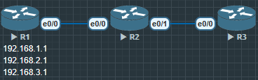

```
R3#show ip bgp
BGP table version is 1, local router ID is 3.3.3.3
Status codes: s suppressed, d damped, h history, * valid, > best, i - internal,
              r RIB-failure, S Stale, m multipath, b backup-path, f RT-Filter,
              x best-external, a additional-path, c RIB-compressed,
              t secondary path,
Origin codes: i - IGP, e - EGP, ? - incomplete
RPKI validation codes: V valid, I invalid, N Not found

     Network          Next Hop            Metric LocPrf Weight Path
 *    192.168.1.1/32   23.1.1.2                               0 200 100 i
 *    192.168.2.1/32   23.1.1.2                               0 200 100 i
 *    192.168.3.1/32   23.1.1.2                               0 200 100 i
```

```
R2(config)#route-map REVISE permit 10
R2(config-route-map)#set as-path prepend 500 600 700
R2(config-route-map)#router bgp 200
R2(config-router)#neighbor 23.1.1.3 route-map REVISE out
```

```
R3#show ip bgp
BGP table version is 7, local router ID is 3.3.3.3
Status codes: s suppressed, d damped, h history, * valid, > best, i - internal,
              r RIB-failure, S Stale, m multipath, b backup-path, f RT-Filter,
              x best-external, a additional-path, c RIB-compressed,
              t secondary path,
Origin codes: i - IGP, e - EGP, ? - incomplete
RPKI validation codes: V valid, I invalid, N Not found

     Network          Next Hop            Metric LocPrf Weight Path
 *>   192.168.1.1/32   23.1.1.2                               0 200 500 600 700 100 i
 *>   192.168.2.1/32   23.1.1.2                               0 200 500 600 700 100 i
 *>   192.168.3.1/32   23.1.1.2                               0 200 500 600 700 100 i
```

## 联邦有序与无序

# Origin
|起源名称|标记|描述|
|:-----:|:--:|:-:|
|IGP|i|如果路由是由始发的BGP路由使用*network或路由汇总*命令注入到BGP的, 那么该BGP路由的Origin属性为IGP|
|EGP|e|如果路由时*通过早期EGP协议*学习到的, 那么该BGP路由的Origin属性为EGP|
|Incomplete|?|如果路由时通过其他方式学习到的, 则Origin属性为Incomplete(不完整的). 例如通过*redistribute*命令引入到BGP的路由|

- 该属性为**公认必遵属性**, 它表示了BGP路由的起源. 如上所述, 根据路由被引入BGP的方式不同, 存在三种类型的Origin.
- 当去往同一个目的地存在多条不同Origin属性的路由时, 在其他条件都相同的情况下, BGP将按如下优选顺序
1. IGP
2. EGP
3. Incomplete

# MED

- MED(Multi-Exit Discriminator, 多出口鉴别器) 是**可选非过渡属性**, 是一种度量值, **用于向外部对等体指出进入本AS的首选路径, 即当进入本AS的入口有多个时**, AS可以使用MED动态地影响其他AS选择进入的路径. (**简单理解AS之间的Metric值**)

- MED属性值**越小**则BGP路由越优
- MED主要用于在AS之间影响BGP的选路. MED被传递给EBGP对等体后, 对等体在其AS内传递路由时, 携带该MED值, 但将路由**再次传递给其EBGP对等体时**, 缺省不会携带MED属性.

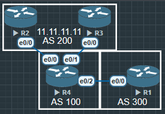

## MED设置方法1

Route-map路由策略(手工修改)方式
- 将IGP路由引入BGP时关联Route-map直接设置
- 对BGP neighbor应用in/out方向的Route-map进行设置

非Route-map(自动生成)方式
- 使用**network**或**redistribute**方式将IGP路由引入BGP时, MED将继承IGP路由的Metric(直连路由, 以及静态路由的Metric为0, 因为本来的cost就是0)

- 使用redistribute方式将IGP路由引入BGP时, 增加**关键字metric直接**设置
- 使用aggregate-address方式引入路由, 则**MED为空**, 如果传递IBGP邻居以0处理.
- 使用aggregate-address方式引入路由, 如果传递给EBGP邻居要看是否本地始发, 本地始发, 传递当0处理, 非本地始发为空处理.

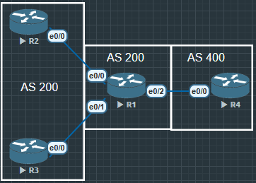

在R2重分布直连路由时增加命令metric

```
R2(config)#router bgp 200
R2(config-router)#redistribute connected metric 20
```

```
R1#show ip bgp
BGP table version is 12, local router ID is 1.1.1.1
Status codes: s suppressed, d damped, h history, * valid, > best, i - internal,
              r RIB-failure, S Stale, m multipath, b backup-path, f RT-Filter,
              x best-external, a additional-path, c RIB-compressed,
              t secondary path,
Origin codes: i - IGP, e - EGP, ? - incomplete
RPKI validation codes: V valid, I invalid, N Not found

     Network          Next Hop            Metric LocPrf Weight Path
 *>   8.8.8.8/32       13.1.1.3                 0             0 200 ?
 *                     12.1.1.2                20             0 200 ?
 r>   12.1.1.0/24      12.1.1.2                20             0 200 ?
 r>   13.1.1.0/24      13.1.1.3                 0             0 200 ?
 *>   192.168.1.1/32   12.1.1.2                20             0 200 ?
 *>   192.168.2.1/32   12.1.1.2                20             0 200 ?
 *>   192.168.3.1/32   13.1.1.3                 0             0 200 ?
 *>   192.168.4.1/32   13.1.1.3                 0             0 200 ?
```

可以看到R1重分布进来的路由MED值都该为20了, 但是直在重分布后面增加metric命令是一种非常粗狂的方式, 没办法精细化管理, 所以还是推荐使用route-map

```
R2(config)#ip prefix-list MED permit 8.8.8.8/32
//创建一个前缀列表
R2(config)#route-map MED permit 10
R2(config-route-map)#match ip address prefix-list MED
R2(config-route-map)#set metric 100
R2(config-route-map)#exit
R2(config)#route-map MED permit 999
R2(config-route-map)#exit
R2(config)#router bgp 200
R2(config-router)#neighbor 12.1.1.1 route-map MED out
```

```
R1#show ip bgp
BGP table version is 15, local router ID is 1.1.1.1
Status codes: s suppressed, d damped, h history, * valid, > best, i - internal,
              r RIB-failure, S Stale, m multipath, b backup-path, f RT-Filter,
              x best-external, a additional-path, c RIB-compressed,
              t secondary path,
Origin codes: i - IGP, e - EGP, ? - incomplete
RPKI validation codes: V valid, I invalid, N Not found

     Network          Next Hop            Metric LocPrf Weight Path
 *>   8.8.8.8/32       13.1.1.3                 0             0 200 ?
 *                     12.1.1.2               100             0 200 ?
 r>   12.1.1.0/24      12.1.1.2                 0             0 200 ?
 r>   13.1.1.0/24      13.1.1.3                 0             0 200 ?
 *>   192.168.1.1/32   12.1.1.2                 0             0 200 ?
 *>   192.168.2.1/32   12.1.1.2                 0             0 200 ?
 *>   192.168.3.1/32   13.1.1.3                 0             0 200 ?
 *>   192.168.4.1/32   13.1.1.3                 0             0 200 ?
```

# Atomic_Aggregate(公认任意) and Aggregator(可选过渡)

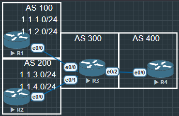

在R3上使用命令聚合路由
```
R3(config)#router bgp 300
R3(config-router)#aggregate-address 1.1.0.0 255.255.0.0 summary-only
```

之前提到过, 这样做有一个很大的问题就是在下游邻居不会显示详细的AS号

R4#show ip bgp
BGP table version is 12, local router ID is 4.4.4.4
Status codes: s suppressed, d damped, h history, * valid, > best, i - internal,
              r RIB-failure, S Stale, m multipath, b backup-path, f RT-Filter,
              x best-external, a additional-path, c RIB-compressed,
              t secondary path,
Origin codes: i - IGP, e - EGP, ? - incomplete
RPKI validation codes: V valid, I invalid, N Not found

     Network          Next Hop            Metric LocPrf Weight Path
 *>   1.1.0.0/16       34.1.1.3                 0             0 300 i
 *>   13.1.1.0/24      34.1.1.3                               0 300 100 ?
 *>   23.1.1.0/24      34.1.1.3                               0 300 200 ?

```
R4#show ip bgp 1.1.0.0
BGP routing table entry for 1.1.0.0/16, version 8
Paths: (1 available, best #1, table default)
  Not advertised to any peer
  Refresh Epoch 2
  300, (aggregated by 300 3.3.3.3)
    34.1.1.3 from 34.1.1.3 (3.3.3.3)
      Origin IGP, metric 0, localpref 100, valid, external, atomic-aggregate, best
      rx pathid: 0, tx pathid: 0x0
```

在详情中可以看到"300, (aggregated by 300 3.3.3.3)"显示这是一个聚合路由, 并且是由AS 300, router ID为3.3.3.3的路由器聚合的. 

"Origin IGP, metric 0, localpref 100, valid, external, atomic-aggregate, best" 同样也提醒了 Atomic-Aggregate 属性, 这是聚合路由, 可能已经丢失了部分BGP路径属性

# Next_Hop(公认必遵)

1. 该属性是一个**公认必遵**属性, 用于指定到达目的网络的下一跳地址.

2. 当路由器学习到BGP路由后, 需对BGP路由的Next_Hop属性进行检查, 该属性值(IP地址)必须在本地路由可达, 如果不可达, 则这条BGP路由不可用.

3. 在不同的场景中, 设备对BGP路由的缺省Next_Hop属性值的设置规则如下

- BGP路由器在向**EBGP对等体**发布某条路由时, 会把该路由信息的下一跳属性设置为本地与对端建立BGP邻居关系的接口地址.

- BGP路由器将本地始发路由发布给**IBGP对等体**时, 会把该路由信息的下一跳属性设置为本地与对端建立BGP邻居关系的接口地址.

- 路由器在收到**EBGP对等体**所通告的BGP路由后, 在将路由**传递给自己的IBGP对等体**时, **会保持路由的Next_Hop属性值不变**

- 如果路由器收到某条BGP路由, 该路由的Next_Hop属性值与EBGP对等体(更新对象)同属一个网段, 那么该条路由的Next_Hop地址将保持不变并传递给它的BGP对等体

## Next_Hop的缺省操作(1)-EBGP对等体传递路由

路由器将BGP路由通告给自己的EBGP对等体时, 将该路由的Next_Hop设置为自己的TCP连接源地址.

## ext_Hop的缺省操作(2)-IBGP对等体传递IBGP路由

BGP路由器将本地始发路由发布给IBGP对等体时, 会把该路由信息的下一跳属性设置为自己的TCP连接源地址.

在IBGP中建立BGP邻居关系, 建议使用环回地址

**总结来说, 无论IBGP还是EBGP, 下一跳都是建立BGP邻居的地址.**

## Next_Hop的缺省操作(3)-IBGP对等体传递EBGP路由

路由器在收到EBGP对等体所通告的BGP路由后, 在将路由传递给自己的IBGP对等体时, 会保持路由的Next_Hop属性值不变. **下一跳本地next hop self解决**

## Next_Hop的缺省操作(4)-IBGP对等体传递IGP路由

如果时是通过network或重分布发布注入的, 那么在注入前该前缀的**IGP下一跳成为BGP的next hop**

如果是通过aggregate-address命令被注入的, 那么BGP的next-hop等于执行汇总路由器的更新源IP


## Next_Hop的缺省操作(5)-第三方下一跳

在MA多点接入**以太网**中, 如果路由器收到某条BGP路由, 该路由的Next_Hop属性值与**EBGP对等体**(更新对象)同属一个网段, 那么该条路由的Next_Hop地址将保持不变并传递给它的BGP对等体.

# Community属性 可选过渡属性

1. Community(团体)属性为**可选过渡属性**, 是一种BGP的**路由标记**, 用于简化路由策略的执行

2. 非常类似于IGP的路由标记**tag**, 只不过在BGP中称为Community团体属性

3. 可以将某些路由分配一个特定的Community属性值, 之后就可以**Community值而不是网络前缀/掩码信息来匹配路由**并执行相应的策略了

## Community技术背景

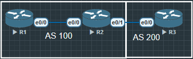

AS 200内有大量的路由被引入BGP, 这些路由分别用于生产以及办公网络, 现在AS100的BGP路由器需要分别针对这些路由执行不同的策略, 如果使用ACL, IP Prefix-list这样的工具, 效率就非常地下了

有了Community属性, 就可以为不同种类的路由打上不同的Community属性值, 这些属性值会随着BGP路由更新给AS 100, 那么在AS 100内BGP路由器上, 只需要根据Community属性值来执行差异化的策略即可, 而不用去关心具体的路由前缀.

## Community属性格式

||2Byte|2Byte|
|:----:|:-:|:-:|
|RFC格式|AA|NN|
|Community 10进制|12|10000|
|16进制|0x000C|0x2710|
|合并|0x000C2710|
|十进制|
|Cisco IOS格式 show ip bgp x.x.x.x|796432|

Community属性值长度为32bit, 也就是4Byte. 可以使用两种形式呈现:
- 十进制整数格式
- AA: NN格式, 其中AA表示AS号, NN是自定义的编号. 团体属性需要配置 route-map 才可以给路由增加上
- *团体(Community)* 属性分为自定义团体属性和公认团体属性以及扩展团体属性


```
R1(config)#ip prefix-list COML permit 8.8.0.0/16 ge 24
//匹配路由前缀, 如果没有ge或le 那么就严格匹配 8.8.0.0/16
R1(config)#route-map COM permit 10
R1(config-route-map)#match ip address prefix-list COML
R1(config-route-map)#set community 12:10000 12:10001 12:10002
//团体属性可以设置1个或多个
R1(config-route-map)#ex

R1(config)#router bgp 100

R1(config-router)#network 8.8.8.8 mask 255.255.255.255 route-map COM
//通告路由器前缀时调用路由策略
R1(config-router)#neighbor 2.2.2.2 send-community
//团体属性默认不发送, 需要手动开启
```

```
R3(config)#ip prefix-list COML0 permit 8.8.8.0/24
R3(config)#ip prefix-list COML0 permit 8.8.8.0/24 ge 25

R3(config)#ip prefix-list COML1 permit 192.168.1.0/24
R3(config)#ip prefix-list COML1 permit 192.168.1.0/24 ge 25

R3(config)#ip prefix-list COML2 permit 192.168.2.0/24
R3(config)#ip prefix-list COML2 permit 192.168.2.0/24 ge 25

R3(config)#route-map COM permit 10
R3(config-route-map)#match ip address prefix-list COML0
R3(config-route-map)#set community 1:10000

R3(config)#route-map COM permit 15
R3(config-route-map)#match ip address prefix-list COML1
R3(config-route-map)#set community 1:10001

R3(config)#route-map COM permit 20
R3(config-route-map)#match ip address prefix-list COML2
R3(config-route-map)#set community 1:10002

R3(config)#router bgp 200
R3(config-router)#network 8.8.8.8 mask 255.255.255.255 route-map COM
R3(config-router)#network 192.168.1.1 mask 255.255.255.255 route-map COM
R3(config-router)#network 192.168.2.1 mask 255.255.255.255 route-map COM
R3(config-router)#neighbor 23.1.1.2 send-community
//在Cisco老版本中不支持在network后直接加命令route-map, 必须在neighbor...route-map...out
```

```
R2(config)#ip community-list 1 deny 1:10001
R2(config)#ip community-list 1 deny 1:10002
R2(config)#ip community-list 1 permit 1:10000
R2(config)#route-map FILTER permit 10
R2(config-route-map)#match community 1
R2(config-route-map)#router bgp 100
R2(config-router)#neighbor 23.1.1.3 route-map FILTER in

R2#show ip bgp
BGP table version is 19, local router ID is 2.2.2.2
Status codes: s suppressed, d damped, h history, * valid, > best, i - internal,
              r RIB-failure, S Stale, m multipath, b backup-path, f RT-Filter,
              x best-external, a additional-path, c RIB-compressed,
              t secondary path,
Origin codes: i - IGP, e - EGP, ? - incomplete
RPKI validation codes: V valid, I invalid, N Not found

     Network          Next Hop            Metric LocPrf Weight Path
 *>   8.8.8.8/32       23.1.1.3                 0             0 200 i

```

在R2上已经没有被deny的路由了, 一定要注意这些命令的逻辑, 首先在community-list 1中已经deny两条路由, 相当于在这个list中只有一条路由. 在使用route-map中 如果使用deny, 那么就把community-list 1 中唯一的一条路由给deny掉了, 所以一定要用permit, 并且不能加上 permit 999, 这样所有路由又都进来了, deny了个寂寞.

举一反三, 也可以在community-list 中permit不需要的路由, 之后使用route-map deny 来匹配community-list, 这样就可以精确命中特定我们不需要的路由, 让其他路由可以宣告进来.

## 公认Community属性

|团体属性名称|团体属性号|说明|
|:---------:|:-------:|:--:|
|Internet|0(0x00000000)|设备在收到具有此属性的路由后, 可以向任何BGP对等体发送该路由. 缺省情况下, 所有的路由前缀都属于Internet团体属性(即使不显示)|
|No_Advertise|4294967042(0xFFFFFF02)|设备收到具有此属性的路由后, 将不向任何BGP对等体发送该路由|
|No_Export|4294967041(0xFFFFFF01)|设备收到具有此属性的路由后, 将不向AS外任何EBGP邻居发送该路由, 联邦EBGP仍然发送该路由|
|Local-AS No_Export_Subconfed(RFC叫法)|4294967043(0先FFFFFF03)|设备收到具有此属性的路由, 将不向AS外任何EBGP邻居发送该路由, 只能在AS内传递, 如果定义了联邦, 则只在联邦AS内传递|

```
R2(config)#route-map COM permit 10
R2(config-route-map)#set community ?
  <1-4294967295>  community number
  aa:nn           community number in aa:nn format
  gshut           Graceful Shutdown (well-known community)
  internet        Internet (well-known community)
  local-AS        Do not send outside local AS (well-known community)
  no-advertise    Do not advertise to any peer (well-known community)
  no-export       Do not export to next AS (well-known community)
  none            No community attribute
```