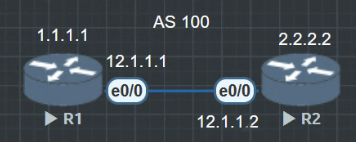

# 路由刷新 Router Refresh

路由刷新有着两个方向一个为 in 另一个 out


首先在R1和R2上写好静态路由 1.1.1.1 和 2.2.2.2
在IBGP中R1与R2建立IBGP邻居关系，R1把11.11.11.11宣告进IBGP

```
R1(config-if)#router bgp 100
R1(config-router)#bgp router-id 1.1.1.1
R1(config-router)#neighbor 2.2.2.2 remote-as 100
R1(config-router)#neighbor 2.2.2.2 update-source lo0
R1(config-router)#network 11.11.11.11 mask 255.255.255.255
```

```
R2(config-if)#router bgp 100
R2(config-router)#bgp router-id 2.2.2.2
R2(config-router)#neighbor 1.1.1.1 remote-as 100
R2(config-router)#neighbor 1.1.1.1 update-source lo0
```

在R2可以看到这条路由的下一跳是1.1.1.1.
```
R2#show ip bgp
BGP table version is 2, local router ID is 2.2.2.2
Status codes: s suppressed, d damped, h history, * valid, > best, i - internal,
              r RIB-failure, S Stale, m multipath, b backup-path, f RT-Filter,
              x best-external, a additional-path, c RIB-compressed,
              t secondary path,
Origin codes: i - IGP, e - EGP, ? - incomplete
RPKI validation codes: V valid, I invalid, N Not found

     Network          Next Hop            Metric LocPrf Weight Path
 *>i  11.11.11.11/32   1.1.1.1                  0    100      0 i
```
现在来设置一个路由策略只是把下一跳改为12.1.1.1

```
R2(config)#route-map RR permit 5
R2(config-route-map)#set ip next-hop 12.1.1.1

R2(config)#router bgp 100
R2(config-router)#neighbor 1.1.1.1 route-map RR in
R2#clear ip bgp * //重置bgp让规则生效

R2#show ip bgp
BGP table version is 2, local router ID is 2.2.2.2
Status codes: s suppressed, d damped, h history, * valid, > best, i - internal,
              r RIB-failure, S Stale, m multipath, b backup-path, f RT-Filter,
              x best-external, a additional-path, c RIB-compressed,
              t secondary path,
Origin codes: i - IGP, e - EGP, ? - incomplete
RPKI validation codes: V valid, I invalid, N Not found

     Network          Next Hop            Metric LocPrf Weight Path
 *>i  11.11.11.11/32   12.1.1.1                 0    100      0 i
```

在R2上使用的路由策略 route-map 是 in 方向, 是因为这条11.11.11.11的路由是R2从R1学习到的, 对R2来说这是一条外来的路由, 那么就是in 入方向的.

同理如果想要在R1上修改这条路由的下一跳, 就是 out 出方向, 因为这是R1要传递给其他邻居的路由.

```
R1(config)#route-map RR permit 5
R1(config-route-map)#set ip next-hop 3.3.3.3

R1(config)#router bgp 100
R1(config-router)#neighbor 2.2.2.2 route-map RR out
```