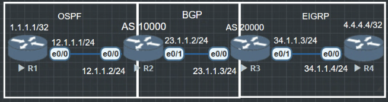

BGP通常被称为路径矢量路由协议(Path-Vector Routing Protocol)
每条BGP路由都携带多种路径属性(Path attribute), BGP可以通过这些路径属性控制路径选择.
不像EIGRP, OSPF只能通过cost控制路径选择, 因此在路径选择上, BGP具有丰富的课操作性, 可以在不同场景下选择最合适的路径控制方式.

</br> 每一跳BGP路由都有三个属性

- AS号
- 下一跳
- NLRI (Next Layer Reachable Information) 简单来说就是路由,类似于OSPF的LSA

```R2#show ip bgp summary
BGP router identifier 2.2.2.2, local AS number 200
BGP table version is 1, main routing table version 1

Neighbor        V           AS MsgRcvd MsgSent   TblVer  InQ OutQ Up/Down  State/PfxRcd
23.1.1.3        4          300      26      27        1    0    0 00:20:22        0
```
在 BGP summary 中可以看到邻居地址, AS号, 路由.
这时候R2和R3可以作为各自的边界网关, 把需要的路由宣告进BGP中.
```R2(config)#router bgp 200
R2(config-router)#network 1.1.1.1 mask 255.255.255.255
```
```
R3(config)#router bgp 300
R3(config-router)#network 4.4.4.4 mask 255.255.255.255
```
现在两边都有到1.1.1.1 和 4.4.4.4 的路由了, 只需要写静态路由或者默认路由就能通信了.
```
R1(config)#ip route 0.0.0.0 0.0.0.0 12.1.1.2

R4(config)#ip route 0.0.0.0 0.0.0.0 34.1.1.3
```
```R1#ping 4.4.4.4 source lo0
Type escape sequence to abort.
Sending 5, 100-byte ICMP Echos to 4.4.4.4, timeout is 2 seconds:
Packet sent with a source address of 1.1.1.1
!!!!!
Success rate is 100 percent (5/5), round-trip min/avg/max = 1/3/15 ms
```
ping对方时要带上源头lo0, 因为BGP路由表里只有1.1.1.1和4.4.4.4, 没有12.1.1.1和34.1.1.4, BGP里没有这两个地址的回程路由.


