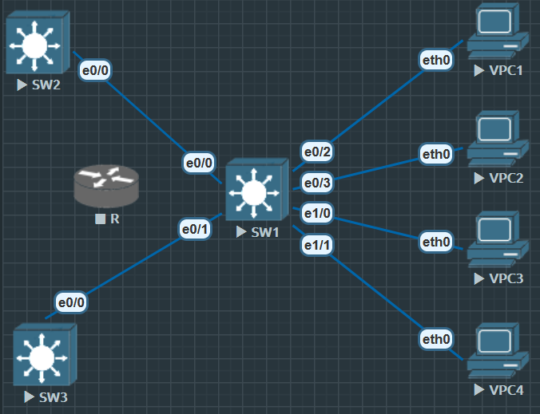

# GLBP(Gateway load Balancing Protocol) 网关负载均衡协议

是 Cisco 的私有协议, 作用, 工作原理与 HSRP, VRRP 类似

- 相同点
    1. 让一个网段的主机只配一个默认网关 IP
    2. 实际背后有多台路由器或三层交换机在提供网关功能

- 不同点
    1. HSRP/VRRP 一条网段只有一个设备在真正转发流量(Active/Master), 其他设备都是备份只有主设备下线后才会接管
    2. GLBP 多台设备同时转发流量, 他会把流量分摊到多台网关上, 实现**负载均衡+冗余**


**GLBP 特点**

1. AVF(Active Virtual Forwarder)
    - 参与转发数据流量的设备, 可以有多个
    - 每台 AVF 都分配到一个虚拟 MAC地址

2. AVG(Active Virtual Gateway)
    - 负责分配虚拟 MAC地址 给各台路由器
    - 调度不同主机流量分配到不同的 AVF

3. 负载均衡
    - 轮询(Round-robin)         主机按顺序获得不同的虚拟 MAC
    - 权重(Weighted)            按设备权重分配流量比列
    - 主机依赖(Host-dependent)  同一主机始终使用同一个网关


## GLBP 配置




**SW1**

```
SW1(config)#int range e0/0-1
SW1(config-if-range)#switchport trunk encapsulation dot1q
SW1(config-if-range)#switchport mode trunk

SW1(config)#vtp domain AD
Domain name already set to AD

SW1(config)#vlan 10
SW1(config-vlan)#name USER

SW1(config)#int vlan 10
SW1(config-if)#ip add 192.168.1.1 255.255.255.0
SW1(config-if)#glbp 10 ip 192.168.1.254
SW1(config-if)#glbp 10 priority 200
SW1(config-if)#glbp 10 preempt // GLBP 默认也是不开启抢占
SW1(config-if)#no shu
```


**SW2**

```
SW2(config)#int vlan 10
SW2(config-if)#ip add 192.168.1.2 255.255.255.0
SW2(config-if)#glbp 10 ip 192.168.1.254
SW2(config-if)#no shu
SW2(config-if)#glbp 10 priority 150
SW2(config-if)#glbp 10 preempt
```


**SW3**

```
SW3(config)#int vlan 10
SW3(config-if)#ip add 192.168.1.3 255.255.255.0
SW3(config-if)#glbp 10 ip 192.168.1.254
SW3(config-if)#no shu
SW3(config-if)#glbp 10 priority 150
SW3(config-if)#glbp 10 preempt
```

主要配置完成


### 验证


`show glbp`

```
SW1#show glbp
Vlan10 - Group 10
  State is Active
    1 state change, last state change 00:08:49
  Virtual IP address is 192.168.1.254
  Hello time 3 sec, hold time 10 sec
    Next hello sent in 0.960 secs
  Redirect time 600 sec, forwarder timeout 14400 sec
  Preemption enabled, min delay 0 sec
  Active is local
  Standby is 192.168.1.3, priority 150 (expires in 9.536 sec)
  Priority 200 (configured)
  Weighting 100 (default 100), thresholds: lower 1, upper 100
  Load balancing: round-robin
  Group members:
    aabb.cc80.5000 (192.168.1.1) local
    aabb.cc80.6000 (192.168.1.2)
    aabb.cc80.7000 (192.168.1.3)
  There are 3 forwarders (1 active)
  Forwarder 1
    State is Active
      1 state change, last state change 00:08:38
    MAC address is 0007.b400.0a01 (default)
    Owner ID is aabb.cc80.5000
    Redirection enabled
    Preemption enabled, min delay 30 sec
    Active is local, weighting 100
  Forwarder 2
    State is Listen
    MAC address is 0007.b400.0a02 (learnt)
    Owner ID is aabb.cc80.7000
    Redirection enabled, 599.552 sec remaining (maximum 600 sec)
    Time to live: 14399.552 sec (maximum 14400 sec)
    Preemption enabled, min delay 30 sec
    Active is 192.168.1.3 (primary), weighting 100 (expires in 11.136 sec)
  Forwarder 3
    State is Listen
    MAC address is 0007.b400.0a03 (learnt)
    Owner ID is aabb.cc80.6000
    Redirection enabled, 599.008 sec remaining (maximum 600 sec)
    Time to live: 14399.008 sec (maximum 14400 sec)
    Preemption enabled, min delay 30 sec
    Active is 192.168.1.2 (primary), weighting 100 (expires in 10.528 sec)
```


`show glbp brief`

```
SW1#show glbp brief
Interface   Grp  Fwd Pri State    Address         Active router   Standby router
Vl10        10   -   200 Active   192.168.1.254   local           192.168.1.3
Vl10        10   1   -   Active   0007.b400.0a01  local           -
Vl10        10   2   -   Listen   0007.b400.0a02  192.168.1.3     -
Vl10        10   3   -   Listen   0007.b400.0a03  192.168.1.2     -
```


```
PC1> show arp 00:07:b4:00:0a:01 192.168.1.254 expires in 113 seconds

PC2> show arp 00:07:b4:00:0a:02 192.168.1.254 expires in 111 seconds

PC3> show arp 00:07:b4:00:0a:02 192.168.1.254 expires in 110 seconds 

PC4> show arp 00:07:b4:00:0a:03 192.168.1.254 expires in 81 seconds 
```

GLBP 轮询负载均衡在生效
    不同主机被分配到不同 AVF 上
    PC2 和 PC3 拿到同一 MAC 也正常——轮询不是“每台主机都唯一”
    而是按顺序分配, 主机数量多于/少于转发器数量时会出现重复分配


#### 总结


GLBP 理论很好, 但是如果和 STP 结合在一起, 由于GLBP 协议天生均衡负载, 因此必然有50%的流量会在二层转发时出现次优路径

VRRP 和 HSRP 也能做负载均衡, 但是需要两个网关

**设备1**

```
int vlan 10
vrrp 10 ip 192.168.1.254
priority 150
vrrp 11 ip 192.168.1.253
priority 120
```


**设备2**

HSRP 同理

```
int vlan 10
vrrp 10 ip 192.168.1.254
priority 120
vrrp 11 ip 192.168.1.253
priority 150
```


VRRP, HSRP 解决次优路径是, 二层 STP 的 Root 必须与三层 VRRP, HSRP 的主设备在同一设备上


##### 后记

```
// 在三台交换机上看转发表与ARP
show glbp brief
show glbp
show mac address-table vlan 10 | inc 0007.b400
show arp vlan 10 | include 192.168.1.254


// 故障切换测试（例如在SW2）
interface e0/0
 shutdown
// 观察：对应 0a03 的转发器会被其他设备接管
```


对象跟踪 + 权重(上行挂了就别再吸流量)

```
track 1 interface e0/0 line-protocol
interface vlan 10
 glbp 10 weighting 110 lower 90 upper 110
 glbp 10 weighting track 1 decrement 20
```


按权重负载均衡(设备性能不一样时)

```
interface vlan 10
 glbp 10 load-balancing weighted
 glbp 10 weighting 130   ! 比如 SW1
```


认证

```
interface vlan 10
 glbp 10 authentication md5 key-string cisco123
```