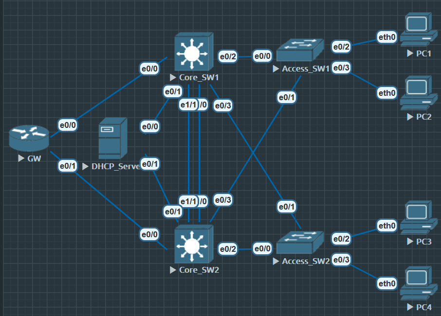

# VRRP(Virtual router Redundancy Protocol) 虚拟路由器冗余协议

- 将可以承担网关功能的一组路由器加入到备份中, 形成一台虚拟路由器, 这样主机的网关设置成*虚拟网关*, 就能实现冗余

- VRRP 将局域网内的一组路由器划分在一起, 称为一个*备份组*. *备份组由一个 Master 路由器和多个 backup 路由器组成*, 功能相当于一台虚拟路由器

- VRRP 备份组具体特点
    1. 虚拟路由器有 IP地址, 称为*虚拟 IP地址*. 局域网内的主机仅需要知道这个虚拟路由的 IP地址, 并将其设置为缺省路由的下一跳

    2. 网路内的主机通过这个虚拟路由器与外部网络通信

    3. 备份组内的路由器根据*优先级*, 选举 Master 路由器, 承担网关功能. 其他路由器作为 Backup 路由器, 当 Master 路由器发送故障时, Backup 取代 Master 继续履行网关职责

## VRRP 选举

1. VRRP 备份组中的设备根据优先级(越大越优)选举出 Master. Master 通过发送**免费 ARP 报文**, 将虚拟 MAC地址 通知与其连接的设备与主机, 从而承担报文转发任务

2. 选举规则
    - 比较优先级大小
    - 优先级相同, 接口 IP地址 大的成为 Master

### VRRP 配置

**基本配置**



**Core_SW1**

```
e0/1 10.1.1.1
vlan 10 USER
ip 10.1.10.250
ip helper add 10.1.1.100

e0/2-3 trunk
```

**Core_SW2**

```
e0/1 10.1.2.1
vlan 10 USER
ip 10.1.10.251
ip helper add 10.1.2.100

e0/2-3 trunk
```

**DHCP_Server**

```
e0/0 ip 10.1.1.100
e0/1 ip 10.1.2.100

ip dhcp pool VLAN10
network 10.1.10.0 /24
default-router 10.1.10.254
dns-server 8.8.8.8
lease infinite

ip dhcp relay information trust-all
ip route 10.1.0.0 255.255.0.0 10.1.1.1
ip route 10.1.0.0 255.255.0.0 10.1.2.1
ip dhcp excluded-address 10.1.10.250 10.1.10.25
```

**Access_SW1**

```
vlan 10
name USER

ip dhcp snooping vlan 10

no ip dhcp snooping information option

e0/0-1
switchport mode trunk
ip dhcp snooping trust

int range e0/2-3
switchport access vlan 10
```

same for Access-SW2


**Core_SW1**

```
Core_SW1(config)#int vlan 10
Core_SW1(config-if)#vrrp 10 ip 10.1.10.254
Core_SW1(config-if)#vrrp 10 priority 100
```

**Core_SW2**

```
Core_SW2(config)#int vlan 10
Core_SW2(config-if)#vrrp 10 ip 10.1.10.254
Core_SW2(config-if)#vrrp 10 priority 200
```

```
Core_SW2#show vrrp br
Interface          Grp Pri Time  Own Pre State   Master addr     Group addr
Vl10               10  200 3218       Y  Master  10.1.10.251     10.1.10.254
```

VRRP 默认开启抢占 "Pre" 为抢占模式

```
Core_SW2#show vrrp
Vlan10 - Group 10
  State is Master
  Virtual IP address is 10.1.10.254
  Virtual MAC address is 0000.5e00.010a
  Advertisement interval is 1.000 sec
  Preemption enabled
  Priority is 200
  Master Router is 10.1.10.251 (local), priority is 200
  Master Advertisement interval is 1.000 sec
  Master Down interval is 3.218 sec
```

MAC地址 0000.5e00.01XX, 同样最后8个 bit 为组别

#### VRRP Track

VRRP 与 HSRP 都有 Track(追踪功能), 命令大同小异

```
Core_SW2(config)#track 1 int e0/0 line-protocol

Core_SW2(config)#int vlan 10
Core_SW2(config-if)#vrrp 10 track 1 decrement 100

Core_SW2#show track br
Track Type        Instance                   Parameter        State Last Change
1     interface   Ethernet0/0                line-protocol    Up    00:01:07
```

也可以配的复杂一些, 显得水平高

```
Core_SW2(config)#track 1 int e0/0 line-protocol
Core_SW2(config-track)#delay down // 接口 down 多少秒之后才通知
Core_SW2(config-track)#delay up // 接口 up 多少秒之后才通知

Core_SW2(config-track)#delay down 2 up 5 // 掉线2秒后通知(防止抖动), 恢复5秒后通知(保障稳定)
```