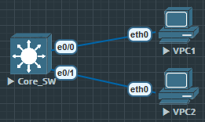

设备从DHCP服务器获取IP需要四次握手分别为：
1. 发现：使用广播
2. 提供：使用单播
3. 请求：使用广播
4. 确认：使用单播 



设置一个名叫'Service'的DHCP地址池, 以及网关. 之后创建使用该地址池的VLAN, 当然也可以使用默认vlan 1. 

```
Core_SW(config)#ip dhcp pool Service
Core_SW(dhcp-config)#network 192.168.10.0 255.255.255.0
Core_SW(dhcp-config)#default-router 192.168.10.254

Core_SW(config)#vlan 10
Core_SW(config-vlan)#name VLAN_SERVICE

Core_SW(config)#int vlan 10
Core_SW(config-if)#ip address 192.168.10.254 255.255.255.0
Core_SW(config-if)#no shu

Core_SW(config)#int e0/0
Core_SW(config-if)#switchport mode access
Core_SW(config-if)#switchport access vlan 10

Core_SW(config)#int e0/1
Core_SW(config-if)#switchport mode access
Core_SW(config-if)#switchport access vlan 10

```

现在接入VLAN 10的两台PC都能自动获取IP地址了.

```
VPC1> ip dhcp
DDORA IP 192.168.10.1/24 GW 192.168.10.254

VPC2> ip dhcp
DDORA IP 192.168.10.2/24 GW 192.168.10.254
```

在交换机上使用命令 `show ip dhcp pool` 可以查看详情

```
Core_SW#show ip dhcp pool

Pool Service :
 Utilization mark (high/low)    : 100 / 0
 Subnet size (first/next)       : 0 / 0
 Total addresses                : 254
 Leased addresses               : 2
 Excluded addresses             : 0
 Pending event                  : none
 1 subnet is currently in the pool :
 Current index        IP address range                    Leased/Excluded/Total
 192.168.10.3         192.168.10.1     - 192.168.10.254    2     / 0     / 254
```

使用命令 `show ip dhcp binding` 可以查看地址绑定情况

```
Core_SW#show ip dhcp binding
Bindings from all pools not associated with VRF:
IP address      Client-ID/              Lease expiration        Type       State      Interface
                Hardware address/
                User name
192.168.10.1     0100.5079.6668.01       Sep 14 2025 10:45 AM    Automatic  Active     Vlan10
192.168.10.2     0100.5079.6668.02       Sep 14 2025 10:45 AM    Automatic  Active     Vlan10
```

