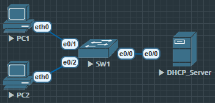

# DHCP 中继(relay)代理

在通常的实际应用中DHCP服务器和客户端很有可能并不在一个广播域（网段）。

这个时候设备就需要使用DHCP终极代理来获取IP地址。

现在因为DHCP服务器和DHCP客户端不在同一个广播域，虽然客户端发送的第一条报文是依靠广播的 discovery，但是服务器还是收不到后续也不能给客户端提供服务。

这个时候就需要将客户端广播报文转发给DHCP服务器并将DHCP服务器的报文转发给客户端，这样才能完成后续所有工作。



## DHCP Server

```
DHCP_Server(config)#int e0/0
DHCP_Server(config-if)#ip address 192.168.1.100 255.255.255.0
DHCP_Server(config-if)#no shu

DHCP_Server(config)#ip dhcp pool USER
DHCP_Server(dhcp-config)#network 192.168.10.0 /24
DHCP_Server(dhcp-config)#default-router 192.168.10.254

DHCP_Server(config)#ip dhcp pool OFFICE
DHCP_Server(dhcp-config)#network 192.168.20.0 /24
DHCP_Server(dhcp-config)#default-router 192.168.20.254

DHCP_Server(config)#ip dhcp excluded-address 192.168.10.250 192.168.10.254
DHCP_Server(config)#ip dhcp excluded-address 192.168.20.250 192.168.20.254

DHCP_Server(config)#ip route 192.168.0.0 255.255.0.0 192.168.1.1
// 注意必须要有这条路由, 不然分配不了IP.
```

### SW1

```
SW1(config)#ip routing
SW1(config)#in e0/0
SW1(config-if)#no switchport
SW1(config-if)#ip address 192.168.1.1 255.255.255.0
SW1(config-if)#no shu

SW1(config)#vlan 10
SW1(config-vlan)#name USER

SW1(config)#int vlan 10
SW1(config-if)#ip add 192.168.10.254 255.255.255.0
SW1(config-if)#no shu
SW1(config-if)#ip helper-address 192.168.1.100
// 核心命令

SW1(config)#vlan 20
SW1(config-vlan)#name OFFICE

SW1(config)#int vlan 20
SW1(config-if)#ip address 192.168.20.254 255.255.255.0
SW1(config-if)#no shu
SW1(config-if)#ip helper-address 192.168.1.100
// 核心命令

SW1(config)#int e0/1
SW1(config-if)#switchport mode access
SW1(config-if)#switchport access vlan 10

SW1(config)#int e0/2
SW1(config-if)#switchport mode access
SW1(config-if)#switchport access vlan 20
```

#### DHCP Server

```
DHCP_Server#show ip dhcp binding
Bindings from all pools not associated with VRF:
IP address      Client-ID/              Lease expiration        Type       State      Interface
                Hardware address/
                User name
192.168.10.2     0100.5079.6668.01       Sep 30 2025 03:04 PM    Automatic  Active     Ethernet0/0
192.168.20.1     0100.5079.6668.02       Sep 30 2025 03:07 PM    Automatic  Active     Ethernet0/0
```

##### 总结

1. DHCP 中继就是在 DHCP Server 上多加一条手工静态路由, 能让 DCHP Server 成功下发地址.
2. 在客户端网关(如 VLAN 中)接口上启用 `ip helper-address X.X.X.X` 命令
3. 检查命令 `show ip helper-address` 
