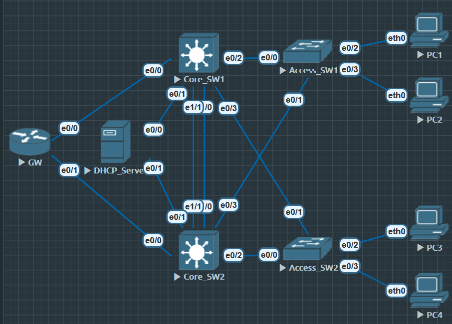

# FHRP FIrst Hop Redundancy Protocol 首跳冗余协议

在一个简单的结构当中， 终端设备往往只有一个网关，这种结构存在故障风险

传统风险：

1. 单节点故障风险
2. 单链路故障风险

网关冗余(一个网关不够，那就再加一个网关)

1. HSRP(cisco私有)
2. VRRP(公有标准)
3. GLBP(cisco私有)

## HSRP(Hot Standby Router Protocol)热备份路由协议

思科私有的 FHRP 协议, 主要用于为局域网中的主机提供冗余的默认网关

1. HSRP 的核心概念
- 目的：在二层网络中为用户网关提供冗余。
    1) PC 只知道一个网关（比如 10.1.10.254），而实际有多台三层设备在后面保证高可用。

2. 组成：
    1) Active Router：当前真正转发流量的设备。
    2) Standby Router：备用，监控 Active，如果 Active 掉了它会顶上。
    3) Virtual IP + Virtual MAC：客户端的网关就是虚拟 IP，底层通过虚拟 MAC 转发。

虚拟 MAC 规则：

```
HSRP version 1: 0000.0c07.acXX (XX=group号)
HSRP version 2: 0000.0c9f.fXXX (XXX=group号)
```



**基本配置**

```
Core_SW1 
e0/1 10.1.1.1
vlan 10 USER
ip 10.1.10.250
ip helper add 10.1.1.100

e0/2-3 trunk
----------------
Core_SW2
e0/1 10.1.2.1
vlan 10 USER
ip 10.1.10.251
ip helper add 10.1.2.100

e0/2-3 trunk
-------------
DHCP_Server
e0/0 ip 10.1.1.100
e0/1 ip 10.1.2.100

ip dhcp pool VLAN10
network 10.1.10.0 /24
default-router 10.1.10.254
dns-server 8.8.8.8
lease infinite

ip dhcp relay information trust-all
ip route 10.1.0.0 255.255.0.0 10.1.1.1
ip route 10.1.0.0 255.255.0.0 10.1.2.1
ip dhcp excluded-address 10.1.10.250 10.1.10.254
-----------------------
Access_SW1

vlan 10
name USER

ip dhcp snooping vlan 10

no ip dhcp snooping information option

e0/0-1
switchport mode trunk
ip dhcp snooping trust

int range e0/2-3
switchport access vlan 10

same for Access-SW2
```


**CORE_SW1**

```
Core_SW1(config)#interface vlan 10
Core_SW1(config-if)#standby 10 ip 10.1.10.254 // 10 为 group number
Core_SW1(config-if)#standby 10 priority 100
```

**Core_SW2**

```
Core_SW2(config)#int vlan 10
Core_SW2(config-if)#standby 10 ip 10.1.10.254
Core_SW2(config-if)#standby 10 priority 150 // 优先级150, 比 Core_SW1 优, 会作为主设备使用, 默认优先级100

Core_SW2#show standby brief
                     P indicates configured to preempt.
                     |
Interface   Grp  Pri P State   Active          Standby         Virtual IP
Vl10        10   150   Standby 10.1.10.250     local           10.1.10.254
```

使用命令 `show standby brief` 可以查看哪台设备在 **active** 状态或者 **standby** 状态

命令 `show standby`

```
Core_SW2#show standby
Vlan10 - Group 10
  State is Standby
    1 state change, last state change 00:03:44
  Virtual IP address is 10.1.10.254
  Active virtual MAC address is 0000.0c07.ac0a (MAC Not In Use)
    Local virtual MAC address is 0000.0c07.ac0a (v1 default)
  Hello time 3 sec, hold time 10 sec
    Next hello sent in 1.920 secs
  Preemption disabled
  Active router is 10.1.10.250, priority 100 (expires in 7.936 sec)
  Standby router is local
  Priority 150 (configured 150)
  Group name is "hsrp-Vl10-10" (default)
```

详情里可以看到各种数据,特别是虚拟的核心MAC地址,这个AMC地址最后8个比特是代表组别

可以看到是0a，因为这是16进制翻译过来就是10了

arp 报文里会询问谁是254 Core_SW1 和 Core_SW2 都会收到, 但是备份COre_SW1不会回应

这时候Core_SW2会回应他是254, 以及mac地址是0000.0c07.ac0a

数据封装才能把mac地址加进去。Access_SW1才能正确转发

客户端设备并不关心这个虚拟的地址是哪一个网关去承担的

在虚拟的IP地址中，有一个主设备和备份设备

- 主设备:
	1. 承担网关的ARP相应
	2. 数据的层面的转发
	3. 周期性存货通告

- 备份设备：
	1. 监听主设备的存活报文
	2. 周期性通告自己存活

周期转发可以抓包可以看到SW1会用组播地址 224.0.0.2（所有路由器） .1 （所有节点，设备）来组播自己存活就是发送Hello报文

封装在Hot standby router protocol

备份也会组播Hello报文表示存活


### HSRP 抢占

HSRP在默认状态主设备离线之后，再次上线只会保持 Standby 状态而不是回到 Active 状态。

```
Core_SW2#show standby brief
                     P indicates configured to preempt.
                     |
Interface   Grp  Pri P State   Active          Standby         Virtual IP
Vl10        10   150   Standby 10.1.10.250     local           10.1.10.254
```

可以看到内容中在优先级右边有一个"P", 代表抢占模式为*关闭*, 默认状态下就是关闭

使用命令 `standby 10 preempt` 开启抢占模式

```
Core_SW2#show standby brief
                     P indicates configured to preempt.
                     |
Interface   Grp  Pri P State   Active          Standby         Virtual IP
Vl10        10   150 P Active  local           unknown         10.1.10.254
```
s
因为考虑到不同网络协议收敛时间不相同, 抢占模式意义不大, 但还是建议开启

#### HSRP 与 EGP

如果 Core_SW1, Core_SW2, GW 都加入到 EIGRP, 有可能在Core_SW1, Core_SW2 的邻居表中会看到其中有 vlan10 的邻居

明显这是一个多余的邻居, 这个时候可以在 Core_SW1, Core_SW2 上使用 Eigrp 的被动模式来避免发生这种情况

```
router eigrp x
passive-interface vlan 10
```

##### HSRP 抢占延时

配合路由协议的收敛速度, 可以设置一个抢占延时

```
Core_SW2(config)#int vlan 10
Core_SW2(config-if)#standby 10 preempt delay minimum ?
  <0-3600>  Number of seconds for minimum delay

Core_SW2(config-if)#standby 10 preempt delay minimum
```

##### HSRP 的 Track 追踪上行流量

正常情况下 PC1 能访问 GW 上的环回 1.1.1.1

```
PC1> ping 1.1.1.1

84 bytes from 1.1.1.1 icmp_seq=1 ttl=254 time=0.555 ms
84 bytes from 1.1.1.1 icmp_seq=2 ttl=254 time=0.865 ms
84 bytes from 1.1.1.1 icmp_seq=3 ttl=254 time=1.145 ms
84 bytes from 1.1.1.1 icmp_seq=4 ttl=254 time=0.746 ms
84 bytes from 1.1.1.1 icmp_seq=5 ttl=254 time=0.786 ms
```

现在关闭 GW 的 e0/0 PC1 肯定不能 ping 1.1.1.1

```
Core_SW2(config)#track 1 int e0/0 line-protocol

Core_SW2(config-track)#do show track br
Track Type        Instance                   Parameter        State Last Change
1     interface   Ethernet0/0                line-protocol    Down    00:03:17

Core_SW2(config)#int vlan 10
Core_SW2(config-if)#standby 10 track 1 ?
  decrement  Priority decrement
  shutdown   Shutdown group
  <cr>

Core_SW2(config-if)#standby 10 track 1 decrement 100
```

可以设置为 track 1 检测到 e0/0 的上行链路 down, 那么 HSRP 自动降低优先级, 使Core_SW1 成为主设备,

##### HSRP 使用真实 MAC地址

默认情况下 HSRP 使用都是虚拟 MAC地址

格式为 0000.0c07.acXX, 后面8位bit为组别号

```
Core_SW2#show standby
Vlan10 - Group 10
  State is Active
    4 state changes, last state change 00:33:14
  Virtual IP address is 10.1.10.254
  Active virtual MAC address is 0000.0c07.ac0a (MAC In Use)
    Local virtual MAC address is 0000.0c07.ac0a (v1 default)
  Hello time 3 sec, hold time 10 sec
    Next hello sent in 1.072 secs
  Preemption enabled
  Active router is local
  Standby router is 10.1.10.250, priority 100 (expires in 9.568 sec)
  Priority 150 (configured 150)
    Track object 1 state Up decrement 100
  Group name is "hsrp-Vl10-10" (default)
```

**SW1**

```
Core_SW1(config)#int vlan 10
Core_SW1(config-if)#standby use-bia
```

**SW2**

```
Core_SW2(config)#int vlan 10
Core_SW2(config-if)#standby use-bia
```
**!!! 该命令必须成对配置 !!!**

```
Core_SW2#show standby
Vlan10 - Group 10
  State is Active
    4 state changes, last state change 00:39:15
  Virtual IP address is 10.1.10.254
  Active virtual MAC address is aabb.cc80.2000 (MAC In Use)
    Local virtual MAC address is aabb.cc80.2000 (bia)
  Hello time 3 sec, hold time 10 sec
    Next hello sent in 2.464 secs
  Preemption enabled
  Active router is local
  Standby router is 10.1.10.250, priority 100 (expires in 9.328 sec)
  Priority 150 (configured 150)
    Track object 1 state Up decrement 100
  Group name is "hsrp-Vl10-10" (default)
```
##### HSRP 版本

HSRP 有v1和v2两个版本, 两个版本都支持IPv4和IPv6虽然同属一个协议

但是两个版本组播地址不同, 支持的组别序列不同, 虚拟MAC地址不同

**不能混用版本**

```
Core_SW2(config)#int vlan 10
Core_SW2(config-if)#standby version ?
  <1-2>  Version number
```

版本1 序列 0-255

版本2 序列 0-4095

##### HSRP 计时器

HSRP的问题在于计时器设计稍显保守, 10s的死亡时间和3s的Hello时间稍微有点慢

可以手动修改为1s hello时间和3s死亡时间

**!!! 注意计时器需要成对修改 !!!!**

```
Core_SW2(config)#int vlan 10
Core_SW2(config-if)#standby timers ?
  <1-254>  Hello interval in seconds
  msec     Specify hello interval in milliseconds // 毫秒

Core_SW2(config-if)#standby timers 1 ?
  <2-255>  Hold time in seconds

Core_SW2(config-if)#standby timers 1 3 ?
  <cr>

Core_SW2(config-if)#standby timers 1 3
```
###### HSRP 的进阶功能

追踪接口：如果 Active 的上行链路挂了，可以自动降权，把 Active 让给 Standby。

```
interface vlan 10
 standby 10 track interface e0/0 20
```

如果 e0/0 down，优先级减 20。

- 多组 HSRP 实现负载分担（类似 GLBP，但更简单）：
  1. VLAN10 用 SW1 优先级高 → SW1 Active
  2. VLAN20 用 SW2 优先级高 → SW2 Active