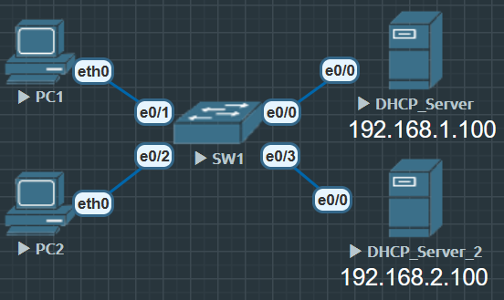

# DHCP Snooping(DHCP 嗅探)

在二层网络攻击中，有一种方法就是DHCP欺骗攻击。以及在实际网络中可能不止一个DHCP服务器，也有网络故障原因是因为私接AP、路由等等产生流氓 DHCP，综上所以部署 DHCP 嗅探来避免这些问题。

DHCP嗅探一般部署在接入交换机上，因为DHCP类的攻击往往出现在接入层面.

DHCP嗅探实现非常简单，在DHCP服务器和DHCP客户端之间增加了一个所谓的“防火墙”，默认禁用所有DHCP报文，设置信任端口，默认所以端口为 untrust 防止流氓 DHCP。

默认情况下，接入交换机所有的端口开启DHCP嗅探后，**默认是 DHCP 嗅探的 untrust 端口**，只有朝向 DHCP 服务器的正确端口手工修改为信任端口后，交换机才可以转发收到 DHCP 报文。

首先切记必须一定要打开 DHCP 嗅探功能，不然后面所有配置都是白费时间。

192.168.10.254 为 vlan 10 的 DHCP Server

192.168.20.254 为 vlan 20 的 DHCP Server

## DHCP Snooping 配置



VLAN 10, VLAN 20 的 ip helper-address 为 192.168.1.100, 在未开启 DHCP Snooping 时 DHCP 服务正常.

**Snooping 服务不能监测 no switchport 接口** 所以这次实验不能使用之前的 DHCP 中继, 而是要把 DHCP 挂在 VLAN 上

**SW1**

```
SW1(config-vlan)#name DHCP_Server

SW1(config)#int vlan 100
SW1(config-if)#ip address 192.168.1.1 255.255.255.0
SW1(config-if)#no shu

SW1(config-if)#int e0/0
SW1(config-if)#switchport
SW1(config-if)#switchport mode access
SW1(config-if)#switchport access vlan 100
```

**DHCP_Server_1**

```
DHCP_Server_1(config)#vlan 100
DHCP_Server_1(config-vlan)#name DHCP_Server

DHCP_Server_1(config)#int vlan 100
DHCP_Server_1(config-if)#ip address 192.168.1.100 255.255.255.0

DHCP_Server_1(config)#int e0/0
DHCP_Server_1(config-if)#switchport
DHCP_Server_1(config-if)#switchport mode access
DHCP_Server_1(config-if)#switchport access vlan 100

DHCP_Server_1(config)#ip route 192.168.0.0 255.255.0.0 192.168.1.1
```

**PC1**

这个时候 PC 是能正常拿到地址的, DHCP 服务是正常的

```
PC1> ip dhcp
DDORA IP 192.168.10.2/24 GW 192.168.10.254
```

现在 SW1 启动 DHCP嗅探

```
SW1(config)#ip dhcp snooping // 启动 Snooping 服务
SW1(config)#ip dhcp snooping vlan 100 //因为所有的 DHCP 服务都来自 vlan 100
```

现在所有端口都属于**非信任**, 对来自 vlan 100的 dhcp 服务会完全丢弃

**PC1**

```
PC1> ip dhcp
DDD
Can't find dhcp server
// PC1 已经拿不到地址了
```

```
SW1#show ip dhcp snooping
Switch DHCP snooping is enabled
Switch DHCP gleaning is disabled
DHCP snooping is configured on following VLANs:
100
DHCP snooping is operational on following VLANs:
100
DHCP snooping is configured on the following L3 Interfaces:

Insertion of option 82 is enabled
   circuit-id default format: vlan-mod-port
   remote-id: aabb.cc00.3000 (MAC)
Option 82 on untrusted port is not allowed
Verification of hwaddr field is enabled
Verification of giaddr field is enabled
DHCP snooping trust/rate is configured on the following Interfaces:

Interface                  Trusted    Allow option    Rate limit (pps)
-----------------------    -------    ------------    ----------------
```

可以看到在 SW1 上是没有信任端口的

必须在 SW1 的 e0/0 使用命令 `SW1(config-if)#ip dhcp snooping trust`

只让这个端口信任VLAN 100 的DHCP 服务, 其他所有端口传来的 vlan 100 DHCP 服务都不信任, 这个时候 PC 才拿得到地址.

```
SW1#show ip dhcp snooping
Switch DHCP snooping is enabled
Switch DHCP gleaning is disabled
DHCP snooping is configured on following VLANs:
100
DHCP snooping is operational on following VLANs:
100
DHCP snooping is configured on the following L3 Interfaces:

Insertion of option 82 is enabled // option 82 启用状态
   circuit-id default format: vlan-mod-port
   remote-id: aabb.cc00.3000 (MAC)
Option 82 on untrusted port is not allowed
Verification of hwaddr field is enabled
Verification of giaddr field is enabled
DHCP snooping trust/rate is configured on the following Interfaces:

Interface                  Trusted    Allow option    Rate limit (pps)
-----------------------    -------    ------------    ----------------
Ethernet0/0                yes        yes             unlimited
  Custom circuit-ids:
SW1#
```

有可能这个时候设备依旧拿不到IP地址, 因为所有被嗅探过的 DHCP 报文会被插入一个 Option 82 字段. 

- 这个字段里面包含了远程ID和链路ID
	1. 远程ID表明是从某一台设备收到的这个DHCP报文，ID是该设备的MAC地址是从哪里收到的	DHCP报文。
	2. 链路ID是某设备VLAN，收到的DHCP报文用于定位DHCP客户端。

- 现在有两种办法让客户端正确从DHCP服务器上获取IP地址
    1. 在交换机上关闭Option82的插入 `no ip dhcp snoping information option`
    2. 在 DHCP 服务器上设置信任Option信息 `DHCP_Server_1(config)#ip dhcp relay information trust-all`

### DAI(动态ARP检测) Dynamic ARP Inspection

1. 保护 ARP 中毒(ettercap, dsniff, arpspoof...)
2. 使用 DHCP Snooping 的绑定表
3. 从 DHCP 交互中得到 IP 和 MAC 的绑定关系
4. 丢弃免费 ARP
5. 防止 ARP 中毒和中间人(Man-In-Middle)攻击
6. 限制来自客户端端口的 ARP 请求报文速率, 防止端口扫描

DAI 只对非信任端口进行校验, 所以要设置信任端口, 在此拓扑中, SW1 的 e0/0 为上行接口, 所以需要设置为 DAI 信任

```
SW1(config)#ip arp inspection vlan 100

SW1(config)#int e0/0
SW1(config-if)#ip arp inspection trust

SW1(config)#int e0/3
SW1(config-if)#ip dhcp snooping limit rate 50
// 在非信任接口可以设置一个 DHCP 报文接收上限, 防止流氓 DHCP 服务打爆 SW1 的 CPU
```

```
SW1#show ip arp inspection vlan 100

Source Mac Validation      : Disabled // 检查 ARP 报文中的 源 MAC 是否和二层以太网帧头的源 MAC 一致
Destination Mac Validation : Disabled // 检查 ARP 报文中的 目标 MAC 是否和以太网帧头的目的 MAC 一致
IP Address Validation      : Disabled // 检查 ARP 报文中的 发送端 IP 地址是否与 Snooping 绑定表匹配（防止 ARP 欺骗）

 Vlan     Configuration    Operation   ACL Match          Static ACL
 ----     -------------    ---------   ---------          ----------
  100     Enabled          Active

 Vlan     ACL Logging      DHCP Logging      Probe Logging
 ----     -----------      ------------      -------------
  100     Deny             Deny              Off
```

1. 开头三个处于 disabled 的检查是默认关闭的
   - 开启命令 `SW1(config)#ip arp inspection validate src-mac dst-mac ip`

2. 第二部分：VLAN 状态
   - Configuration：表示在 VLAN100 上启用了 DAI（你执行了 ip arp inspection vlan 100）。
   - Operation：表示 VLAN100 上 DAI 处于 **Active（生效）**状态。
   - ACL Match / Static ACL：如果你给 DAI 配了 ACL（比如允许某些静态 IP-MAC 对），会在这里显示；目前为空。

3. 第三部分：日志行为
   - ACL Logging
      - 如果 ARP 报文匹配了 DAI 的 ACL，是否记录日志。这里 Deny 表示 丢弃并记录日志。
   - DHCP Logging
      - 如果 ARP 报文和 Snooping 绑定表不匹配，是否记录日志。这里 Deny 表示 丢弃并记录日志。
   - Probe Logging
      - 用于 ARP Probe（探测） 的日志。默认 Off。

看绑定表（依赖 snooping）
   `show ip dhcp snooping binding`

看统计信息（是否丢弃过 ARP）
   `show ip arp inspection statistics`

#### IP 源保护(IP Source Guard) 端口绑定

1. 防止 IP地址 欺骗
2. 使用 DHCP Snopping 绑定表
3. 跟踪 IP地址 和接口的关联关系
4. 动态下发 ACL 丢弃来自非法 IP地址 报文

```
SW1(config)#int e0/3
SW1(config-if)#switchport port-security // 启用接口安全
SW1(config-if)#switchport port-security maximum 2 // 最大MAC地址限制 最多学习2个 MAC 地址
SW1(config-if)#switchport port-security violation restrict // 丢弃不合法的帧, 生成日志 / SNMP trap
SW1(config-if)#ip verify source port-security // IPSG
```

`ip verify source port-security`

1. IPSG 依赖 DHCP Snooping 或 Port Security 的记录。
2. 作用：检查端口进来的报文是否使用了合法的 IP/MAC 对。
3. 如果来源 IP/MAC 不在绑定表/Port Security 表里，就直接丢弃。
4. 这里用了 port-security 参数，所以它会用 Port Security 学到的 MAC 来做验证。

验证命令 `show port-security int x/x`

```
SW1#show port-security interface e0/3
Port Security              : Disabled     // 接口上还没真正启用
Port Status                : Secure-down  // 不处于 Secure 状态
Violation Mode             : Restrict     // 违规模式 restrict
Aging Time                 : 0 mins       
Aging Type                 : Absolute
SecureStatic Address Aging : Disabled
Maximum MAC Addresses      : 2            // 最大允许 2 个 MAC
Total MAC Addresses        : 0            // 当前没有学习到任何 MAC 
Configured MAC Addresses   : 0
Sticky MAC Addresses       : 0
Last Source Address:Vlan   : 0000.0000.0000:0
Security Violation Count   : 0            // 没有违规计数
```

port security 只能作用于2层接口(access / trunk)

violation mode 有三种模式

1. protect(安静)
   -  超过最大 MAC 数时，直接 丢弃违规帧。
   -  不会记录日志，不会发 SNMP trap。
   - 接口保持 up

2. restrict(警告)
   - 超过最大 MAC 数时，丢弃违规帧。
   - 会记录日志（syslog、计数器、SNMP trap）。
   - 接口保持 up。

3. shutdown(严格)
- 超过最大 MAC 数时，接口直接 error-disable（相当于被关了）。
- 需要管理员手动 shutdown / no shutdown 或配置 errdisable recovery 才能恢复。

##### 后记

如果接口多, 可以使用命令 `SW1(config-if)#description xxxx` 来描述各个接口的作用,  在running config 和 intface 详情中能看到写的描述.

在现实工作环境中, 设备通过接入交换机将DHCP报文转发给汇聚层交换机, 汇聚层交换机设置设置 DHCP relay 转发给DHCP服务器, DHCP服务器根据对应的网关选择对应的DHCP地址池, 默认情况下DHCP服务器会检查两个字段第一个是DHCP报文中的 option 82 字段来确定中继地址, 如果为空那么就是不信任, 因为option 82里应该是有对应的网关

所以要么我们选择不插入 option 82, 要么在DHCP服务器上选择信任所有

接入交换机通过读取DHCP服务器回应的ACK报文, 可以生成一种DHCP嗅探绑定表, 这张表在安全层面具有一定意义. 

这个表可以生成两个接入层面的安全机制

接入层 -- 汇聚层（分布层）-- 核心层

DHCP服务大概率是在汇聚层 核心层布置路由器和防火墙接入公网

