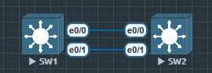

# 以太网的链路聚合Link Aggregation 将多个物理网络接口组合成一个逻辑接口 

解决单链路的拥塞问题

一味增加上行链路不具备扩展性的方案

多个上行链路由于防环机制将Block端口

逻辑链路聚合

提高带宽

链路负载均衡 Load Balancing

EtherChannel 在 STP 眼中是一个逻辑端口，因此可以避免多个链路被 STP 阻塞，提升冗余和可用带宽。

Redundancy冗余-可以允许某些端口关闭，但依然工作


**标准**

1. PAgP     思科私有协议 Port aggregation protocol
2. LACP     公有协议 Link aggregation control protocol




## PAgP

- PAgP 协商 EtherChannel 创建和维护
    1. On: 通道成员无需协商
    2. Desirable: 主动向对端发送协商报文
    3. Auto: 被动响应对端的协商报文
    4. Off: 此接口无法形成 EtherChannel


二层设备配置

**SW1**

```
SW1(config)#interface range ethernet 0/0-1
SW1(config-if-range)#channel-group 1 mode ?
  active     Enable LACP unconditionally
  auto       Enable PAgP only if a PAgP device is detected
  desirable  Enable PAgP unconditionally
  on         Enable Etherchannel only
  passive    Enable LACP only if a LACP device is detected

SW1(config-if-range)#channel-group 1 mode desirable
Creating a port-channel interface Port-channel 1

*Oct  3 21:15:36.234: %LINEPROTO-5-UPDOWN: Line protocol on Interface Ethernet0/0, changed state to down
// 因为现在只设置了一端, 所以状态是 down
```

**SW2**

```
SW2(config)#interface range ethernet 0/0-1
SW2(config-if-range)#channel-group 1 mode desirable

Creating a port-channel interface Port-channel 1
*Oct  3 21:18:46.220: %LINK-3-UPDOWN: Interface Port-channel1, changed state to up
*Oct  3 21:18:47.224: %LINEPROTO-5-UPDOWN: Line protocol on Interface Port-channel1, changed state to up
状态已经 up 了
```

三层设备配置

**SW1**

```
SW1(config)#int port-channel 1
SW1(config-if)#no switchport
SW1(config-if)#ip address 12.1.1.1 255.255.255.0
SW1(config-if)#no shu

SW1(config)#int range e0/0-1
SW1(config-if-range)#no switchport
SW1(config-if-range)#channel-group 1 mode desirable
```

**SW2**

```
SW2(config)#interface port-channel 1
SW2(config-if)#no switchport
SW2(config-if)#ip add 12.1.1.2 255.255.255.0
SW2(config-if)#no shu

SW2(config)#int range e0/0-1
SW2(config-if-range)#no switchport
SW2(config-if-range)#channel-group 1 mode desirable

```


常用命令

1. `show etherchannel summary`	
    显示聚合端口简要状态

2. `show running-config interface port-channel 1`	
    查看逻辑端口配置

3. `show pagp neighbor`	
    查看 PAgP 邻居信息

4. `debug pagp packet`	
    实时调试 PAgP 数据包 (注意生产环境慎用)


### LACP

- LACP 协商 EtherChannel 创建和维护
    1. On: 通道成员无需协商
    2. Active: 主动向对端发送协商报文
    3. Passive: 被动响应对端的协商报文
    4. Off: 此接口无法形成 EtherChannel    


二层设备配置

**SW1**

```
SW1(config)#interface range ethernet 0/0-1
SW1(config-if-range)#channel-group 1 mode active
```

**SW2**

```
SW2(config)#interface range ethernet 0/0-1
SW2(config-if-range)#channel-group 1 mode active
```

三层设备配置

**SW1**

```
SW1(config)#int port-channel 1
SW1(config-if)#no switchport
SW1(config-if)#ip address 12.1.1.1 255.255.255.0
SW1(config-if)#no shu

SW1(config)#int range e0/0-1
SW1(config-if-range)#no switchport
SW1(config-if-range)#channel-group 1 mode active
```

**SW2**

```
SW2(config)#interface port-channel 1
SW2(config-if)#no switchport
SW2(config-if)#ip add 12.1.1.2 255.255.255.0
SW2(config-if)#no shu

SW2(config)#int range e0/0-1
SW2(config-if-range)#no switchport
SW2(config-if-range)#channel-group 1 mode active

```

#### 配置以太通道的负载均衡


EtherChannel 在成员端口间分担流量

负载分担基于 MAC, IP, 4层端口号(源, 目的)

默认, 不同交换机不同, 一般为源+目的 IP(src-dst-ip)


```
SW1(config)#port-channel load-balance ?
  dst-ip       Dst IP Addr          // 根据目标 IP 地址进行哈希
                                        多个客户端访问同一台服务器（例如 web server）时较有效
  dst-mac      Dst Mac Addr         // 根据源 IP 地址进行哈希
                                        一台服务器回应多个客户端（如 DHCP、DNS）时较有效
  src-dst-ip   Src XOR Dst IP Addr  // 根据源 IP 和目标 IP 地址组合进行哈希（默认）
                                        双向通信、P2P、互为主备的路由器之间推荐使用
  src-dst-mac  Src XOR Dst Mac Addr // 根据目标 MAC 地址进行哈希
                                        二层通信中，多个主机访问同一台设备（如文件服务器）
  src-ip       Src IP Addr          // 根据源 MAC 地址进行哈希
                                        多个主机向外发送数据的流量分担
  src-mac      Src Mac Addr         // 根据源 MAC 和目标 MAC 地址组合哈希
                                        纯二层 EtherChannel 推荐，或混杂 MAC 通信场景
```

查看命令 `show etherchannel load-balance`


不需要两端配置完全相同的 load-balance 算法

建议一致，以避免排障困难或性能不一致问题


##### 后记

PAgP 支持选项

Slient    auto和desirable 模式所使用的默认关键字
- 表示交换机不期望从伙伴设备接收PAgP帧来防止交换机报告到达STP的链路状态 down。
- 用于连接不支持PAgP功能的设备，例如流量发生器。

Non-slient    auto和desirable 模式所使用的关键字
- 表示期望从伙伴设备接收PAgP帧，用于检测单向链路故障。
- 如果没有从伙伴收到PAgP帧，表示单向通信失败。
- 能够根据单向链路检测把到达STP的状态报告为 down 

|模式名称|描述|与什么配对能成功|
|:---:|:----:|:------------:|
|AUTO|被动模式, 只响应PAgP数据包, 但不会主动发起|与 Desirable|
|Desirable|主动模式, 主动发送PAGP请求|与Auto或Desirable|
|On|静态模式, 使用PAgP, 只要两边都设置为On就会建立Ether Channel|另一端也必须是On, 否则引起问题|

PAgP优先级是0-255, 越大越优, 由优先级大的端口进行数据转发, 其他端口进行热备份. (默认优先级为128)

修改优先级命令
pagp port-priority 255

LACP

LACP 是一种公有协议, 所以适用范围远超Cisco的PAgP

LACP的优先级是越小越优

|PAgP|优先级|0 - 255|越大越优|默认值 128|
|:---|:---:|:------:|:-----:|:-------:|
|LACP|优先级|1 - 65536|越小越优|默认值 32768|

配置LACP必须使要匹配的端口参数匹配
- Speed and duplex
- Mode (access or trunk)
- Native and allowed VLANs on trunk ports
- Access VLAN on access ports

指导原则

1. 不必连续分布, 也不必位于相同模块.
2. 一个 EtherChnnel 内的所有端口必须使用相同协议.
3. 一个 EtherChnnel 内的所有端口都必须具有相同的速度和双工模式, LACP要求端口只能工作再全双工模式.
4. 一个 EtherChnnel 内的所有端口都必须配置到相同的接入Vlan中, 或配置到具有相同Vlan许可列表和 native Vlan的 Vlan干道中.
5. 一个EtherChannel内的所有端口都必须配置相同的干道模式。（如采用 dot1q desirable的干道模式）
6. 一个EtherChannel内的所有端口都要求具有相同的VLAN开销设置