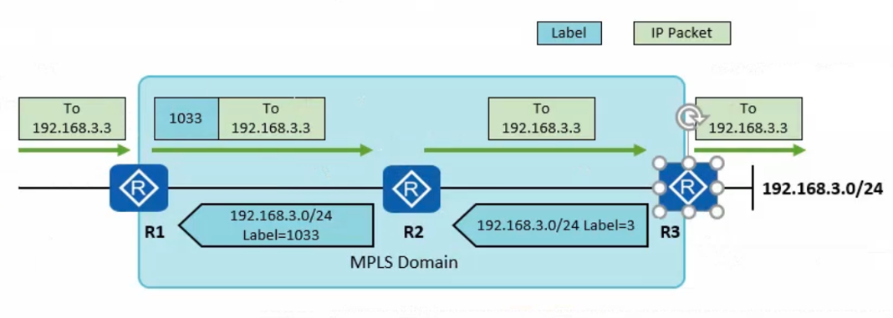
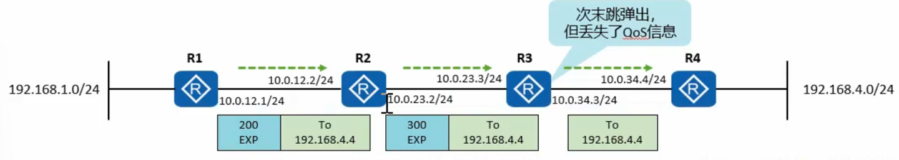
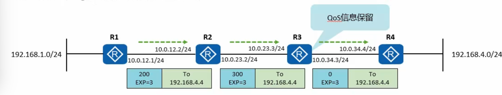

# PHP(Penultimate Hop Popping) 特性

- PHP 次末弹跳出, 如果激活了 PHP 特性, 那么 egress 节点再为本地路由分配标签的时候, 会分配一个特殊标签(3), 该标签被称为隐式空标签(Implicit NULL Label). 当 LSR 转发一个标签报文时, 如果发现对应的出标签值为3, 则 LSR 会将栈顶标签弹出, 并将里面所封装的数据转发给下游 LSR

在标签发布时, R3 为作为 192.168.3.0/24 这条 FEC 的 Egress LSR, 分配标签时, R3 为该 FEC 分配了标签3, 并将该标签绑定信息通告给 R2

在数据转发时, R2 作为到达 192.168.3.0 的次末跳(倒数第二跳), 发现出标签值为3, 于是将标签头部弹出, 将 IP 报文转发给 R3, 而 R3 则仅需执行一次查询操作(查询 FIB 表)即可获得相应的转发信息, 转发效率的高了提升

## 隐式空标签与显式空标签(1)

- 缺省情况下, Egress 节点向倒数第二条分配隐式空标签(Implicit-null), 即特殊标签3

- 但在部署 QoS 的场景下, 标签被弹出后, 其中的优先级也会一并丢失

## 隐式空标签与显式空标签(2)

- 显式空标签机制, Egress 节点向倒数第二跳分配**特殊标签0**

- R3 在转发标签报文时, 若出标签封装为0, 则不会将标签头部弹出, **标签头部中的 QoS 信息得以保存.** R4 收到带0标签的报文时, 直接弹出标签, **不用去查找标签转发表项, 只需一次查表

- 缺省情况下, Egress 分配的是隐式空标签

命令 `R4(config)#mpls ldp explicit-null`

是让 Egress LSR 告诉网络：“不要提前剥标签，我要自己看到标签”，主要用于 QoS 保留（保留 EXP 字段） 或 DiffServ-Aware MPLS TE。

|项目|默认(Implicit Null)|启用 Explicit Null|
|:-:|:-----------------:|:----------------:|
|标签值|3|0|
|倒数第二跳行为|PHP(弹出标签)|保留标签|
|Egress|看到的包|IP 包|MPLS 包|
|QoS 信息(EXP)|丢失|保留|
|使用场景|性能优先|QoS 精确控制优先|

