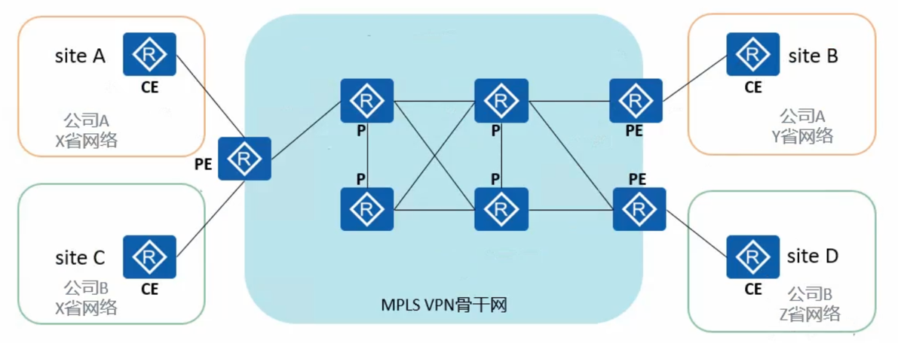
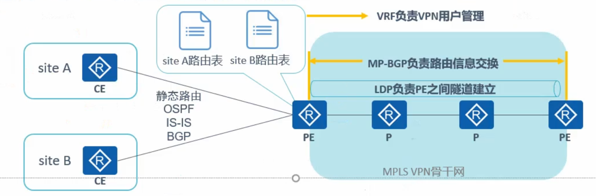
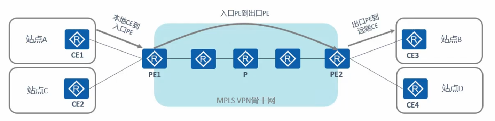
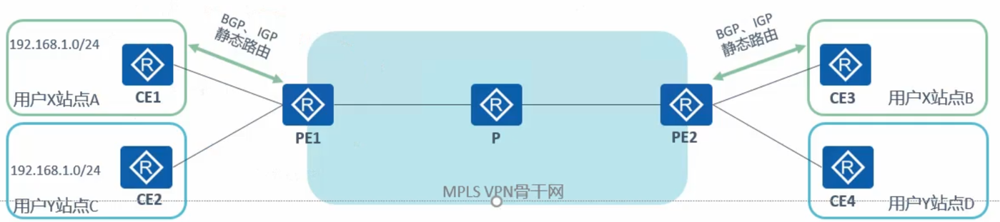

# **前言**

- VPN(Virtual Private Network, 虚拟专用网) 指的式一个公共网络中实现虚拟的专用网络, 从而使得用户能够基于该专用网络实现通信的技术

- MPLS VPN 也是 VPN 技术中的一种. 需要强调的式, 本节所介绍的 MPLS VPN 指的是 BGP/MPLS IP VPN, 这是一种被业界广泛使用的三层 VPN

- 本节将介绍 MPLS VPN 的基本概念, 工作过程以及典型配置方法

## 定义

- BGP/MPLS IP VPN 网络一般由运营商搭建, VPN 用户购买 VPN 服务来实现用户网络之间的**路由传递**, **数据互通**等, 不同 VPN 用户之间的路由和数据是完全隔离

- MPLS VPN 使用 BGP 在运营商骨干网络上发布 VPN 路由, 使用 MPLS 在运营商骨干网上转发 VPN 报文. BGP/MPLS IP VPN 又被简称为 MPLS VPN, 是一种常见的 L3VPN(Layer 3 VPN)技术

## MPLS VPN 网络架构

- MPLS VPN 网络架构由三部分组成:
    1. CE(Customer Edge)
    2. PE(Provider Edge)
    3. P(Provider)
    - 其中 PE 和 P 是运营商设备, CE 是 MPLS VPN 用户设备

- 站点(Site)就是 MPLS VPN的用户, 由 CE 和其他用户设备构成

### MPLS VPN 技术架构

- MPLS VPN 不是单一的一种 VPN 技术, 是多种技术结合的综合解决方案, 主要包含:
    1. MP-BGP: 负责在 PE 与 PE 之间传递站点内的路由信息
    2. LDP: 负责 PE 与 PE 之间的隧道建立
    3. VRF: 负责 PE 的 VPN 用户管理(虚拟路由器)
    4. 静态路由, IGP, BGP: 负责 PE 与 CE 之间的路由信息交换

### 为什么要选择 MPLS VPN

- 对 VPN 客户而言
    1. 不"感知" VPN 的存在, 不需要部署和维护 VPN, 降低企业运维难度和成本
    2. 一般部署在运营商的 MPLS VPN 专网上, 有一定的安全性保障

- 对运营商而言
    1. MPLS 在无连接的 IP 网络中增加了面向连接的控制平面, 为 IP 网络增添了管理和运营的手段
    2. 支持地址空间重叠
    3. 组网方式灵活, 可扩展性好
    4. 能够方便地支持 MPLS TE(MPLS Traffic ENgineering) 合理调控现有网络资源, 最大限度的节省运营商成本

## MPLS VPN 路由发布概述

- 若想实现同一个 VPN 的不同站点之间的通信, 首先需要完成不同站点之间的路由交互, 在基本 MPLS VPN 组网中, VPN 路由信息的发布涉及 CE 和 PE, P 路由器只维护骨干网的路由, 不需要了解任何 VPN 路由信息. VPN 路由信息的发布过程包括三部分:
    1. 本地 CE 到入口 PE
    2. 入口 PE 到出口 PE
    3. 出口 PE 到远端 CE

## CE 与 PE 之间的路由信息交换

- 如图, 客户 X 和 客户 Y 属于不同的 VPN, 分别拥有两个站点, 现需要实现站点间的路由信息交互
- CE 与 PE 之间可以使用静态路由, OSPF, EIGRP 或 BGP 交换路由信息(BGP 最简单). 无论使用哪种路由协议, CE 和 PE 之间交换的都是标准的 IPv4 路由
- 本地 CE 到入口 PE 和出口 PE 到远端 CE 的路由信息交换原理完全相同

### 入口 PE 到出口 PE 路由传递(1)

- VPN 是一种私有网络, 不同的 VPN 独立管理自己的地址范围, 也称为地址空间(address space)

- PE 在接收到 CE 传递来的路由之后, 需要独立保存不同的 VPN 的路由, 且需要解决不同的客户使用重叠 IP 地址空间的问题

- 例如图中用户 X 和 用户 Y 都是用 192.168.1.0/24 网段地址

