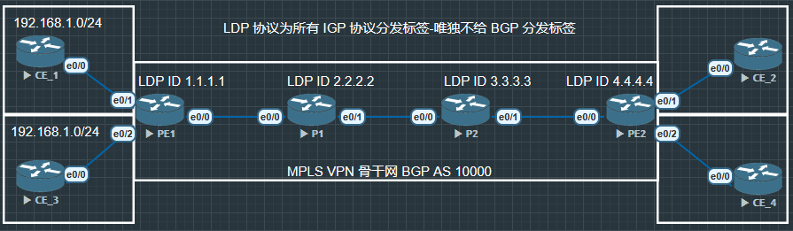

# VRF(Virtual Routing and Forwarding) 虚拟路由和转发

又称 VPN 实例, 是 MPLS VPN 架构中的关键技术, 每个 VPN 实例使用独立的路由转发表项, 实现 VPN 之间的逻辑隔离





## 本地 CE 到入口 PE


**CE1**

```
CE1(config)#int lo0
CE1(config-if)#ip address 192.168.1.1 255.255.255.255
CE1(config-if)#no shu

CE1(config)#int e0/0
CE1(config-if)#ip address 172.16.1.1 255.255.255.0
CE1(config-if)#no shu

CE1(config)#router bgp 65001
CE1(config-router)#bgp router-id 172.16.1.1
CE1(config-router)#neighbor 172.16.1.2 remote-as 10000
CE1(config-router)#network 192.168.1.1 mask 255.255.255.255

```


**CE3** 同理配置, 建立 BGP AS 65003


**PE1**

```
PE1(config)#ip vrf VPNA
PE1(config-vrf)#rd 10000:1 
// rd - Route Distinguisher

PE1(config)#ip VRF VPNB
PE1(config-vrf)#rd 10000:3


PE1(config)#int e0/1
PE1(config-if)#ip vrf forwarding VPNA
PE1(config-if)#ip address 172.16.1.2 255.255.255.0
PE1(config-if)#no shu

PE1(config)#int e0/2
PE1(config-if)#ip vrf forwarding VPNB
PE1(config-if)#ip address 172.16.2.2 255.255.255.0
PE1(config-if)#no shu


PE1(config)#router bgp 10000
PE1(config-router)#bgp router-id 1.1.1.1

PE1(config-router)#address-family ipv4 vrf VPNA
PE1(config-router-af)#neighbor 172.16.1.1 remote-as 65001

PE1(config-router)#address-family ipv4 vrf VPNB
PE1(config-router-af)#neighbor 172.16.2.1 remote-as 65003
```

### 验证

**RD**

rd(Route Distinguisher), 在 MPLS VPN 里, 每个客户(CE)都可能使用相同的私有地址空间(eg: 192.168.1.1), 如果没有 rd 那么就会有地址冲突. 加上 rd 让其变为全局唯一不再冲突, 也就是 VPN-IPv4 路由


|Type Field 2字节|Administrator Subfield|Assigned Number Subfield|备注|
|:-------------:|:--------------------:|:----------------------:|:--:|
|Type = 0|2字节, AS 号|4字节, 用户自定义|AS : NN|
|Type = 1|4字节, IPv4 地址|2字节, 用户自定义|

如同:

```
VPNA: 192.168.1.0/24 + RD 10000:1
VPNB: 192.168.1.0/24 + RD 10000:3
```


现在在 PE1 中使用命令 `show ip route` 查路由表是查不到 CE1 和 CE2 的路由的, 因为这个命令是查询全局路由, 但是 CE1, CE2 并不在全局路由上, 而是在 VRF 的虚拟路由器上, 所以要使用命令 `show ip route vrf 'WORD'` 才能查看相对应的虚拟路由器上的路由.

同样使用命令 `ping 172.16.1.1`, `ping 172.16.2.2` ... 地址都是ping不通的, 因为这些地址也不在 PE1 的全局路由器上, 而是在相对应的 VPNA, VPNB 虚拟路由器上, 要使用命令 `ping vrf 'WORD' X.X.X.X` 才能 ping 通


### VPN-IPv4 地址

VPN-IPv4 地址又被称为 VPNv4 地址, VPNv4 地址共有12个字节, 包括8字节的路由标识符 RD(Route Distinguisher) 和4字节的 IPv4 地址前缀


*RD - 8字节, IP - 4字节*