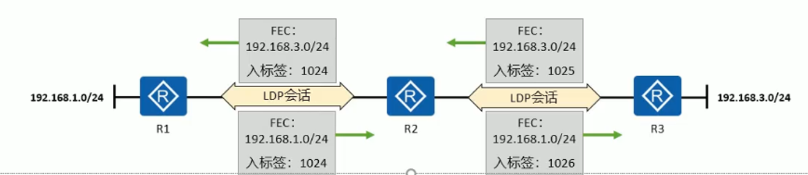
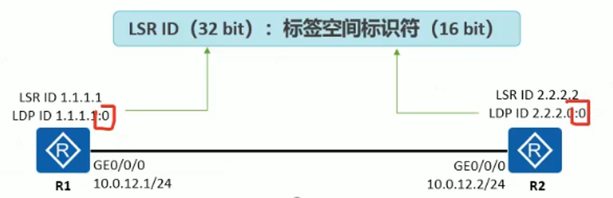
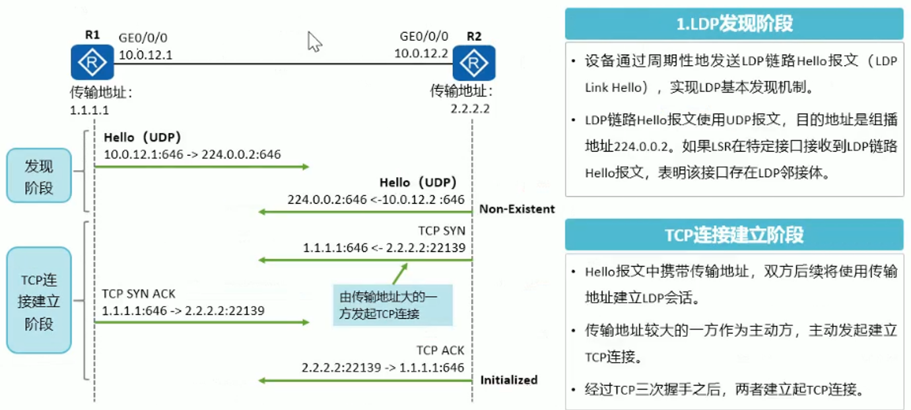
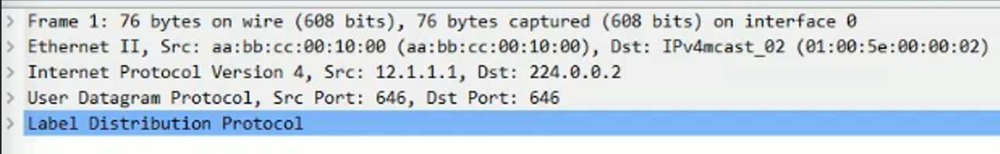
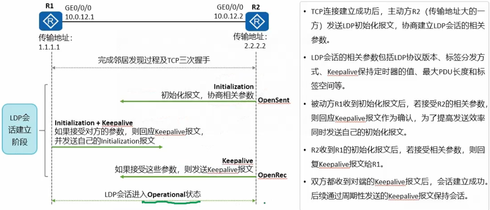
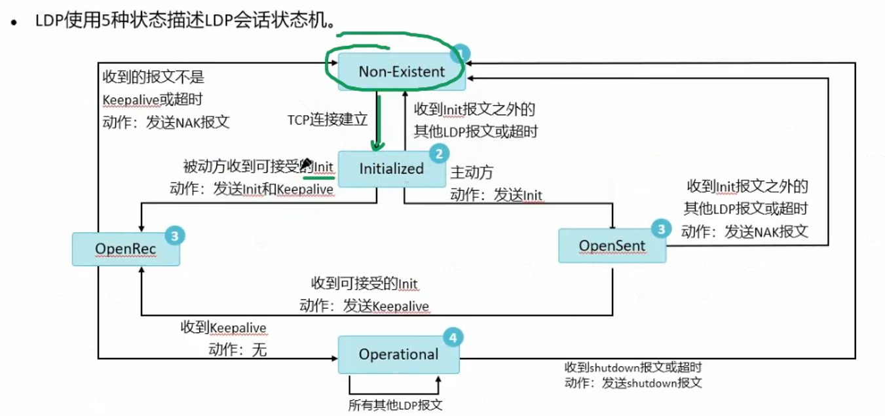
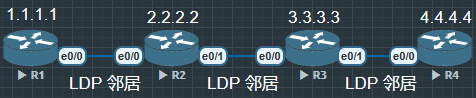

# LDP(Label Distribution Protocol) 

是一种**在 MPLS 网络中哟关于分发标签的(Label)**的协议, 作用是**让网络中所有运行 MPLS 的路由器互相告知"我对某个目的网络分配了哪个标签"**


其实 CISCO 有个私有叫做 TDP 的私有协议, 但是现在 CISCO 自己也不用了

**概述**


- LDP 是 MPLS 的一种控制协议, 相当于传统网络中的信令协议, 负责 FEC 的分类, 标签的分配以及 LSP 的建立和维护等操作. LDP 规定了标签分发过程中的各种消息以及相关处理过程

- LDP 的工作过程主要分为两部分
      1. LSR 之间建立 LDP 会话
      2. LSR 之间基于 LDP 会话动态交换标签与 FEC 的映射信息, 并根据标签信息建立 LSP
      
      (FEC 转发等价类, 相当于路由, LDP 给 IGP 分发标签, 不会给 EGP 分发标签)

- 为什么需要 LDP
    1. 在 MPLS 网络中, **转发不再依赖 IP 地址, 而是依赖标签**
    2. 如果没有一种机制让路由器之间共享这些标签信息, MPLS 就无法正常工作
    3. LDP 就是完成这个任务的协议

- MPLS 是一种根据报文携带的标签来转发数据的技术
- MPLS 的一个基本概念就是两台 LSR 必须对在它们之间转发的数据的标签使用上 "达成共识". LSR 之间可以运行 LDP(Label Distribution Protocol)从而实现标签报文的正确转发, 来告知其他 LSR 本设备上的标签绑定信息.





**LDP 的工作原理**

1. 发现阶段（Discovery）
    - 路由器使用 UDP 646 端口 发送 Hello 报文, 告诉邻居“我也支持 LDP”
    - 一旦两个设备互相发现, 就建立 TCP 连接

2. 会话建立（Session Establishment）
    - 使用 TCP 646 端口, LDP 邻居之间建立可靠连接

3. 标签分发（Label Distribution）
    - 邻居之间互相交换“FEC（Forwarding Equivalence Class, 转发等价类）”与“Label”的映射
    - 简单理解：FEC 就是“一类目的地址”, LDP 为每个 FEC 分配一个标签

4. 标签绑定（Label Binding）
    - 路由器把学到的标签放入 LFIB（Label Forwarding Information Base）, 用于真正的转发


## 配置


R1

```
R1(config)#router ospf 110
Router(config-router)#mpls ldp autoconfig ?
  area  Configure an OSPF area to run MPLS LDP
  <cr>

R1(config-router)#mpls ldp autoconfig // 全局开启 LDP 也可以分 area 开启 LDP
```

在R1 - R4 中配置 MPLS LDP

在 OSPF 中 MPLS 的 LDP 自动分发标签, 在 OSPF 中 如果配置时不带区域, 就是全区域配置**标签协议**


### 检查


**显示转发表**

显示转发表 `show mpls forwarding-table`

```
R1#show mpls forwarding-table
Local      Outgoing   Prefix           Bytes Label   Outgoing   Next Hop
Label      Label      or Tunnel Id     Switched      interface
16         Pop Label  2.2.2.2/32       0             Et0/0      12.1.1.2
17         17         3.3.3.3/32       0             Et0/0      12.1.1.2
18         18         4.4.4.4/32       0             Et0/0      12.1.1.2
19         Pop Label  23.1.1.0/24      0             Et0/0      12.1.1.2
20         19         34.1.1.0/24      0             Et0/0      12.1.1.2
```


显示转发表 `show mpls ldp bindings`

```
R1#show mpls ldp bindings
  lib entry: 1.1.1.1/32, rev 2
        local binding:  label: imp-null
        remote binding: lsr: 2.2.2.2:0, label: 16
  lib entry: 2.2.2.2/32, rev 4
        local binding:  label: 16
        remote binding: lsr: 2.2.2.2:0, label: imp-null
  lib entry: 3.3.3.3/32, rev 6
        local binding:  label: 17
        remote binding: lsr: 2.2.2.2:0, label: 17
  lib entry: 4.4.4.4/32, rev 8
        local binding:  label: 18
        remote binding: lsr: 2.2.2.2:0, label: 18
  lib entry: 12.1.1.0/24, rev 10
        local binding:  label: imp-null
        remote binding: lsr: 2.2.2.2:0, label: imp-null
  lib entry: 23.1.1.0/24, rev 12
        local binding:  label: 19
        remote binding: lsr: 2.2.2.2:0, label: imp-null
  lib entry: 34.1.1.0/24, rev 14
        local binding:  label: 20
        remote binding: lsr: 2.2.2.2:0, label: 19
```


## LDP会话, 邻接体, 会等体


- LSR之间交互标签绑定消息之前必须建立 LDP 会话. LDP 会话可以分为
      1. 本地 LDP 会话(Local LDP Session), 建立会话的两个 LSR 之间是直连的
      2. 远程 LDP 会话(Remote LDP Session), 建立会话的两个 LSR 之间可以是直连的, 也可以是非直连的

- 两台 LSR 之间交互 Hello 消息后, 即建立起邻接体(Adjiacency)关系

- 建立邻接体关系的基础上, 两台 LSR 之间交互 LDP 会话消息, 建立起 LDP 会话, 两台设备之间形成 LDP 对等体关系


### LSR ID 与 LDP ID


- 每一台运行了 LDP 的 LSR 除了必须配置 LSR ID, 还必须拥有 LDP ID
      1. LDP ID 的长度为48 bit, 由32 bit 的 LSR ID 与16 bit 的标符空间(Local Space ID)构成
      2. LDP ID 以 "LSR ID, 标符空间标识" 的形式呈现. 例如 2.2.2.2

- 标签空间标识一般存在两种形态     
      1. 值为0, 表示基于设备(或平台)的标签空间
      2. 值非0, 表示基于接口的标签空间 **(现在基本没有标签标识非0存在)**


```
R3#show mpls ldp neighbor
    Peer LDP Ident: 4.4.4.4:0; Local LDP Ident 3.3.3.3:0
        TCP connection: 4.4.4.4.14481 - 3.3.3.3.646
        State: Oper; Msgs sent/rcvd: 128/127; Downstream
        Up time: 01:43:06
        LDP discovery sources:
          Ethernet0/1, Src IP addr: 34.1.1.4
        Addresses bound to peer LDP Ident:
          34.1.1.4        4.4.4.4
    Peer LDP Ident: 2.2.2.2:0; Local LDP Ident 3.3.3.3:0
        TCP connection: 2.2.2.2.646 - 3.3.3.3.21280
        State: Oper; Msgs sent/rcvd: 127/127; Downstream
        Up time: 01:43:01
        LDP discovery sources:
          Ethernet0/0, Src IP addr: 23.1.1.2
        Addresses bound to peer LDP Ident:
          12.1.1.2        23.1.1.2        2.2.2.2
```





## LDP 会话建立, 发现阶段与 TCP 连接建立




在 TCP 连接建立阶段, LDP 协议通过 UDP 发现邻居, 使用 TCP 建立会话





```
R3#show mpls ldp discovery
 Local LDP Identifier:
    3.3.3.3:0
    Discovery Sources:
    Interfaces:
        Ethernet0/0 (ldp): xmit/recv
            LDP Id: 2.2.2.2:0
        Ethernet0/1 (ldp): xmit/recv
            LDP Id: 4.4.4.4:0
```

如果相邻路由器没有 IGP 协议, 但是也能建立 MPLS, 因为是接口直连可以互相发现邻居, 但是建立不了会话


```
R1#show mpls ldp discovery
 Local LDP Identifier:
    1.1.1.1:0
    Discovery Sources:
    Interfaces:
        Ethernet0/0 (ldp): xmit/recv
            LDP Id: 2.2.2.2:0
R1#show mpls ldp nei
R1#show mpls ldp neighbor
    Peer LDP Ident: 2.2.2.2:0; Local LDP Ident 1.1.1.1:0
        TCP connection: 2.2.2.2.28869 - 1.1.1.1.646
        State: Oper; Msgs sent/rcvd: 134/132; Downstream
        Up time: 01:48:08
        LDP discovery sources:
          Ethernet0/0, Src IP addr: 12.1.1.2
        Addresses bound to peer LDP Ident:
          12.1.1.2        23.1.1.2        2.2.2.2
```

```
R2#show mpls ldp neighbor
    Peer LDP Ident: 3.3.3.3:0; Local LDP Ident 2.2.2.2:0
        TCP connection: 3.3.3.3.21280 - 2.2.2.2.646
        State: Oper; Msgs sent/rcvd: 133/133; Downstream
        Up time: 01:48:19
        LDP discovery sources:
          Ethernet0/1, Src IP addr: 23.1.1.3
        Addresses bound to peer LDP Ident:
          23.1.1.3        34.1.1.3        3.3.3.3
    Peer LDP Ident: 1.1.1.1:0; Local LDP Ident 2.2.2.2:0
        TCP connection: 1.1.1.1.646 - 2.2.2.2.28869
        State: Oper; Msgs sent/rcvd: 133/134; Downstream
        Up time: 01:48:15
        LDP discovery sources:
          Ethernet0/0, Src IP addr: 12.1.1.1
        Addresses bound to peer LDP Ident:
          12.1.1.1        1.1.1.1
```

在 R1 与 R2 的 TCP connection, 2.2.2.2.28869, 1.1.1.1.646. 会有数字更大的首先发起会话


## LDP 协议原理


- 除了基本发现及之外, 可以通过拓展发现机制发现非直连的远端邻接体.

- LDP 的传输地址用于邻居建立 TCP 连接
      1. 两台 LSR 之间在建立 LDP 会话之前, 需要先建立 TCP 连接, 以便进行 LDP 协议报文的交换
      2. 设备的传输地址被包含在 LDP Hello 报文中, LSR 通过 Hello 报文知晓邻居的传输地址
      3. 在使用 Hello 报文发现邻居并且知道了对方的传输地址后, 邻居之间就会开始尝试 TCP 三次握手(基于传输地址), 并且交互 LDP 的初始化报文, 标签映射报文等, 这些报文都使用双方的传输地址作为源, 目的 IP 地址
      4. LSR 必须拥有到达邻居的传输地址的路由


### LDP 会话建立, 会话建立于保持





### LDP 会话状态机








**重置 LDP 邻居**

`R1#clear mpls ldp neighbor * `