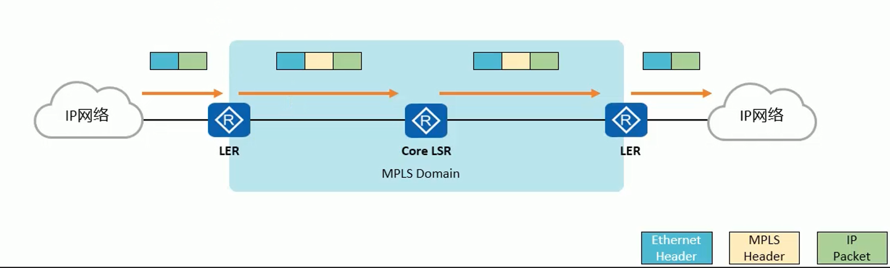
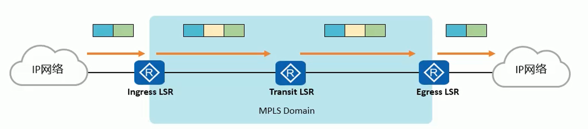
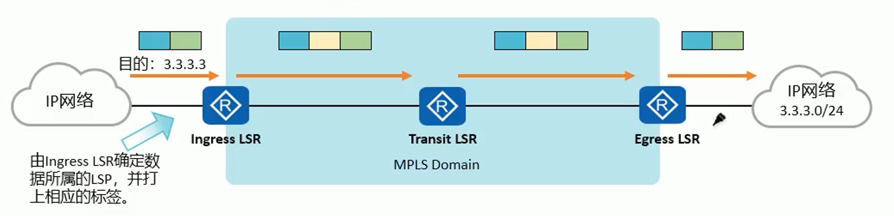
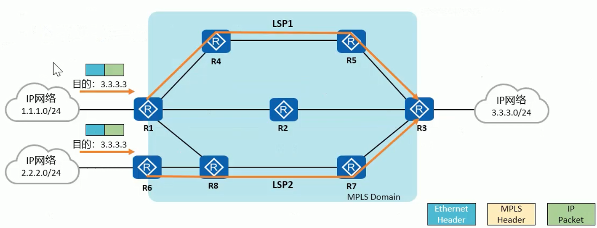
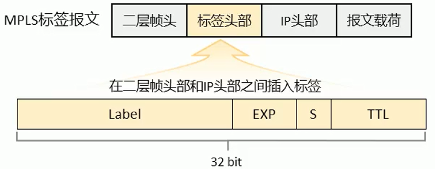

# LSR 与 MPLS 域

- MPLS 域(MPLS Domain), 一系列连续的运行 MPLS 的网络设备构成了一个 MPLS 域
- LSR(Label Switching Router), 支持 MPLS 的路由器(所有支持 MPLS 的设备, 路由器, 交换机, 防火墙, etc. 都可以称为 LSR). 
    1. 位于 MPLS 域边缘, 连接其他网络的 LSR 叫做 **LER(Label Edge Router)**
    2. 位于 MPLS 域内部, 称为**核心 LSR(Core LSR)**

## LSR 分类

- 入站 LSR(Ingress LSR), 通常是向 IP 报文压入 MPLS 头部并生成 MPLS 报文的 LSR
- 中转 LSR(Transit LSR), 通常是将 MPLS 报文进行例如标签置换操作, 并将报文继续在 MPLS 域中转发的 LSR
- 出站 LSR(Egress LSR), 通常是将 MPLS 报文中 MPLS 头部移除, 还原为 IP 报文的 LSR

### FEC

- FEC(Forwarding Equivalence Class, 转发等价类) 是一组具有某些共性的数据流的集合, 这些数据流在转发过程中被网络节点以相同方式处理
    
    1. 在 MPLS 网络中, FEC 可以通过多种方式划分, 例如基于**目的IP地址以及网络掩码**, DSCP 等特征来划分

    2. 数据属于哪一个 LSP, 由数据进入 MPLS 域时的 Ingress LSR 决定

    3. MPLS 标签通常是与 FEC 相对应的, 必须有某种机制使得网络中的 LSR 获得关于某 FEC 的标签信息

- 在传统的采用最长匹配算法的 IP 转发中, 匹配到同一条路由的所有报文就是一个转发等价类
- 在 MPLS 中, 关于 FEC 最常见的例子是: 目的 IP 地址匹配同一条 IP 路由的报文被认同属于通一个 FEC

#### LSP

- LSP(Label Switched Path, 标签交换路劲) 是标签报文穿越 MPLS 网络到达目的地所走的路径
- 同一个 FEC 的报文通常采用相同的 LSP 穿越 MPLS 域, 所以对同一个 FEC, LSR 总是用相同的标签转发

- 一条 LSP 包含一台入站 LSR, 一台出站 LSR 以及数量可变的中转 LSR, 因此 LSP 也可以看做是这些 LSR 的有序集合
- LSP 需要在数据转发开始前建立完成, 只有这样报文才能顺利穿越 MPLS 域
- LSP 可通过静态和动态两种方式建立
- 需要注意的是, LSP是一个从"起点"到"终点"的单向路劲, 若需要双向数据互通, 则需要在双方之间建立双向的 LSP

## MPLS 标签

- IP 报文进入 MPLS 域之前, 会被入站 LSR 压入 MPLS 头部(又称 MPLS 标签), 形成一个 MPLS 标签报文. 一个标签报文可以包含一个或多个 MPLS 标签
    
    1. 标签(Label), 用于携带标签值, 长度20 bit
    2. EXP(Experimental Use), 主要用于 QoS(Class of Service), 长度3 bit
    3. S(Bottom of Stack), 栈底位, 用于指示该标签头部是否为最后一层标签, 长度1 bit.
        - 如果该字段为1, 则表示当前标签头部为栈底
        - 如果该字段为0, 则表示当前标签头部之后依然还有其他标签头部
    4. TTL(Time To Live), 用于当网络出现环路时, 防止标签报文被无限制转发, 与 IP 报文头部中的 TTL 具有相同的意义, 长度8 bit

EXP 表示标签的优先级

MPLS 的 TTL 与 IP 报文中的 TTL 相等

https://wiki.wireshark.org/samplecaptures

在 Wire Shark 中可以找到相应的报文范本

### MPLS 标签栈

- MPLS 支持一层或多层标签头部, 这些标签头部的有序集合被称为**标签栈(Label Stack)**
- 当标签栈中存在多个标签时, 这些标签的顺序是非常讲究的:
    1. 最靠近二层头部的标签是栈顶标签, 标签中的 s 字段为0
    2. 最靠近 IP 头部的标签是栈底标签, 标签中的 s 字段为1

当上层为 MPLS 标签栈时, 以太网头部中的 Type 字段为 0X8847, PPP 头部中的 Protocol 字段为 0X8281          

这个以太网头部的 Type字段比较重要, 让路由器知道, 这是一个标签包还是IP包

标签: 0x8847

IPv4: 0x0806
