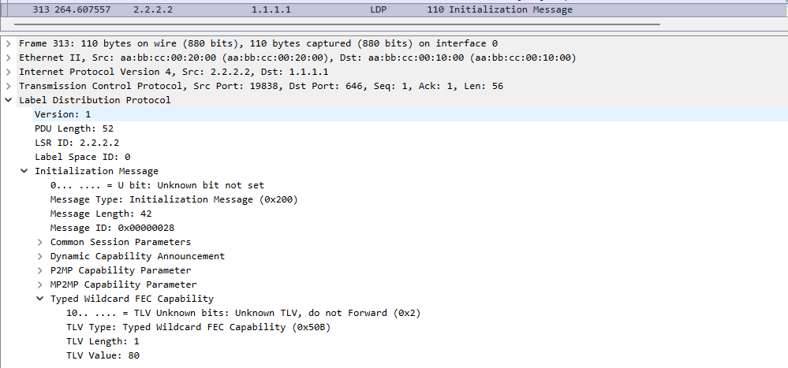
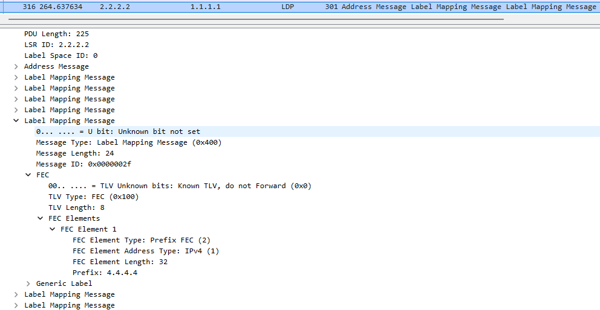
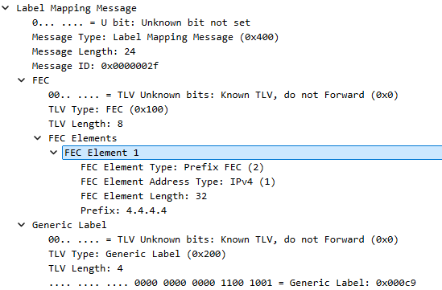

# 标签空间


- 标签时一个短而定长的, 只具有本地意义的标识符. 
- 对 CISCO 来说, 这个可配置标符空间式可以自定义的:
    1. `R1(config)#mpls label range?`
        `(16-1048575) Minimum label value for dynamic label range`
        `R1(config)#mpls label range 100 199`
    2. 标签一旦分配给某条路由就不能再重新分配, 如果改路由需要分配新标签, 需要重启路由器(reload), 因为默认标签已经生效

- 标签空间就是值标签的取值范围. 标签值得范围及规划如下:


|**标签值**|**描述**|
|:---:|:---:|
|0 - 15|特殊标签值, 例如0被定义为 IPv4 显式空标签(IPv4 Explicit NULL Label), 标签值3被定义为隐式空标签(Implicit NULL Label)|
|16 - 1048575|LDP, RSVP-TE, MP-BGP等动态信令协议的标签空间. 动态信令协议的标签空间不是共享的, 而是独立且连续的, 互不影响|

标签只具有本地意义, 每一台 LSR 之间的标签空间是互相独立的, 即每台路由器都可以使用完整的标签空间


## MPLS 标签的处理


标签的生成时从下游到上游, 从目的地址到源地址


PUSH(压入) - SWAP(交换) - POP(弹出)


## 配置


所有路由器事先OSPF互联,再依次配置

```
R1(config)#router ospf 110
R1(config-router)#router id 1.1.1.1
R1(config-router)#mpls ldp autoconfig

R1(config)#mpls label range 100 199
```


全部建立 LDP 协议, 所有路由器会分配 LDP 标签, 在抓包中可以看到 IP 头部后2.5层会有一个标签包


### MPLS 标签栈


- MPLS 支持一层或多层标签头部, 这些标签头部的有序集合被称为标签栈(Label Stack)
- 当标签栈中存在多个标签时, 这些标签的顺序是非常讲究的
    1. 最靠近 IP 头部的标签是栈底标签, 标签中的 s 字段为1
    


路由器收到会根据 Type 类型知道应该是按照 IP 转发还是按照 MPLS 标符转发


```
R1#traceroute 4.4.4.4
Type escape sequence to abort.
Tracing the route to 4.4.4.4
VRF info: (vrf in name/id, vrf out name/id)
  1 12.1.1.2 [MPLS: Label 202 Exp 0] 1 msec 1 msec 0 msec
  2 23.1.1.3 [MPLS: Label 300 Exp 0] 1 msec 1 msec 1 msec
  3 34.1.1.4 2 msec 1 msec *
```


```
R1#traceroute mpls ipv4 4.4.4.4/32
Tracing MPLS Label Switched Path to 4.4.4.4/32, timeout is 2 seconds

Codes: '!' - success, 'Q' - request not sent, '.' - timeout,
  'L' - labeled output interface, 'B' - unlabeled output interface,
  'D' - DS Map mismatch, 'F' - no FEC mapping, 'f' - FEC mismatch,
  'M' - malformed request, 'm' - unsupported tlvs, 'N' - no label entry,
  'P' - no rx intf label prot, 'p' - premature termination of LSP,
  'R' - transit router, 'I' - unknown upstream index,
  'X' - unknown return code, 'x' - return code 0

Type escape sequence to abort.
  0 12.1.1.1 MRU 1500 [Labels: 202 Exp: 0]
L 1 12.1.1.2 MRU 1500 [Labels: 300 Exp: 0] 14 ms
L 2 23.1.1.3 MRU 1504 [Labels: implicit-null Exp: 0] 15 ms
! 3 34.1.1.4 17 ms
```


```
R1#traceroute 4.4.4.4 source 1.1.1.1 numeric
Type escape sequence to abort.
Tracing the route to 4.4.4.4
VRF info: (vrf in name/id, vrf out name/id)
  1 12.1.1.2 [MPLS: Label 202 Exp 0] 2 msec 2 msec 0 msec
  2 23.1.1.3 [MPLS: Label 300 Exp 0] 1 msec 1 msec 0 msec
  3 34.1.1.4 3 msec *  1 msec
```

可以看到每台路由器都会对标签压入或者交换


## TLV

TLV(Type Length Value) 是一种**可扩展的数据编码格式**

TLV 本身不是 MPLS 标签栈的一部分, 而是常出现在 MPLS 控制协议 中

| 字段             | 含义                   | 示例                |
| -------------- | -------------------- | ----------------- |
| **Type（类型）**   | 指示该字段表示的内容类型         | 比如「标签映射」、「路由信息」等  |
| **Length（长度）** | 指明 Value 部分的长度（多少字节） | 4 表示 Value 占 4 字节 |
| **Value（值）**   | 具体的数据内容              | 实际的标签、地址、参数等      |


### 用途


| 使用场景                                             | 所属协议                                 | 说明                         |
| ------------------------------------------------ | ------------------------------------ | -------------------------- |
| 标签分发                                             | **LDP（Label Distribution Protocol）** | LDP 使用 TLV 来携带标签绑定、地址映射等信息 |
| 标签交换路径建立                                         | **RSVP-TE（用于 MPLS-TE）**              | 使用 TLV 携带隧道属性、带宽需求等参数      |
| MPLS OAM（Operation, Administration, Maintenance） | 多种扩展协议                               | 用 TLV 携带诊断、性能监控数据          |




在 Initialization, Address / Address Withdraw, Label Mapping / Label Withdrew, Notification 都能在报文中看到 TLV

在建立建立的 TCP 报文中也能找到 TLV


同样在address meaasge label 报文中, 可以看到邻居传来的前缀和标签



也能看到相对的标签, 二进制




```
R1#traceroute 4.4.4.4 numeric
Type escape sequence to abort.
Tracing the route to 4.4.4.4
VRF info: (vrf in name/id, vrf out name/id)
  1 12.1.1.2 [MPLS: Label 201 Exp 0] 1 msec 1 msec 1 msec
  2 23.1.1.3 [MPLS: Label 300 Exp 0] 0 msec 0 msec 1 msec
  3 34.1.1.4 0 msec *  1 msec
```

numeric = 关键字


**注意** LDP 只会给 IGP 分发标签, 不会给 EGP 分发标签


标签转发信息库, 能看到各个路由的下一跳和其他信息

`show mpls forwading-table`

```
R1#show mpls forwarding-table
Local      Outgoing   Prefix           Bytes Label   Outgoing   Next Hop
Label      Label      or Tunnel Id     Switched      interface
100        Pop Label  2.2.2.2/32       0             Et0/0      12.1.1.2
101        Pop Label  23.1.1.0/24      0             Et0/0      12.1.1.2
102        201        4.4.4.4/32       0             Et0/0      12.1.1.2
103        202        3.3.3.3/32       0             Et0/0      12.1.1.2
104        203        34.1.1.0/24      0             Et0/0      12.1.1.2
```


对于 CISCO 来说, 还有一个 CEF 库, CSISCO Express Flowing 完全依靠 CEF 来转发

`show ip cef`

```
R1#show ip cef
Prefix               Next Hop             Interface
0.0.0.0/0            no route
0.0.0.0/8            drop
0.0.0.0/32           receive
1.1.1.1/32           receive              Loopback0
2.2.2.2/32           12.1.1.2             Ethernet0/0
3.3.3.3/32           12.1.1.2             Ethernet0/0
4.4.4.4/32           12.1.1.2             Ethernet0/0
12.1.1.0/24          attached             Ethernet0/0
12.1.1.0/32          receive              Ethernet0/0
12.1.1.1/32          receive              Ethernet0/0
12.1.1.2/32          attached             Ethernet0/0
12.1.1.255/32        receive              Ethernet0/0
23.1.1.0/24          12.1.1.2             Ethernet0/0
34.1.1.0/24          12.1.1.2             Ethernet0/0
127.0.0.0/8          drop
224.0.0.0/4          drop
224.0.0.0/24         receive
240.0.0.0/4          drop
255.255.255.255/32   receive
```


除了 CEF 表还有一个邻接表, 包含下一跳和 MAC 地址

`show adjacency`

`show adjacency detail`

```
R1#show adjacency
Protocol Interface                 Address
IP       Ethernet0/0               12.1.1.2(14)
TAG      Ethernet0/0               12.1.1.2(7)
```


```
R1#show adjacency detail
Protocol Interface                 Address
IP       Ethernet0/0               12.1.1.2(14)
                                   0 packets, 0 bytes
                                   epoch 0
                                   sourced in sev-epoch 0
                                   Encap length 14
                                   AABBCC002000AABBCC0010000800
                                   ARP
TAG      Ethernet0/0               12.1.1.2(7)
                                   0 packets, 0 bytes
                                   epoch 0
                                   sourced in sev-epoch 0
                                   Encap length 14
                                   AABBCC002000AABBCC0010008847
                                   ARP
```


LSR 收到一个IP报文, 就会查看 CEF 表, 将这个 IP 包压入一个标签头, 打上标签, 所以只要是 MPLS 协议必定要启用 CEF, `no ip cef` 命令是关闭 CEF, **注意 MPLS 排错 `ip cef`**

配置MPLS 一定不忘记 `ip cef`, 没有 IP CEF, LDP协议也会工作, 但是 `no ip cef` 的路由器不会参与标签转发