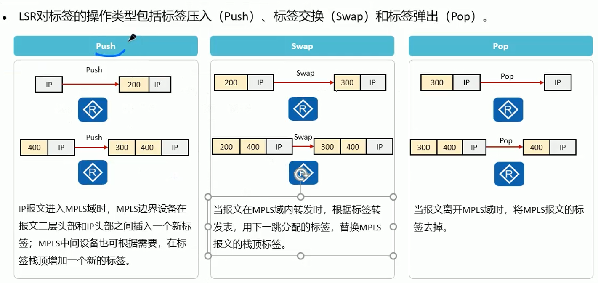
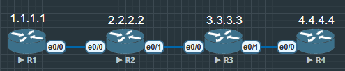
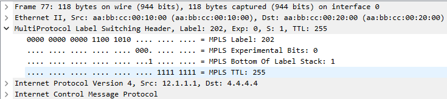
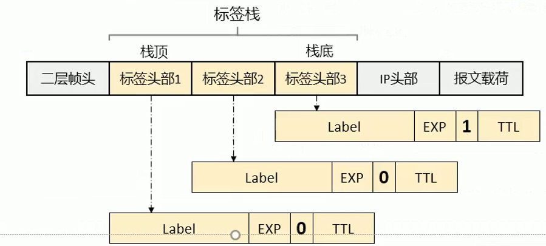

# 标签空间


- 标签时一个短而定长的, 只具有本地意义的标识符. 
- 对 CISCO 来说, 这个可配置标符空间式可以自定义的:
    1. `R1(config)#mpls label range?`
        `(16-1048575) Minimum label value for dynamic label range`
        `R1(config)#mpls label range 100 199`
    2. 标签一旦分配给某条路由就不能再重新分配, 如果改路由需要分配新标签, 需要重启路由器(reload), 因为默认标签已经生效

- 标签空间就是值标签的取值范围. 标签值得范围及规划如下:


|**标签值**|**描述**|
|:---:|:---:|
|0 - 15|特殊标签值, 例如0被定义为 IPv4 显式空标签(IPv4 Explicit NULL Label), 标签值3被定义为隐式空标签(Implicit NULL Label)|
|16 - 1048575|LDP, RSVP-TE, MP-BGP等动态信令协议的标签空间. 动态信令协议的标签空间不是共享的, 而是独立且连续的, 互不影响|

标签只具有本地意义, 每一台 LSR 之间的标签空间是互相独立的, 即每台路由器都可以使用完整的标签空间


## MPLS 标签的处理


标签的生成时从下游到上游, 从目的地址到源地址




PUSH(压入) - SWAP(交换) - POP(弹出)


## 配置





所有路由器事先OSPF互联,再依次配置

```
R1(config)#router ospf 110
R1(config-router)#router id 1.1.1.1
R1(config-router)#mpls ldp autoconfig

R1(config)#mpls label range 100 199
```


全部建立 LDP 协议, 所有路由器会分配 LDP 标签, 在抓包中可以看到 IP 头部后2.5层会有一个标签包




### MPLS 标签栈


- MPLS 支持一层或多层标签头部, 这些标签头部的有序集合被称为标签栈(Label Stack)
- 当标签栈中存在多个标签时, 这些标签的顺序是非常讲究的
    1. 最靠近 IP 头部的标签是栈底标签, 标签中的 s 字段为1
    


路由器收到会根据 Type 类型知道应该是按照 IP 转发还是按照 MPLS 标符转发


```
R1#traceroute 4.4.4.4
Type escape sequence to abort.
Tracing the route to 4.4.4.4
VRF info: (vrf in name/id, vrf out name/id)
  1 12.1.1.2 [MPLS: Label 202 Exp 0] 1 msec 1 msec 0 msec
  2 23.1.1.3 [MPLS: Label 300 Exp 0] 1 msec 1 msec 1 msec
  3 34.1.1.4 2 msec 1 msec *
```


```
R1#traceroute mpls ipv4 4.4.4.4/32
Tracing MPLS Label Switched Path to 4.4.4.4/32, timeout is 2 seconds

Codes: '!' - success, 'Q' - request not sent, '.' - timeout,
  'L' - labeled output interface, 'B' - unlabeled output interface,
  'D' - DS Map mismatch, 'F' - no FEC mapping, 'f' - FEC mismatch,
  'M' - malformed request, 'm' - unsupported tlvs, 'N' - no label entry,
  'P' - no rx intf label prot, 'p' - premature termination of LSP,
  'R' - transit router, 'I' - unknown upstream index,
  'X' - unknown return code, 'x' - return code 0

Type escape sequence to abort.
  0 12.1.1.1 MRU 1500 [Labels: 202 Exp: 0]
L 1 12.1.1.2 MRU 1500 [Labels: 300 Exp: 0] 14 ms
L 2 23.1.1.3 MRU 1504 [Labels: implicit-null Exp: 0] 15 ms
! 3 34.1.1.4 17 ms
```


```
R1#traceroute 4.4.4.4 source 1.1.1.1 numeric
Type escape sequence to abort.
Tracing the route to 4.4.4.4
VRF info: (vrf in name/id, vrf out name/id)
  1 12.1.1.2 [MPLS: Label 202 Exp 0] 2 msec 2 msec 0 msec
  2 23.1.1.3 [MPLS: Label 300 Exp 0] 1 msec 1 msec 0 msec
  3 34.1.1.4 3 msec *  1 msec
```

可以看到每台路由器都会对标签压入或者交换