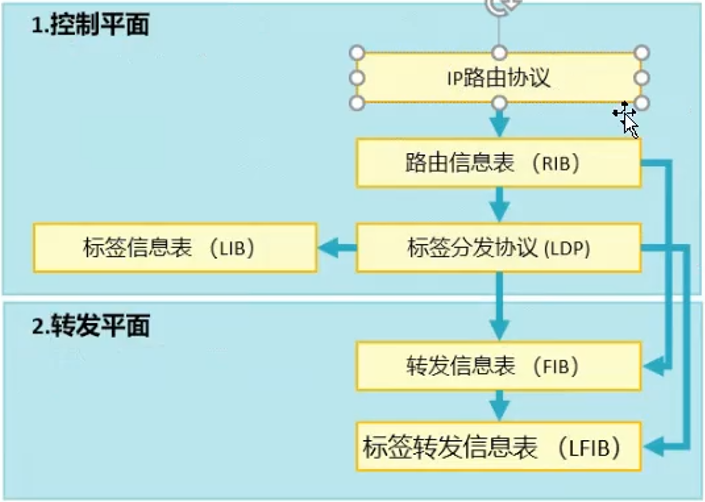
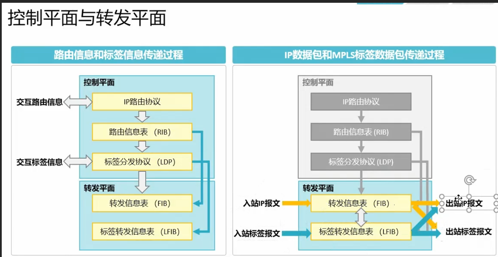
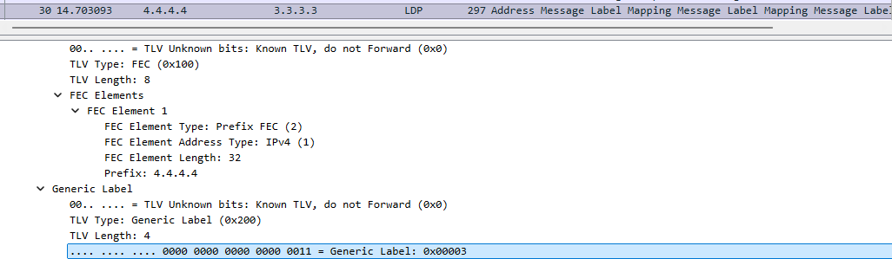
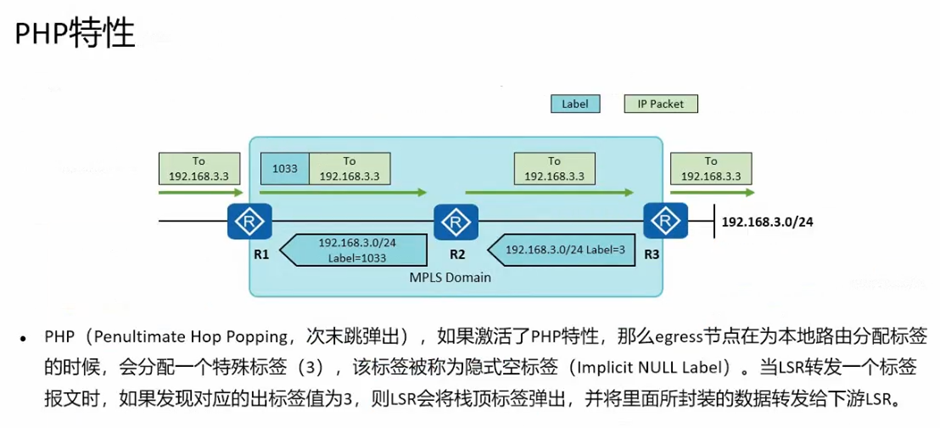

# MPLS 体系结构

- MPLS 的体系结构由**控制平面(Control Plane)**和**转发平面(Forwarding Plane)**组成

- 控制平面
    1. 负责产生和维护路由信息以及标签信息
    2. 控制平面包括 IP 路由协议和路由信息表, 标签分发协议和标签信息表

- 转发平面
    1. 也称数据平面(Data Plane), 负责普通 IP 报文的转发以及带 MPLS 标签报文的转发
    2. 转发平面包括 IP 转发信息表和标签转发信息表

**路由 转发 标签 不是同样的东西**

收到一个标签转发信息表, 路由器必须查库才知道具体是什么路由, 同样当这个标签包出站的时候 出站的时候也是标签包

R4 发给 R3 的标签必定是3, 因为最后一跳会给倒数第二条分配一个3的标签, 告诉要求剥离标签包, 所以最后传过去的是 IP 包

## PHP 特性

