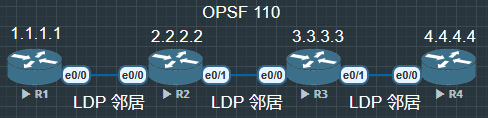

R1 - R4 OSPF 连接


```
R1(config)#ip cef
R1(config)#mpls label protocol ldp
R1(config)#mpls ldp router-id loopback 0 force // 强制使用 lo0 作为 LDP 的 Router-ID
R3(config)#router ospf 110
R1(config-router)#mpls ldp autoconfig
R1(config)#int e0/0
R1(config-if)#mpls ip // 接口模式, 精细化管理哪些接口参与 MPLS
R1(config)#mpls label range 100 199
```

R2 range 200 - 299
R3 range 300 - 399
R4 range 400 - 499


