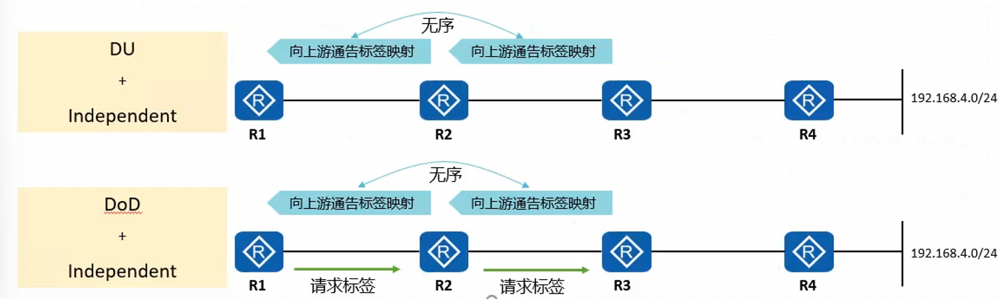
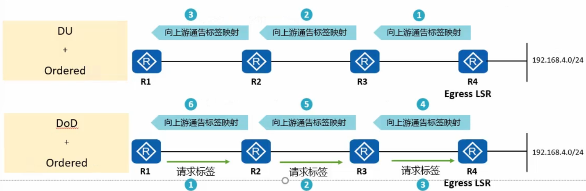
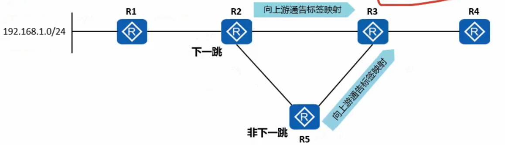
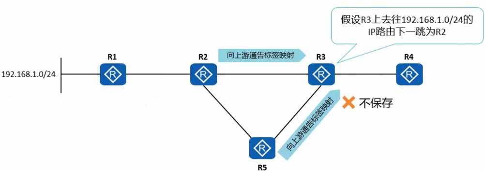

# 标签的发布和管理

- 在 MPLS 网络中, 下游 LSR 决定标签和 FEC 的绑定关系, 并将这种绑定关系发布给上游 LSR

-  LDP 通过发送标签请求和标签映射消息, 在 LDP 对等体之间通告 FEC 和标签的绑定关系来建立 LSP

- 标签的发布和管理由标签发布方式, 标签分配控制方式和标签保持方式来决定

|**内容**|**名称**|**默认**|**含义**|
|:-----:|:------:|:------:|:-----:|
|标签发布方式(Label Advertisement Mode)|下游自助方式(Downstream Unsolicited, DU)|是|对于一个特定的 FEC, LSR 无需从上游获得标签请求消息即进行标签分配与分发|
|标签发布方式(Label Advertisement Mode)|下游按需方式(Downstream on Demand, DoD)|否|对于一个特定的 FEC, LSR 获得标签请求消息之后才进行标签分配与分发|
|标签分配控制方式(Label Distribution Control Mode)|独立方式(Independent)|是|本地 LSR 可以自助地分配一个标签绑定到某个 FEC, 并通告给上游 LSR, 而无需等待下游的标签|
|标签分配控制方式(Label Distribution Control Mode)|有序方式(Ordered)|否|对于 LSR 上某个 FEC 的标签映射, 只有当该 LSR 已经具有此 FEC 下一跳的标签映射消息, 或该 LSR 就是此 FEC 的出节点时, 该 LSR 才可以向上游发送此 FEC 的标签映射|
|标签保持方式(Label Reterntion Mode)|自由方式(Liberal)|是|对于邻居 LSR 收到的标签映射, 无论邻居 LSR 是不是子的下一跳都保留|
|标签保持方式(Label Reterntion Mode)|保守方式(Conservative)|否|对于邻居 LSR 收到的标签映射, 只有当邻居 LSR 是自己的下一跳时才保留|

## 上游与下游

- MPLS 根据数据的转发方向确定上, 下游关系. 标签报文从上游 LSR 出发, 被下游 LSR 接受并处理.

- 如图所示, 对于到达 192.168.3.0/24 的 LSR 而言, R3 是 R2 的下游 LSR, R1 是 R2 的上游 LSR

### 标签发布方式: DU 模式

- 对于一个特定的 FEC, LSR 无需从上游获得标签请求消息即进行标签分配与分发

- LSR 会主动将自己为 FEC 捆绑的标签通告给上游邻居, 无需邻居先发起请求再通告

R1 ⬅ R2 ⬅ R3 (向上游通告标签映射)

## 标签发布方式

### 标签发布方式 DoD 模式

- 对于一个特定的 FEC, LSR 获得标签请求消息之后才进行标签分配与发布

- 一般情况下, 对特定的 FEC 的访问需求会触发标签请求消息

R1 ⬅ R2 ⬅ R3 (向上游通告标签映射)

R1 ➡ R2 ➡ R3 (请求标签, 当 R1 有访问 192.168.3.0/24 的需求)

只有上有邻居向自己请求标签映射时, LSR 才会通告标签映射给该邻居

### 标签分配控制方式: 独立模式

- 独立(Independent)模式

    - 本地 LSR 可以自主地分配一个标签绑定到某个 FEC, 并通告给上游 LSR, 而无需等待下游的标签
    
    

### 标签分配控制方式: 有序模式

- 有序(Ordered)模式

    - 对于 LSR 上某个 FEC 的标签映射, 只有当该 LSR 已经具有此 FEC 下一跳的标签映射消息, 或该 LSR 就是此 LSR 就是此 FEC 就是此 FEC 的出节点时, 该 LSR 才可以向上游发送此 FEC 的标签映射
    

(有序模式标签路劲完整, 但是速度慢)

## 标签保留

### 标签保留: 自由模式

- 自由(liberal)模式

    - LSR 收到的标签映射可能来自下一跳, 也可能来自非下一跳

    - 对于从邻居 LSR 收到的标签映射, 无论邻居 LSR 是不是自己的下一跳都保留

当基于 IP 网络部署 MPLS 时, LSR 根据 IP 路由表判断接收到的标签映射是否来自下一跳

Liberal 方式的最大有点在于路由发生变化时, 能够快速建立新的 LSP 进行数据转发, 因为 liberal 方式保留了所有的标签, 缺点时需要分发和维护不必要的标签映射

### 标签保留: 保守模式

- 保守(Conservative)模式
    
    - 对于从邻居 LSR 收到的标签映射, 只有当邻居 LSR 时自己的下一跳才保留
    
    

- Conservative 方式的优点在于只需要保留和维护用于转发数据的标签, 以达到节约标签的目的  

    - 当使用 DU 标签分发方式时, LSR 可能从多个 LDP 邻居收到统一网段的标签映射消息, 如图中 R3 和 R5 收到网段 192.168.1.0/24 的标签映射消息. 如果采用 Conservative 保守方式, 则 R3 只保留下一跳 R2 发来的标签, 丢弃非下一跳 R5 发来的标签

    - 当使用 DoD 标签分发方式时, LSR 根据路由信息只向它的下一跳请求标签

- 当网络拓扑变化引起下一跳邻居改变时

    - 使用自由标签保持方式, LSR 可以直接利用原来非下一跳邻居发来的标签, 迅速重建 LSP, 但需要更多的内存和标签空间

    - 使用保守标签保持方式, LSR 只保留来自下一跳邻居的标签, 节省了内存和标签空间, 但 LSP 的重建会比较慢

    - 保守标签保持方式通常与 DoD 方式一起, 用于标签空间有限的 LSR
    