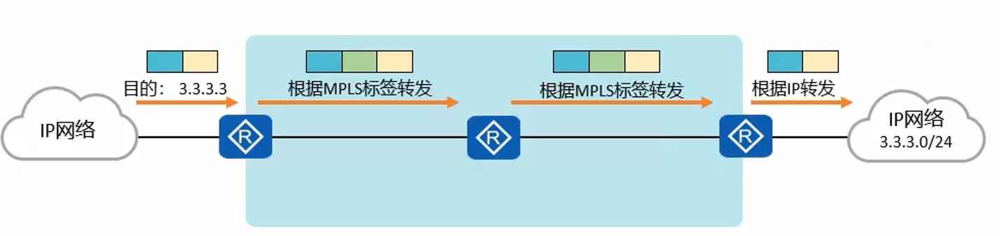

# MPLS(Multiple Protocol Label Switching) 背景

- 由于20世纪90年代, 硬件技术存在限制瓶颈, 传统的 IP 报文又依赖路由器查询路由表转发, 导致转发性能低
- MPLS 多协议标签交换被发明, MPLS 只在网络边缘分析 IP 报文头, 在网络内部采用 标签(Label) 转发, 节约性能
- 现在已经解决硬件性能问题, MPLS 由于支持多层标签嵌套和设备内转控分离的特点, 在 VPN(Virtual Private Network), QoS(Quality of Service) 等应用中得到广泛应用

## 传统 IP 路由转发

- 传统 IP 是逐跳转发, 数据报文经过每一台路由器, 都要解封装查看报文网络层信息, 之后根据路由最长匹配查找路由表再封装进行转发

### MPLS 基本概念

- MPLS 位于 TCP/IP 协议栈中的数据链路层和网络层之间, 可以向所有的网络层提供服务
- 通过再数据链路层和网络层之间额外增加 MPLS 头部, 基于 MPLS 头部实现数据快速转发

