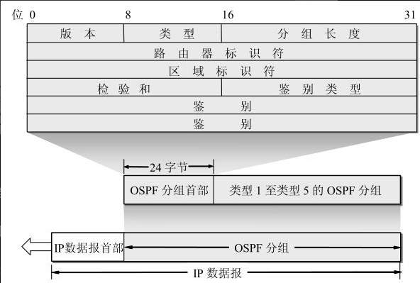

## OSPF 特点

1. OSPF协议的基本特点
Open Shortest Path Frist, OSPF是一种开放协议, 使用最短路径算法SPF.
- 同区域中所有路由器都会泛洪向邻居发送信息, 每个路由器又再次将信息发往其他相邻路由器, 最终同区域内所有路由器都拥有相同信息副本.
- 发送的信息就是与本路由器相邻的所有路由器的链路状态. 包含本路由器和哪些路由器相邻, 该链路的 "度量" metric值, OSPF使用 metric 开计算路由开销. 
- 只有当链路状态发生变化, 路由器才会向所有路由器泛洪.

2. 由于各路由器之间频繁地交换链路状态信息，因此所有的路由器最终都能建立一个链路状态数据库(link-state database)，这个数据库实际上就是全网的拓扑结构图。
- 这个拓扑结构图在全网范围内是一致的（这称为链路状态数据库的同步）​

3. 为了使OSPF能够用于规模很大的网络，OSPF将一个自治系统再划分为若干个更小的范围，叫作区域(area)。
- 每一个区域都有一个32位的区域标识符（用点分十进制表示）
- 一个区域也不能太大，在一个区域内的路由器最好不超过200个。

## OSPF 区域
1. 划分区域是为了整个网络上的通信量。
- 在一个区域内部的路由器只知道本区域的完整网络拓扑，而不知道其他区域的网络拓扑的情况。

2. 为了使每一个区域能够和本区域以外的区域进行通信，OSPF使用层次结构的区域划分。在上层的区域叫作主干区域(backbone area)。主干区域的标识符规定为0. 主干区域的作用是用来连通其他在下层的区域.
- 从其他区域来的信息都由区域边界路由器(area border router)进行概括, 每一个区域至少应当有一个区域边界路由器。
- 在主干区域内的路由器叫做主干路由器(backbonerouter). 一个主干路由器可以同时是区域边界路由器, 在主干区域内还要有一个路由器专门和本自治系统外的其他自治系统交换路由信息.

3. OSPF不用UDP而是直接用IP数据报传送(其IP数据报首部的协议字段值为89)
- OSPF构成的数据报很短。这样做可减少路由信息的通信量
- OSPF分组使用24字节的固定长度首部, 分组的数据部分可以是五种类型分组中的一种

## OSPF 报文

1. 版本 当前的版本号是
2. 类型 可以是五种类型分组中的一种
3. 分组长度 包括OSPF首部在内的分组长度，以字节为单位
4. 路由器标识符 标志发送该分组的路由器的接口的IP地址
5. 区域标识符 分组属于的区域的标识符
6. 检验和 用来检测分组中的差错
7. 鉴别类型 目前只有两种 0（不用）和1（口令）​
8. 鉴别 鉴别类型为0时就填入0。鉴别类型为1则填入8个字符的口令。

除了以上的几个基本特点外，OSPF还具有下列的一些特点：
1) OSPF允许管理员给每条路由指派不同的开销
2) 如果到同一个目的网络有多条相同代价的路径，那么可以将通信量分配给这几条路径。这叫作多路径间的负载均衡（load balancing）
3) 所有在OSPF路由器之间交换的分组（例如，链路状态更新分组）都具有鉴别的功能，因而保证了仅在可信赖的路由器之间交换链路状态信息
4) OSPF支持可变长度的子网划分和无分类的编址CIDR
5) 由于网络中的链路状态可能经常发生变化，因此OSPF让每一个链路状态都带上一个32位的序号，序号越大状态就越新。OSPF规定，链路状态序号增长的速率不得超过每5秒钟1次。这样，全部序号空间在600年内不会产生重复号

## OSPF 报文类型

OSPF的五种分组类型OSPF共有以下五种分组类型：
1) 类型1，问候(Hello)分组，用来发现和维持邻站的可达性
2) 类型2，数据库描述(Database Description)分组，向邻站给出自己的链路状态数据库中的所有链路状态项目的摘要信息
3) 类型3，链路状态请求(Link State Request)分组，向对方请求发送某些链路状态项目的详细信息
4) 类型 4，链路状态更新(Link State Update)分组，用洪泛法对全网更新链路状态。这种分组是最复杂的，也是OSPF协议最核心的部分。路由器使用这种分组将其链路状态通知给邻站。
5) 类型5，链路状态确认(Link State Acknowledgment)分组，对链路更新分组的确认。