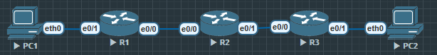

## 阻止icmp

```
1(config)#ip dhcp pool USER

R1(dhcp-config)#network 10.1.1.0 /24
R1(dhcp-config)#default-router 10.1.1.254

R1(config)#ip dhcp excluded-address 10.1.1.254

R1(config)#router ospf 110

R1(config-router)#router-id 1.1.1.1

R1(config)#int e0/0
R1(config-if)#ip address 12.1.1.1 255.255.255.0
R1(config-if)#no shu
R1(config-if)#ip ospf 110 area 0

R1(config)#int e0/1
R1(config-if)#ip address 10.1.1.254 255.255.255.0
R1(config-if)#no shu
R1(config-if)#ip o 110 a 0
```

R3

```
R3(config)#ip dhcp pool SERVER
R3(dhcp-config)#network 10.3.3.0 /24
R3(dhcp-config)#default-router 10.3.3.254

R3(config)#ip dhcp excluded-address 10.3.3.254

R3(config)#router ospf 110
R3(config-router)#router-id 3.3.3.3

R3(config)#int e0/0
R3(config-if)#ip address 23.1.1.3 255.255.255.0
R3(config-if)#no shu
R3(config-if)#ip ospf 110 area 0

R3(config)#int e0/1
R3(config-if)#ip address 10.3.3.254 255.255.255.0
R3(config-if)#ip ospf 110 area 0
```

R2

```
// 配置好OSPF

R2(config)#ip access-list extended BLOCK
R2(config-ext-nacl)#remark PC-A to Server any protocol 
deny ip 10.1.1.0 0.0.0.255 10.3.3.0 0.0.0.255
// 如果要deny精确地址, 使用命令 'deny ip host 10.1.1.1 host 10.3.3.1'
R2(config-ext-nacl)#remark Permit all the rest 
R2(config-ext-nacl)#permit ip any any // 批准任意源ip访问任意目的ip

R2(config)#int e0/0
R2(config-if)#ip access-group BLOCK in 
// 在接口调用 BLOCK
```

这个时候源头为 10.1.1.0 的网段已经不能访问目的网段 10.3.3.0

```
PC1> ping 10.3.3.1

*12.1.1.2 icmp_seq=1 ttl=254 time=0.285 ms (ICMP type:3, code:13, Communication administratively prohibited)
```

但是除了这个这个网段, 其他网段能正常访问

```
R1#ping 10.3.3.1 source e0/0
Type escape sequence to abort.
Sending 5, 100-byte ICMP Echos to 10.3.3.1, timeout is 2 seconds:
Packet sent with a source address of 12.1.1.1
!!!!!
Success rate is 100 percent (5/5), round-trip min/avg/max = 1/1/2 ms
```

- access-list 的详细列表有:
    1. standard
        1) 标准 ACL，只能匹配源 IP 地址。
        2) 常用于“阻止某台主机/子网访问任何目标”。
        3) 写法简单：access-list 1 deny host 10.1.1.10
    2. extended
        1) 扩展 ACL，可以匹配源 IP、目标 IP、协议（ip/tcp/udp/icmp）、端口号（eq 80/443 等）。
        2) 更灵活，能精确限制“谁访问谁，用什么协议”。
        3) 写法如：deny tcp 10.1.1.0 0.0.0.255 10.3.3.0 0.0.0.255 eq 80
    3. helper
        1) 很少用，专门用来控制 DHCP helper-address 的流量。
        2) log-update / logging
        3) 控制 ACL 日志输出方式。比如 log 后缀的日志刷新频率。
    4. resequence
        1) 重新编号 ACL 条目的序号（像编辑时插行）。

验证排错:

```
R2#show access-lists BLCOK
Extended IP access list BLCOK
    10 deny ip 10.1.1.0 0.0.0.255 10.3.3.0 0.0.0.255 (10 matches)
    20 permit ip any any (119 matches)
```

`show ip interface e0/0`

```
Outgoing access list is not set
Inbound  access list is BLCOK
```

## 允许icmp 阻止http和https

```
R2(config)#ip access-list extended SUB_WEB_BLOCK
R2(config-ext-nacl)#remark 1. allow icmp first
R2(config-ext-nacl)#permit icmp 10.1.1.0 0.0.0.255 10.3.3.0 0.0.0.255
// 同样精确源和地址 使用 host x.x.x.x host x.x.x.x
R2(config-ext-nacl)#remark 2. deny http&https
R2(config-ext-nacl)#deny tcp 10.1.1.0 0.0.0.255 10.3.3.0 0.0.0.255 eq 80
R2(config-ext-nacl)#deny tcp 10.1.1.0 0.0.0.255 10.3.3.0 0.0.0.255 eq 443
// 精确地址使用host
R2(config-ext-nacl)#remark 3. allow the rest
R2(config-ext-nacl)#permit ip any any

R2(config)#int  e0/0
R2(config-if)#ip access-group SUB_WEB_BLOCK in
```

PC1

```
PC1> ping 10.3.3.1

84 bytes from 10.3.3.1 icmp_seq=1 ttl=61 time=1.805 ms
```

我的EVE-NG上验证不了

```
PC1> telent ?
Bad command: "telent ?". Use ? for help.

PC1> telent?
Bad command: "telent?". Use ? for help.

PC1> curl ?
Bad command: "curl ?". Use ? for help.

PC1> ssh ?
Bad command: "ssh ?". Use ? for help.
```

在R3上开启HTTP和HTTPS

```
R3(config)#ip http server

R3(config)#ip http secure-server
```

R1

```
R1#telnet 10.3.3.254 80
Trying 10.3.3.254, 80 ... Open
```