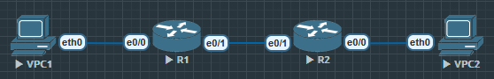

1. 理解 ACL 的位置与方向（in/out） 的设计原则：
- 靠近源端阻止（标准 ACL）
- 靠近目的端阻止（扩展 ACL，避免误杀其他流量）

2. 学习如何用扩展 ACL 实现 端口级控制：
- 阻止 telnet (TCP/23)
- 允许 http (TCP/80)
- 阻止特定网段访问服务器

```
R2(config)#ip access-list extended SET_FUNCTION
R2(config-ext-nacl)#deny tcp host 10.1.1.1 host 10.3.3.1 eq 23
R2(config-ext-nacl)#permit tcp host 10.1.1.1 host 10.3.3.1 eq 80
R2(config-ext-nacl)#deny ip 10.2.2.0 0.0.0.255 host 10.3.3.1
R2(config-ext-nacl)#permit ip any any

R2(config)#int e0/1
R2(config-if)#ip access-group SET_FUNCTION in

R2#show access-lists
Extended IP access list SET_FUNCTION
    10 deny tcp host 10.1.1.1 host 10.3.3.1 eq telnet
    20 permit tcp host 10.1.1.1 host 10.3.3.1 eq www
    30 deny ip 10.2.2.0 0.0.0.255 host 10.3.3.1
    40 permit ip any any (1 match)
```