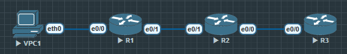

# 有状态防火墙(CBAC)

1. ACL与防火墙的区别
    - ACL：单向匹配规则（无状态），只能按条件允许或拒绝。
    - 防火墙：有状态（stateful），能跟踪连接状态（如TCP三次握手）。

2. 防火墙的基本类型
    - 包过滤防火墙（Packet Filter）：基于五元组（源IP、目的IP、协议、端口、方向）做控制。
    - 状态检测防火墙（Stateful Inspection）：跟踪会话，支持动态端口（如FTP数据通道）。
    - 应用层防火墙（Proxy / NGFW）：理解应用层协议（如HTTP、DNS），能做更细粒度控制。

实验思路

在 Cisco IOS 中，使用 CBAC（Context-Based Access Control） 可以实现类似状态防火墙的功能。

明天我们会动手配置 CBAC，今天只需要理解原理：

在出方向允许流量的同时，自动在返回流量方向插入动态ACL条目。

✅ 今日总结

你已经掌握了扩展ACL的放置与优化原则，并完成了一个更复杂的ACL实验。

你理解了 ACL与防火墙的根本区别，并认识了防火墙的三大类型。



在 R1 和 R3 上设置静态路由, 以及 R2 上设置到 10.1.1.0 和 10.3.3.0 的路由

`R1(config)#ip route 0.0.0.0 0.0.0.0 12.1.1.2`

`R3(config)#ip route 0.0.0.0 0.0.0.0 23.1.1.2`

```
R2(config)#ip route 10.1.1.0 255.255.255.0 12.1.1.1
R2(config)#ip route 10.3.3.0 255.255.255.0 23.1.1.3
```

## 启用 CBAC

```
R2(config)#ip inspect name FIREWALL tcp
R2(config)#ip inspect name FIREWALL udp
R2(config)#ip inspect name FIREWALL icmp
// 定义检查规则

R2(config)#int e0/0
R2(config-if)# ip inspect FIREWALL out
// 在出口上启用检测

R2(config)#access-list 100 permit ip any any
R2(config)#int e0/1
R2(config-if)#ip access-group 100 in
// 在进接口只允许被检查的流量返回, 在实际环境中, 需要ACL来配合CBAC使用, ACL决定哪些流量能in/out, CBAC决定回流是否允许.
```

### 验证命令
```
R2#show ip inspect all

R2#show ip inspect sessions
Established Sessions
 Session C5F53FA8 (10.1.1.1:8)=>(10.3.3.254:0) icmp SIS_OPEN
R2#show ip inspect sessions
Half-open Sessions
 Session C5F53FA8 (10.1.1.1:28914)=>(10.3.3.254:7) udp SIS_OPENING
```

## 总结

1. CBAC 本质
    - CBAC 是“有状态的防火墙检查”，但是它本身只会“插入动态条目”，并不会替代静态 ACL。
    - 出去的流量（Inside → Outside）被检查；
    - 回来的流量（Outside → Inside）会临时被动态放行。

## 语法

ip inspect name <Name> <protocol> 

- 其中 <protocol> 可以是：
    1. 通用协议：tcp、udp、icmp
    2. 应用协议：http、ftp、telnet、smtp、dns、h323、sip …（列表里几十个）

你选择什么协议，CBAC 就会跟踪什么类型的会话。

举例：

`ip inspect name FIREWALL tcp`
→ 检查所有 TCP 流量，能动态放行回流。

`ip inspect name FIREWALL http`
→ 专门检查 HTTP，会话返回自动放行，还能防御某些 HTTP 攻击。

`ip inspect name FIREWALL ftp`
→ 检查 FTP：FTP 有 控制通道（21） 和 数据通道（20 或者动态端口），普通 ACL 很难处理，但 CBAC 能自动识别，动态放行数据通道。

- 附加选项
    
    `ip inspect name FIREWALL tcp ?` 时，会出现这些子选项：

        alert
        打开/关闭报警信息（syslog 报警）。

        audit-trail
        开启详细日志，记录每个会话的建立/关闭，方便审计。

        router-traffic
        让路由器自己发出的流量也能被检查（默认只检查经过的流量）。

        timeout <秒数>
        设置会话空闲多久后自动删除，比如 TCP 默认 3600 秒。

| 协议         | Inspect 命令                        | 为什么要单独检查                  | 效果                              |
| ---------- | --------------------------------- | ------------------------- | ------------------------------- |
| **TCP**    | `ip inspect name FIREWALL tcp`    | 通用 TCP 流量，保证返回会话自动放行      | 适用所有 TCP 应用，但不解析应用层             |
| **UDP**    | `ip inspect name FIREWALL udp`    | UDP 无连接，默认 ACL 难处理        | 自动允许返回的 UDP 报文                  |
| **ICMP**   | `ip inspect name FIREWALL icmp`   | ICMP 请求/应答是一对，ACL 无状态     | 允许 Echo-Reply、Time-Exceeded 等回流 |
| **HTTP**   | `ip inspect name FIREWALL http`   | 可解析 HTTP 流量，支持应用层安全       | 回流允许，还能做 URL/头部检查（老 IOS）        |
| **FTP**    | `ip inspect name FIREWALL ftp`    | FTP 控制通道(21) 和数据通道(20/动态) | 能识别 PORT/PASV，自动放行数据连接          |
| **SMTP**   | `ip inspect name FIREWALL smtp`   | 邮件协议，可被滥用                 | 检查 SMTP 流量，阻止恶意命令               |
| **DNS**    | `ip inspect name FIREWALL dns`    | DNS 请求/响应 UDP 53          | 允许正确的响应通过                       |
| **H.323**  | `ip inspect name FIREWALL h323`   | VoIP 协议，需动态开媒体流端口         | 自动放行音视频端口                       |
| **SIP**    | `ip inspect name FIREWALL sip`    | VoIP 信令协议                 | 检查 SIP INVITE、动态放 RTP/RTCP      |
| **SQLNet** | `ip inspect name FIREWALL sqlnet` | Oracle SQL\*Net 使用动态端口    | 自动跟踪 Oracle 会话                  |
| **TFTP**   | `ip inspect name FIREWALL tftp`   | 无连接协议，客户端随机端口             | 动态允许 TFTP 的返回流量                 |
