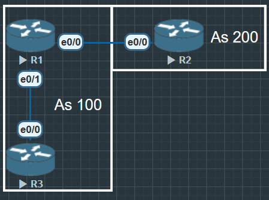

R1 与 R2 建立 EBGP 邻居

R1 与 R3 建立 IBGP 邻居

**R1**

```
R1(config)#router ospf 110
R1(config-router)#router-id 1.1.1.1

R1(config)#int lo0
R1(config-if)#ip address 1.1.1.1 255.255.255.255
R1(config-if)#no shu
R1(config-if)#ip ospf 110 area 0

R1(config)#int e0/0
R1(config-if)#ip address 12.1.1.1 255.255.255.0
R1(config-if)#no shu

R1(config)#int e0/1
R1(config-if)#ip address 13.1.1.1 255.255.255.0
R1(config-if)#no shu
R3(config-if)#ip ospf 110 area 0

R1(config)#router bgp 100
R1(config-router)#bgp router-id 1.1.1.1
R1(config-router)#neighbor 12.1.1.2 remote-as 200
R1(config-router)#network 1.1.1.1 mask 255.255.255.255

R1(config)#router bgp 100
R1(config-router)#neighbor 3.3.3.3 remote-as 100
R1(config-router)#neighbor 3.3.3.3 update-source lo0
```

**R2**

```
outer(config)#hostname R2
R2(config)#int lo0
R2(config-if)#ip address 2.2.2.2 255.255.255.255
R2(config-if)#no shu

R2(config)#int e0/0
R2(config-if)#ip address 12.1.1.2 255.255.255.0
R2(config-if)#no shu

R2(config)#router bgp 200
R2(config-router)#bgp router-id 2.2.2.2
R2(config-router)#neighbor 12.1.1.1 remote-as 100
R2(config-router)#network 2.2.2.2 mask 255.255.255.255
```

**R3**

```
R3(config)#router ospf 110
R3(config-router)#router-id 3.3.3.3

R3(config)#int lo0
R3(config-if)#ip address 3.3.3.3 255.255.255.255
R3(config-if)#no shu
R3(config-if)#ip ospf 110 area 0

R3(config)#int e0/0
R3(config-if)#ip address 13.1.1.3 255.255.255.0
R3(config-if)#no shu
R3(config-if)#ip ospf 110 area 0

R3(config)#router bgp 100
R3(config-router)#bgp router-id 3.3.3.3
R3(config-router)#neighbor 1.1.1.1 remote-as 100
R3(config-router)#neighbor 1.1.1.1 update-source lo0
```

show ip bgp summary：检查邻居状态是否 Established

show ip bgp：查看路由表中 BGP 路由

show ip bgp neighbors：查看邻居详细状态