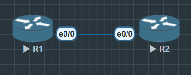

1. 为什么需要 BGP？
- OSPF/EIGRP 属于 IGP，适合小到中等规模网络。
- BGP 是 唯一的 EGP，用于连接不同的自治系统（AS），支撑互联网。
- BGP 的特点：
    1) 基于 TCP（179端口）保证可靠性
    2) 支持海量路由（数十万条）
    3) 强调策略控制，而不是最短路径

2. 基本概念
- AS（Autonomous System）：一组由单一管理策略控制的网络。
- EBGP：不同 AS 之间的 BGP（如 ISP 与企业）。
- IBGP：同一 AS 内的 BGP（用于分布外部学到的路由）。
- BGP 邻居建立的条件：
    1) 直连（EBGP 默认要求）
    2) 手动配置对端 IP 和 AS

3. BGP 的重要属性（后续几天会逐步深入）：
- AS-PATH
- NEXT-HOP
- LOCAL-PREFERENCE
- MED
- Weight（Cisco 专有）



## 建立EBGP邻居

**R1**

```
R1(config)#int lo0
R1(config-if)#ip address 1.1.1.1 255.255.255.255
R1(config-if)#no shu

R1(config)#int e0/0
R1(config-if)#ip address 12.1.1.1 255.255.255.0
R1(config-if)#no shu

R1(config)#router bgp 100
R1(config-router)#bgp router-id 1.1.1.1
R1(config-router)#neighbor 12.1.1.2 remote-as 200
R1(config-router)#network 1.1.1.1 mask 255.255.255.255
```

**R2**

```
outer(config)#hostname R2
R2(config)#int lo0
R2(config-if)#ip address 2.2.2.2 255.255.255.255
R2(config-if)#no shu

R2(config)#int e0/0
R2(config-if)#ip address 12.1.1.2 255.255.255.0
R2(config-if)#no shu

R2(config)#router bgp 200
R2(config-router)#bgp router-id 2.2.2.2
R2(config-router)#neighbor 12.1.1.1 remote-as 100
R2(config-router)#network 2.2.2.2 mask 255.255.255.255
```

### 验证

```
R1#show ip bgp summary
BGP router identifier 1.1.1.1, local AS number 100
BGP table version is 3, main routing table version 3
2 network entries using 288 bytes of memory
2 path entries using 168 bytes of memory
2/2 BGP path/bestpath attribute entries using 320 bytes of memory
1 BGP AS-PATH entries using 24 bytes of memory
0 BGP route-map cache entries using 0 bytes of memory
0 BGP filter-list cache entries using 0 bytes of memory
BGP using 800 total bytes of memory
BGP activity 2/0 prefixes, 2/0 paths, scan interval 60 secs

Neighbor        V           AS MsgRcvd MsgSent   TblVer  InQ OutQ Up/Down  State/PfxRcd
12.1.1.2        4          200       9       8        3    0    0 00:04:02        1
```

#### 查询BGP路由

```
R1#show ip bgp
BGP table version is 3, local router ID is 1.1.1.1
Status codes: s suppressed, d damped, h history, * valid, > best, i - internal,
              r RIB-failure, S Stale, m multipath, b backup-path, f RT-Filter,
              x best-external, a additional-path, c RIB-compressed,
              t secondary path,
Origin codes: i - IGP, e - EGP, ? - incomplete
RPKI validation codes: V valid, I invalid, N Not found

     Network          Next Hop            Metric LocPrf Weight Path
 *>   1.1.1.1/32       0.0.0.0                  0         32768 i
 *>   2.2.2.2/32       12.1.1.2                 0             0 200 i
```