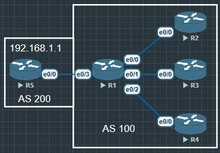

```
R1(config)#router bgp 100
R1(config-router)#bgp router-id 1.1.1.1
~~R1(config-router)#neighbor BGP_1 peer-group~~
~~R1(config-router)#neighbor BGP_1 remote-as 100~~
~~R1(config-router)#neighbor BGP_1 update-source lo0~~
~~R1(config-router)#neighbor BGP_1 next-hop-self~~
~~R1(config-router)#neighbor BGP_1 password 2109~~
//建立一个动态对等体组, 就不需要再挨个手动建立邻居并设置了
~~R1(config-router)#bgp listen limit 1000~~
~~R1(config-router)#bgp listen range 0.0.0.0/0 peer-group BGP_1~~
// 别建动态对等体组了, 老实挨个见建邻居或者建立对等体组, 别动态
R1(config-router)#neighbor 15.1.1.5 remote-as 200
```

R2

```
R2(config)#router bgp 100
R2(config-router)#bgp router-id 2.2.2.2
R2(config-router)#neighbor 1.1.1.1 remote-as 100
R2(config-router)#neighbor 1.1.1.1 password 2109
R2(config-router)#neighbor 1.1.1.1 update-source lo0
R2(config-router)#neighbor 1.1.1.1 next-hop-self
```

R3, R4同理, R5建立邻居AS 200, 同时在R5中宣告路由192.168.1.1/32, R2宣告22.22.22.22/32, R4宣告44.44.44.44/32

R1 BGP路由

```
R1#show ip bgp
...

     Network          Next Hop            Metric LocPrf Weight Path
 *>i  22.22.22.22/32   2.2.2.2                  0    100      0 i
 *>i  44.44.44.44/32   4.4.4.4                  0    100      0 i
 *>   192.168.1.1/32   15.1.1.5                 0             0 200 i
```

R3 BGP路由表

```
R3#show ip bgp
...

     Network          Next Hop            Metric LocPrf Weight Path
 *>i  192.168.1.1/32   1.1.1.1                  0    100      0 200 i
```

由于BGP的规则, 只会把EBGP路由传递给自己的IBGP邻居, 但是不会传递IBGP路由给自己的IBGP邻居, 所有R2不会有R4宣告的路由, 同理R4也不会有R2宣告的路由, R3什么都不会有.

简单说, 任何正常网络环境都不可能去实现BGP的全互联, 所以这时候需要路由反射, 分为CLient和 Non-client

现在把R2设置为反射客户端, R4设置为非客户端.

R1 

```
R1(config-router)#neighbor 2.2.2.2 route-reflector-client
```
现在R2上能看到所有的BGP路由

R2

```
R2#show ip bgp
...

     Network          Next Hop            Metric LocPrf Weight Path
 *>   22.22.22.22/32   0.0.0.0                  0         32768 i
 *>i  44.44.44.44/32   4.4.4.4                  0    100      0 i
 *>i  192.168.1.1/32   1.1.1.1                  0    100      0 200 i
```

但是R3除了EBGP路由外, 只有R2宣告的IBGP路由

R3

```
R3#show ip bgp
...

     Network          Next Hop            Metric LocPrf Weight Path
 *>i  22.22.22.22/32   2.2.2.2                  0    100      0 i
 *>i  192.168.1.1/32   1.1.1.1                  0    100      0 200 i

```

## 总结

路由反谁的规则是, 会把**客户端**的路由反射给**客户端**和**非客户端**, 也会把**非客户**端路由反射给**客户端**, 但是绝不会把**非客户端**路由反射给**非客户端**

以及注意下一跳, 最优解是在建立邻居时候加上命令 `next-hop-self` 要不会有下一跳不可达的问题.

