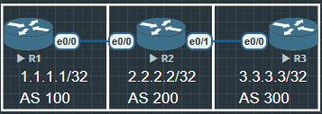

- AS-PATH：路由经过的 AS 列表，最短路径优先，用于防环。
- NEXT-HOP：指明下一跳 IP，IBGP 中默认不会改变，可能导致 “下一跳不可达” 的问题。
- LOCAL-PREFERENCE：在本 AS 内用于控制出口，数值越大越优先。
- MED (Multi Exit Discriminator)：告诉对方 AS 建议从哪里进入，数值越小越优先。
- Weight（Cisco 私有）：只在本地路由器生效，数值越大越优先。



## R1

```
R1(config)#int lo0
R1(config-if)#ip address 1.1.1.1 255.255
R1(config)#no shu

R1(config)#int e0/0
R1(config-if)#ip address 12.1.1.1 255.255.255.0
R1(config-if)#no shu

R1(config)#router bgp 100
R1(config-router)#bgp router-id 1.1.1.1
R1(config-router)#neighbor 12.1.1.2 remote-as 200
R1(config-router)#network 1.1.1.1 mask 255.255.255.255
```

## R2

```
R2(config)#int lo0
R2(config-if)#ip add
R2(config-if)#ip address 2.2.2.2 255.255.255.255
R2(config-if)#no shu

R2(config)#int e0/0
R2(config-if)#ip address 12.1.1.2 255.255.255.0
R2(config-if)#no shu

R2(config)#int e0/1
R2(config-if)#ip address 23.1.1.2 255.255.255.0
R2(config-if)#no shu

R2(config)#router bgp 200
R2(config-router)#bgp router-id 2.2.2.2
R2(config-router)#neighbor 12.1.1.1 remote-as 100
R2(config-router)#neighbor 23.1.1.3 remote-as 300
R2(config-router)#network 2.2.2.2 mask 255.255.255.255
```

## R3

```
Router(config)#hostname R3
R3(config)#int lo055.255.255
R3(config-if)#no shu

R3(config)#int e0/0
R3(config-if)#ip address 23.1.1.3 255.255.255.0
R3(config-if)#no shu

R3(config)#router bgp 300
R3(config-router)#bgp router-id 3.3.3.3
R3(config-router)#neighbor 23.1.1.2 remote-as 200
R3(config-router)#network 3.3.3.3 mask 255.255.255.255
```

## NEXT STEP

现在BGP 100 200 300 都建立了BGP邻居, 但是现在R1和R3是无法互相访问的, 虽然在BGP路由表已经由路由了, 但是没有回程路由.

```
R1#show ip bgp
BGP table version is 4, local router ID is 1.1.1.1
Status codes: s suppressed, d damped, h history, * valid, > best, i - internal,
              r RIB-failure, S Stale, m multipath, b backup-path, f RT-Filter,
              x best-external, a additional-path, c RIB-compressed,
              t secondary path,
Origin codes: i - IGP, e - EGP, ? - incomplete
RPKI validation codes: V valid, I invalid, N Not found

     Network          Next Hop            Metric LocPrf Weight Path
 *>   1.1.1.1/32       0.0.0.0                  0         32768 i
 *>   2.2.2.2/32       12.1.1.2                 0             0 200 i
 *>   3.3.3.3/32       12.1.1.2                               0 200 300 i

R1#ping 3.3.3.3
Type escape sequence to abort.
Sending 5, 100-byte ICMP Echos to 3.3.3.3, timeout is 2 seconds:
.....
Success rate is 0 percent (0/5)
```

# NEXT_HOP


## R4

```
R4(config)#int lo0
R4(config-if)#ip address 4.4.4.4 255.255.255.255
R4(config-if)#no shu

R4(config)#int e0/0
R4(config-if)#ip address 45.1.1.4 255.255.255.0
R4(config-if)#no shu

R4(config)#router bgp 100
R4(config-router)#bgp router-id 4.4.4.4
R4(config-router)#neighbor 45.1.1.5 remot
R4(config-router)#neighbor 45.1.1.5 remote-as 100
R4(config-router)#network 4.4.4.4 mask 255.255.255.255

R4(config)#ip route 0.0.0.0 0.0.0.0 45.1.1.5
```

## R5

```
R5(config)#int lo0
R5(config-if)#ip address 5.5.5.5 255.255.255.255
R5(config-if)#no shu

R5(config)#int e0/0
R5(config-if)#ip address 45.1.1.5 255.255.255.0
R5(config-if)#no shu

R5(config)#int e0/1
R5(config-if)#ip address 56.1.1.5 255.255.255.0
R5(config-if)#no shu

R5(config)#router bgp 100
R5(config-router)#bgp router-id 5.5.5.5
R5(config-router)#neighbor 56.1.1.6 remote-as 200
R5(config-router)#neighbor 45.1.1.4 remote-as 100
R5(config-router)#network 5.5.5.5 mask 255.255.255.255

R5(config)#ip route 0.0.0.0 0.0.0.0 56.1.1.6
```

## R6

```
R6(config)#int lo0
R6(config-if)#ip address 6.6.6.6 255.255.255.255
R6(config-if)#no shu

R6(config)#int e0/0
R6(config-if)#ip address 56.1.1.6 255.255.255.0
R6(config-if)#no shu

R6(config)#router bgp 200
R6(config-router)#bgp router-id 6.6.6.6
R6(config-router)#neighbor 56.1.1.5 remote-as 100
R6(config-router)#network 6.6.6.6 mask 255.255.255.255

R6(config)#ip route 0.0.0.0 0.0.0.0 56.1.1.5
```

NEXT-HOP 属性：

EBGP 学到的路由，默认 next-hop 是邻居地址。

IBGP 学到的路由，默认 next-hop 不变（即保持 EBGP 邻居传来的下一跳）。

如果 IGP 中没有到达该 next-hop 的路由，BGP 路由即使存在也不可达。

实验中常见的问题：

路由学到，但不可达 —— 需要检查 next-hop 是否在 IGP 可达。

解决方法：

在 IBGP 上 next-hop-self

或者在 IGP 中宣告 EBGP 邻居的地址。