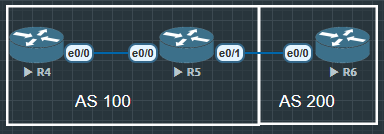

Local Preference：IBGP 内部选择出站路径的关键属性。

默认值 100，数值越大越优先。

常见应用：指定出口路由。



```
R5#show ip bgp
BGP table version is 4, local router ID is 5.5.5.5
Status codes: s suppressed, d damped, h history, * valid, > best, i - internal,
              r RIB-failure, S Stale, m multipath, b backup-path, f RT-Filter,
              x best-external, a additional-path, c RIB-compressed,
              t secondary path,
Origin codes: i - IGP, e - EGP, ? - incomplete
RPKI validation codes: V valid, I invalid, N Not found

     Network          Next Hop            Metric LocPrf Weight Path
 *>i  4.4.4.4/32       45.1.1.4                 0    100      0 i
 *>   5.5.5.5/32       0.0.0.0                  0         32768 i
 *>   6.6.6.6/32       56.1.1.6                 0             0 200 i
```

可以看到 IBGP中从R4传来的路由, Local Preference为100, 因为Local Preference只对本地有效, 所以要修改从R4传来的IBGP路由的Local Preference只能在R5进行设置.

```
R5(config)#route-map PR-LOCAL permit 10
R5(config-route-map)#set local-preference 200

R5(config)#router bgp 100
R5(config-router)#neighbor 45.1.1.4 route-map PR-LOCAL in

R5#show ip bgp
BGP table version is 7, local router ID is 5.5.5.5
Status codes: s suppressed, d damped, h history, * valid, > best, i - internal,
              r RIB-failure, S Stale, m multipath, b backup-path, f RT-Filter,
              x best-external, a additional-path, c RIB-compressed,
              t secondary path,
Origin codes: i - IGP, e - EGP, ? - incomplete
RPKI validation codes: V valid, I invalid, N Not found

     Network          Next Hop            Metric LocPrf Weight Path
 *>i  4.4.4.4/32       45.1.1.4                 0    200      0 i
 *>   5.5.5.5/32       0.0.0.0                  0         32768 i
 *>   6.6.6.6/32       56.1.1.6                 0             0 200 i
```
