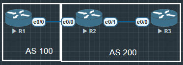

# BGP 属性（Next-Hop、Local Preference、MED、Weight）

## NEXT-Hop

Next-Hop 属性
- 作用：告诉路由器到达某个前缀的下一跳 IP 地址。
- 默认行为：
    1) 在 EBGP 中：下一跳改为邻居 IP（直接对端）。
    2) 在 IBGP 中：下一跳 不会改变（保持原始 EBGP 对端的 IP）。
- 问题：IBGP 内的其他路由器可能到不了 EBGP 的下一跳，需要解决。
- 解决方法：
    1) 静态路由/IGP 路由：在 IGP 中宣告 EBGP 的邻居网段。
    2) next-hop-self：在 IBGP 中使用该命令强制自己成为下一跳。

## Local Preference

- 仅在AS内有效
- 数值越大, 路径越优
- 常用于运营商之间的流量控制

## Weight (Cisco私有)
- 仅在本地路由器有效, 不传递给其他设备
- 数值越大越优
- 常用于测试或临时流量调整



R1 在BGP中宣告一条 1.1.1.1/32 的路由, 在R3上能看到由R2在IBGP中传来的路由1.1.1.1/32, 下一跳是 12.1.1.1

```
R3#show ip bgp
BGP table version is 1, local router ID is 3.3.3.3
Status codes: s suppressed, d damped, h history, * valid, > best, i - internal,
              r RIB-failure, S Stale, m multipath, b backup-path, f RT-Filter,
              x best-external, a additional-path, c RIB-compressed,
              t secondary path,
Origin codes: i - IGP, e - EGP, ? - incomplete
RPKI validation codes: V valid, I invalid, N Not found

     Network          Next Hop            Metric LocPrf Weight Path
 * i  1.1.1.1/32       12.1.1.1                 0    100      0 100 i
```

因为对于R3来说, 下一跳12.1.1.1未知的地址, 这时候就需要用到 `next-hop` 命令

```
R2(config)#router bgp 200
R2(config-router)#neighbor 23.1.1.3 next-hop-self
```


```
R3#show ip bgp
BGP table version is 3, local router ID is 3.3.3.3
Status codes: s suppressed, d damped, h history, * valid, > best, i - internal,
              r RIB-failure, S Stale, m multipath, b backup-path, f RT-Filter,
              x best-external, a additional-path, c RIB-compressed,
              t secondary path,
Origin codes: i - IGP, e - EGP, ? - incomplete
RPKI validation codes: V valid, I invalid, N Not found

     Network          Next Hop            Metric LocPrf Weight Path
 *>i  1.1.1.1/32       23.1.1.2                 0    100      0 100 i

R3#ping 1.1.1.1
Type escape sequence to abort.
Sending 5, 100-byte ICMP Echos to 1.1.1.1, timeout is 2 seconds:
!!!!!
Success rate is 100 percent (5/5), round-trip min/avg/max = 1/1/1 ms

```


### PS:
R1

```
R1(config)#int lo0
R1(config-if)#ip address 1.1.1.1 255.255.255.255
R1(config-if)#no shu

R1(config)#int e0/0
R1(config-if)#ip address 12.1.1.1 255.255.255.0
R1(config-if)#no shu

R1(config)#router bgp 100
R1(config-router)#bgp router-id 1.1.1.1
R1(config-router)#neighbor 12.1.1.2 remote-as 200
R1(config-router)#network 1.1.1.1 mask 255.255.255.255
```

R2

```
R2(config)#int e0/0
R2(config-if)#ip address 12.1.1.2 255.255.255.0
R2(config-if)#no shu

R2(config)#int e0/1
R2(config-if)#ip address 23.1.1.2 255.255.255.0
R2(config-if)#no shu

R2(config)#router bgp 200
R2(config-router)#bgp router-id 2.2.2.2
R2(config-router)#neighbor 12.1.1.1 remote-as 100
R2(config-router)#neighbor 23.1.1.3 remote-as 100
R2(config-router)#neighbor 23.1.1.3 as-override
// 因为R1有一条3.3.3.3的路由, 由于R1属于AS100, 
根据BGP防环, 不会把路由传给相同AS-Path的路由器, 
所以这里必须使用命令让R2往R3传递时去掉AS号
```

R3

```
R3(config)#int e0/0
R3(config-if)#ip address 23.1.1.3 255.255.255.0
R3(config-if)#no shu

R3(config)#router bgp 100
R3(config-router)#bgp router-id 3.3.3.3
R3(config-router)#neighbor 23.1.1.2 remote-as 200
// neighbor 23.1.1.2 allowas-in 1 如果R2上不做设置, 
可以在R3上放行所有路由
```