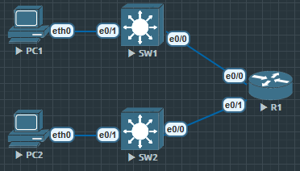

# 实验任务
拓扑
- 2台交换机（SW1, SW2）
- 1台路由器（R1）
- 2台 PC（PC1, PC2）

实验步骤
1. 在 SW1 上创建 VLAN 10 和 VLAN 20
2. 配置 PC1 在 VLAN 10，PC2 在 VLAN 20
3. 配置 SW1 与 R1 之间的端口为 trunk
4. 在 R1 上用 Router-on-a-Stick 配置两个子接口，分别作为 VLAN 10 与 VLAN 20 的网关

测试：
- PC1 能 ping 自己的网关
- PC2 能 ping 自己的网关
- PC1 与 PC2 能 ping 通彼此




## SW1
```
SW1(config)#vlan 10
SW1(config-vlan)#name NB_VLAN10

SW1(config)#vlan 20
SW1(config-vlan)#name NB_VLAN 20

SW1(config)#ip dhcp pool V10
SW1(dhcp-config)#network 192.168.1.0 255.255.255.0
SW1(dhcp-config)#default-router 192.168.1.254

SW1(config)#int e0/1
SW1(config-if)#switchport mode access
SW1(config-if)#switchport access vlan 10

//SW1(config)#int e0/0
//SW1(config-if)#switchport trunk encapsulation dot1q
//SW1(config-if)#switchport mode trunk
// 如果需要配置vlan的IP
```

可以使用命令 `show interface trunk` 查看trunk具体内容

`show running-config interface e0/0` 查看接口配置

`show interface e0/0 switchport` 查看接口状态

## SW2

```
SW2(config)#ip dhcp pool VLAN20
SW2(dhcp-config)#network 192.168.2.0 255.255.255.0
SW2(dhcp-config)#default-router 192.168.2.254

SW2(config)#vlan 10
SW2(config-vlan)#name NB_VLAN10

SW2(config-vlan)#vlan 20
SW2(config-vlan)#name NB_VLAN20

//SW2(config)#int vlan 20
//SW2(config-if)#ip address 192.168.2.254 255.255.255.0
//SW2(config-if)#no shu


SW2(config)#int e0/1
SW2(config-if)#switchport mode access
SW2(config-if)#switchport access vlan 20

SW2(config)#int e0/0
SW2(config-if)#switchport trunk encapsulation dot1q
SW2(config-if)#switchport mode trunk
```

```
PC1> ping 192.168.1.254
84 bytes from 192.168.1.254 icmp_seq=1 ttl=255 time=0.293 ms
```

```
PC2> ping 192.168.2.254
84 bytes from 192.168.2.254 icmp_seq=1 ttl=255 time=0.969 ms
```

# R1
```
R1(config)#int e0/0
R1(config-if)#no ip address
R1(config-if)#no shu

R1(config)#int e0/0.10
R1(config-subif)#encapsulation dot1Q 10
R1(config-subif)#ip address 192.168.1.254 255.255.255.0

R1(config)#int e0/1
R1(config-if)#no ip address
R1(config-if)#no shu

R1(config)#int e0/1.20
R1(config-subif)#encapsulation dot1Q 20
R1(config-subif)#ip address 192.168.2.254 255.255.255.0
// 处理对应VLAN, 最好也是用该vlan的数字当作子接口
```

在一些显示情况中, 一个物理接口往往会应对多个VLAN, 所以这时候需要用到子接口. 当然如果一个接口只需要负责一个VLAN, 就完全不需要使用子接口.
