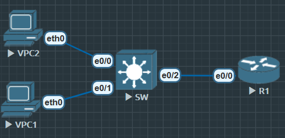

# 第二天实验完成标准：

- VLAN 间通信正常
- 能够通过静态路由或 OSPF 路由访问 R1
- 能在 `show ip route` 中看到 OSPF 学到的路由
- 能在 `show ip ospf neighbor` 中看到邻居



## SW

```
SW(config)#ip routing

SW(config)#router ospf 110
SW(config-router)#router-id 2.2.2.2

SW(config)#vlan 10
SW(config-vlan)#name NB_VLAN10

SW(config)#int vlan 10
SW(config-if)#ip address 192.168.1.254 255.255.255.0
SW(config-if)#no shu
SW(config-if)#ip ospf 110 area 0

SW(config)#vlan 20
SW(config-vlan)#name NB_VLAN20

SW(config)#int vlan 20
SW(config-if)#ip address 192.168.2.254 255.255.255.0
SW(config-if)#no shu
SW(config-if)#ip ospf 110 area 0

SW(config)#router ospf 110
SW(config-router)#passive-interface vlan 10
SW(config-router)#passive-interface vlan 20
// vlan接入OSPF后作为被动接口, 不主动寻找邻居, 减少HEllO报文对性能占比

SW(config)#ip dhcp pool V10
SW(dhcp-config)#network 192.168.1.0 255.255.255.0
SW(dhcp-config)#default-router 192.168.1.254
SW(config)#ip dhcp excluded-address 192.168.1.254 192.168.1.254
// 保留网关地址不做分配

SW(config)#ip dhcp pool V20
SW(dhcp-config)#network 192.168.2.0 255.255.255.0
SW(dhcp-config)#default-router 192.168.2.254
SW(config)#ip dhcp excluded-address 192.168.2.254 192.168.2.254

SW(config)#int e0/0
SW(config-if)#switchport mode access
SW(config-if)#switchport access vlan 20

SW(config)#int e0/1
SW(config-if)#switchport mode access
SW(config-if)#switchport access vlan 10

SW(config)#int e0/2
SW(config-if)#no switchport
SW(config-if)#ip address 10.10.10.1 255.255.255.0
SW(config-if)#ip ospf 110 area 0

```

# R1

```
R1(config)#router ospf 110
R1(config-router)#router-id 1.1.1.1

R1(config)#int e0/0
R1(config-if)#ip address 10.10.10.2 255.255.255.0
R1(config-if)#no shu
R1(config-if)#ip ospf 110 area 0

R1#show ip route ospf
......

O     192.168.1.0/24 [110/11] via 10.10.10.1, 00:01:01, Ethernet0/0
O     192.168.2.0/24 [110/11] via 10.10.10.1, 00:01:01, Ethernet0/0

R1#show ip ospf neighbor

Neighbor ID     Pri   State           Dead Time   Address         Interface
2.2.2.2           1   FULL/DR         00:00:32    10.10.10.1      Ethernet0/0

```

# PC1&PC2

```
PC1> ip dhcp
DDORA IP 192.168.1.1/24 GW 192.168.1.254

PC1> ping 192.168.2.1
84 bytes from 192.168.2.1 icmp_seq=1 ttl=63 time=2.212 ms

PC1> ping 10.10.10.2
84 bytes from 10.10.10.2 icmp_seq=1 ttl=254 time=1.098 ms
......

PC2> ip dhcp
DDORA IP 192.168.2.1/24 GW 192.168.2.254

PC2> ping 192.168.1.1
84 bytes from 192.168.1.1 icmp_seq=1 ttl=63 time=1.810 ms
......

```

### 进阶

```
SW(config)#int e0/2
SW(config-if)#description to VPC2 (VLAN20)
```

增加对接口的描述, 在 `show int vlan 20` 会看到有一个description条目显示 'to VPC2 (20)'

若希望 SW 做 DR，可保持默认；若希望 R1 不参与选举
```
R1(config)#int e0/0
R1(config-if)#ip ospf priority 0
```

明确 DR 角色（可选）

OSPF 规定：在这种网络里，会通过选举产生一个 指定路由器（DR），以及一个 备份指定路由器（BDR）。

DR（Designated Router）：负责在这个网段内收集/转发 OSPF 的 LSAs，简化邻居关系。

BDR（Backup Designated Router）：备用，一旦 DR 挂掉，BDR 立即接替。

其他路由器（DROther）：只和 DR/BDR 建立邻居，不会和所有设备两两建立邻居。


每个接口都会发送 Hello 包，里面包含 Router ID、优先级（OSPF Priority）。

优先级最高 的设备赢得 DR（默认 Priority=1，范围 0–255）。

如果优先级相同，则比 Router ID 大小（数值大的胜出）。

如果你设置 ip ospf priority 0，那么这个接口永远不会参与 DR 选举。