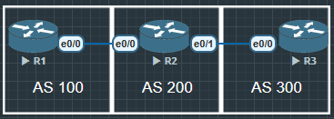

R1

```
R1#show ip bgp
...

     Network          Next Hop            Metric LocPrf Weight Path
 *>   1.1.1.1/32       0.0.0.0                  0         32768 i
 *>   2.2.2.2/32       12.1.1.2                 0             0 200 i
 *>   3.3.3.3/32       12.1.1.2                               0 200 300 i
```

R2

```
R2#show ip bgp
...

     Network          Next Hop            Metric LocPrf Weight Path
 *>   1.1.1.1/32       12.1.1.1                 0             0 100 i
 *>   2.2.2.2/32       0.0.0.0                  0         32768 i
 *>   3.3.3.3/32       23.1.1.3                 0             0 300 i
```

R3

```
R3#show ip bgp
...

     Network          Next Hop            Metric LocPrf Weight Path
 *>   1.1.1.1/32       23.1.1.2                               0 200 100 i
 *>   2.2.2.2/32       23.1.1.2                 0             0 200 i
 *>   3.3.3.3/32       0.0.0.0                  0         32768 i
```

## 在R2上通过 Route-map 修改LocPrf 和 MED

```
R2(config)#route-map SET_LOCPFR permit 10
R2(config-route-map)#set local-preference 200

R2(config)#router bgp 200
R2(config-router)#neighbor 12.1.1.1 route-map SET_LOCPFR in

R2#show ip bgp
...

     Network          Next Hop            Metric LocPrf Weight Path
 *>   1.1.1.1/32       12.1.1.1                 0    200      0 100 i
 *>   2.2.2.2/32       0.0.0.0                  0         32768 i
 *>   3.3.3.3/32       23.1.1.3                 0             0 300 i
```

## 修改MED值

```
R2(config)#route-map SET_MED permit 10
R2(config-route-map)#set metric +250
// 可以直接设置数值, 或者要求把原本的MED值增加或减少

R2(config)#router bgp 200
R2(config-router)#neighbor 23.1.1.3 route-map SET_MED out
```

R3

```
R3#show ip bgp
...

     Network          Next Hop            Metric LocPrf Weight Path
 *>   1.1.1.1/32       23.1.1.2               250             0 200 100 i
 *>   2.2.2.2/32       23.1.1.2               250             0 200 i
 *>   3.3.3.3/32       0.0.0.0                  0         32768 i
```

因为原本MED值是0, 增加250也就显示250