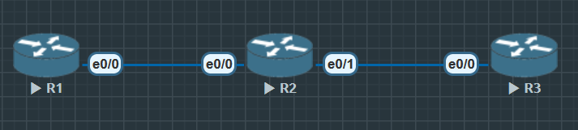

# 理论学习

- 什么是 OSPF 邻居状态机（Down → Init → 2-Way → ExStart → Exchange → Loading → Full）。
- 什么是 DR（Designated Router）/BDR（Backup Designated Router）：
- 在多访问网络（如以太网）中，为了减少邻居数量和 LSDB 同步开销，OSPF 会在一个网段选举 1 个 DR 和 1 个 BDR。
- 其他路由器只与 DR/BDR 建立完整邻居关系。
- DR 负责泛洪 LSAs。

DR/BDR 的选举规则：
- 优先级（ip ospf priority，默认 1，0 表示不参与选举）。
- Router-ID 大小（优先级相同时，Router-ID 最大者胜出）。

注意：一旦 DR/BDR 选出，不会自动被替换，除非它下线。

## 实验目标
1. 在一个路由器三台互联的网段中，观察 OSPF 邻居状态变化。
2. 验证 DR/BDR 选举过程。
3. 修改 优先级 强制某台成为 DR。



### R1

```
R1(config)#router ospf 110
R1(config-router)#router-id 1.1.1.1

R1(config)#int lo0
R1(config-if)#ip address 1.1.1.1 255.255.255.255
R1(config-if)#no shu
R1(config-if)#ip o 110 a 0

R1(config)#int e0/0
R1(config-if)#ip address 192.168.1.1 255.255.255.0
R1(config-if)#no shu
R1(config-if)#ip o 110 a 0
```

### R3

```
R2(config)#router ospf 110
R2(config-router)#router-id 2.2.2.2

R2(config)#int e0/0
R2(config-if)#ip address 192.168.1.2 255.255.255.0
R2(config-if)#no shu
R2(config-if)#ip o 110 a 0

R2(config)#int e0/1
R2(config-if)#ip address 192.168.2.2 255.255.255.0
R2(config-if)#no shu
R2(config-if)#ip o 110 a 0

R2(config)#int lo0
R2(config-if)#ip address 2.2.2.2 255.255.255.255
R2(config-if)#no shu
R2(config-if)#ip o 110 a 0
```

### R3

```
R3(config)#router ospf 110
R3(config-router)#router-id 3.3.3.3

R3(config)#int e0/0
R3(config-if)#ip address 192.168.2.3 255.255.255.0
R3(config-if)#no shu
R3(config-if)#ip o 110 a 0

R3(config)#int lo0
R3(config-if)#ip address 3.3.3.3 255.255.255.255
R3(config-if)#no shu
R3(config-if)#ip o 110 a 0
```

```
R2#show ip route ospf
...

      1.0.0.0/32 is subnetted, 1 subnets
O        1.1.1.1 [110/11] via 192.168.1.1, 00:03:53, Ethernet0/0
      3.0.0.0/32 is subnetted, 1 subnets
O        3.3.3.3 [110/11] via 192.168.2.3, 00:00:48, Ethernet0/1

R2#show ip ospf neighbor

Neighbor ID     Pri   State           Dead Time   Address         Interface
3.3.3.3           1   FULL/BDR        00:00:34    192.168.2.3     Ethernet0/1
1.1.1.1           1   FULL/DR         00:00:35    192.168.1.1     Ethernet0/0
```

### R2 成为DR

```
R1(config)#int e0/0
R1(config-if)#ip ospf priority 1
```

```
R3(config)#int e0/0
R3(config-if)#ip ospf priority 1
```

```
R2(config)#int e0/0
R2(config-if)#ip ospf priority 200

R2(config)#int e0/1
R2(config-if)#ip ospf priority 200


R2#clear ip ospf process
Reset ALL OSPF processes? [no]: yes

R2#show ip ospf neighbor

Neighbor ID     Pri   State           Dead Time   Address         Interface
3.3.3.3           1   FULL/BDR        00:00:37    192.168.2.3     Ethernet0/1
1.1.1.1           1   FULL/BDR        00:00:37    192.168.1.1     Ethernet0/0
```

OSPF DR选举至少需要2台设备, 如果有其中一个优先级被修改成0, 在neighbor中只会显示为Other状态.

如果优先级相同比较 Router-ID 越大越优

1. DR = 中心代理，统一转发 LSA。
2. BDR = 备用，如果 DR 掉线，BDR 立刻顶上。
3. DROTHER 路由器不直接交换 LSA，减少泛洪。
4. 最终效果：OSPF 在广播网络里通过 中心化转发，避免了全网泛洪风暴。
