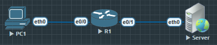

## Zone-Based Firewall(ZBF) 初探



- 相比 CBAC，ZBF 是更现代的 IOS 防火墙实现方式。
- 基于 Zone（安全区域） 来定义流量策略，而不是接口。
- 必须先创建 Zone，再把接口分配进去。

```
1. 定义安全区域

R1(config)#zone security INSIDE
// 设置一个内网区域

R1(config)#zone security OUTSIDE
// 设置一个外网区域

2. 设置对应接口

R1(config)#int e0/1
R1(config-if)#zone-member security OUTSIDE
R1(config)#int e0/0
R1(config-if)#zone-member security INSIDE
将对应接口分配至之前设置好的区域

3. 匹配条件(class-map)

R1(config)#class-map type inspect match-any ALLOW_HTTP
// 配置CPL类映射 类型 配置防火墙类别映射 匹配所有 ALLOW_HTP, 定义匹配条件
R1(config-cmap)#match protocol http
//匹配http协议

4. 定义处理动作(Policy-map)

R1(config)#policy-map type inspect POLICY1
// 策略 类型 配置防火墙类别映射 POLICY1

R1(config-pmap)#class type inspect ALLOW_HTTP
// 政策标准 映射类型 配置防火墙类别映射
policy criteria, type of the class-map, configure Firewall Class Map

R1(config-pmap)#class class-default
R1(config-pmap-c)#drop
// 其他的都丢掉

5. 应用到zone-pair

R1(config)#zone-pair security ZP_IO source INSIDE destination OUTSIDE
// 防火墙分区 安全 源 x 目的 x

R1(config-sec-zone-pair)#service-policy type inspect POLICY1
```

## 验证

```
R1# show policy-map type inspect zone-pair sessions

policy exists on zp ZP_IO
  Zone-pair: ZP_IO

  Service-policy inspect : POLICY1

    Class-map: ALLOW_HTTP (match-any)
      Match: protocol http
        0 packets, 0 bytes
        30 second rate 0 bps

    Class-map: class-default (match-any)
      Match: any
      Drop
        0 packets, 0 bytes
```

这个时候PC1 除了 http流量会被R1允许外, 其他流量都会被R1丢弃掉

PC1

```
PC1> ping 12.1.1.100

12.1.1.100 icmp_seq=1 timeout
12.1.1.100 icmp_seq=2 timeout
12.1.1.100 icmp_seq=3 timeout
12.1.1.100 icmp_seq=4 timeout
12.1.1.100 icmp_seq=5 timeout
```

R1

```

R1#show policy-map type inspect zone-pair sessions

policy exists on zp ZP_IO
  Zone-pair: ZP_IO

  Service-policy inspect : POLICY1

    Class-map: ALLOW_HTTP (match-any)
      Match: protocol http
        0 packets, 0 bytes
        30 second rate 0 bps

    Class-map: class-default (match-any)
      Match: any
      Drop
        5 packets, 320 bytes
```

可以看到有5个包被丢弃了

### 总结

- CPL 类映射就是 ZBF 的流量分类工具。
- 它相当于给防火墙一个“过滤器”，告诉它 哪些流量是我要特别处理的。
- 后续 policy-map 才会基于这个“类映射”去决定动作（允许、检查、拒绝）。


#### ZBF 工作原理流程

           [1] 定义安全区域 (Zone)
          +-----------------------+
          |  INSIDE   |  OUTSIDE |
          +-----------------------+

           [2] 接口加入 Zone
          e0/0 → INSIDE
          e0/1 → OUTSIDE


           [3] CPL 类映射 (class-map)
          +------------------------------+
          | class-map type inspect ...   |
          |  ↳ match protocol http       |
          |  ↳ match protocol https      |
          +------------------------------+
             ⬇️
        (相当于“流量分类器”)


           [4] 策略 (policy-map)
          +----------------------------------+
          | policy-map type inspect POLICY1  |
          |   class WEB_TRAFFIC              |
          |      ↳ inspect (允许并跟踪)      |
          |   class class-default            |
          |      ↳ drop (默认丢弃)           |
          +----------------------------------+
             ⬇️
        (相当于“对分类后的流量采取动作”)


           [5] Zone-Pair 应用策略
          +------------------------------------------------+
          | zone-pair security ZP-IO                       |
          |   source INSIDE  → destination OUTSIDE         |
          |   service-policy type inspect POLICY1          |
          +------------------------------------------------+

1. Zone：先把网络接口分到不同的安全域。
2. class-map (CPL 类映射)：定义匹配条件，分类流量。
3. policy-map：对不同的分类流量定义动作（inspect / drop / pass）。
4. zone-pair：把策略应用到“源区 → 目的区”的通信。

- 这样，防火墙就能精确控制哪些流量可以从 INSIDE 出去，哪些必须丢掉。