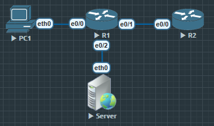

1. 理解Zone-pair的核心逻辑
2. 配置 Class-map & Policy-map 来控制TCP, ICMP等协议




R1

```
R1(config)#zone security INSIDE
R1(config)#zone security OUTSIDE

R1(config)#int e0/0
R1(config-if)#zone-member security INSIDE

R1(config-if)#int e0/2
R1(config-if)#zone-member security OUTSIDE


R1(config)#class-map type inspect CM_TCP
R1(config-cmap)#match protocol tcp

R1(config)#class-map type inspect CM_ICMP
R1(config-cmap)#mat
R1(config-cmap)#match pro
R1(config-cmap)#match protocol icm
R1(config-cmap)#match protocol icmp

R1(config)#policy-map type inspect PM_IN_TO_OUT
R1(config-pmap)#class type inspect CM_TCP
R1(config-pmap-c)#inspect

R1(config-pmap)#class type inspect CM_ICMP
R1(config-pmap-c)#drop

R1(config-pmap)#class class-default
R1(config-pmap-c)#drop

R1(config)#zone-pair security ZP_IN_OUT source INSIDE destination OUTSIDE
R1(config-sec-zone-pair)#service-policy type inspect PM_IN_TO_OUT
```

验证
```
R1#show policy-map type inspect zone-pair sessions

policy exists on zp ZP_IN_OUT
  Zone-pair: ZP_IN_OUT

  Service-policy inspect : PM_IN_TO_OUT

    Class-map: CM_TCP (match-all)
      Match: protocol tcp

   Inspect

    Class-map: CM_ICMP (match-all)
      Match: protocol icmp
      Drop
        5 packets, 320 bytes

    Class-map: class-default (match-any)
      Match: any
      Drop
        5 packets, 320 bytes
```