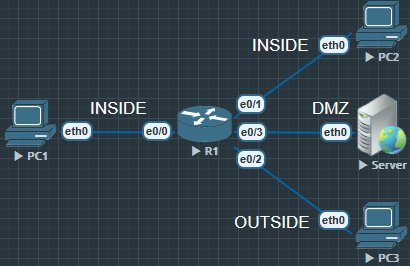

```
Router#show ip int br
Interface                  IP-Address      OK? Method Status                Protocol
Ethernet0/0                11.1.1.1        YES manual up                    up  
Ethernet0/1                10.1.1.1        YES manual up                    up  
Ethernet0/2                200.1.1.1       YES manual up                    up  
Ethernet0/3                172.16.1.1      YES manual up                    up  
```


```
R1(config)#int e0/0
R1(config-if)#zone-member security INSIDE

R1(config)#int e0/1
R1(config-if)#zone-member security INSIDE

R1(config)#int e0/2
R1(config-if)#zone-member security OUTSIDE

R1(config)#int e0/3
R1(config-if)#zone-member security DMZ

R1(config)#class-map type inspect match-any ALLOW_TCP
R1(config-cmap)#match protocol tcp
R1(config-cmap)#match protocol udp

R1(config)#class-map type inspect DENY_ICMP
R1(config-cmap)#match protocol icmp

R1(config)#policy-map type inspect IN_TO_OUT
R1(config-pmap)#class type inspect ALLOW_TCP
R1(config-pmap-c)#inspect

R1(config-pmap)#class type inspect DENY_ICMP
R1(config-pmap-c)#drop

R1(config-pmap)#class class-default
R1(config-pmap-c)#drop

R1(config)#zone-pair security IN_OUT source INSIDE destination OUTSIDE
R1(config-sec-zone-pair)#service-policy type inspect IN_TO_OUT
```
