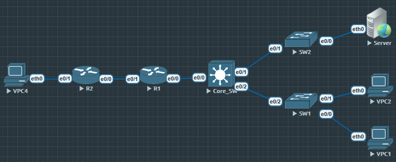
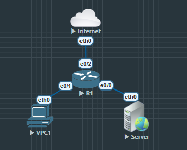

## Core_SW

```
Core_SW(config)#int range e0/1-2
Core_SW(config-if-range)#switchport trunk encapsulation dot1q
Core_SW(config-if-range)#switchport mode trunk

Core_SW(config)#vtp domain STR1

Core_SW(config)#int vlan 10
Core_SW(config-if)#ip add 192.168.1.254 255.255.255.0
Core_SW(config-if)#no shu

Core_SW(config)#int vlan 20
Core_SW(config-if)#ip add 192.168.100.254 255.255.255.0
Core_SW(config-if)#no shu

Core_SW(config)#ip dhcp pool USER
Core_SW(dhcp-config)#network 192.168.1.0 /24
Core_SW(dhcp-config)#default-router 192.168.1.254

Core_SW(config)#ip dhcp pool SERVER
Core_SW(dhcp-config)#network 192.168.100.0 /24
Core_SW(dhcp-config)#default-router 192.168.100.254

Core_SW(config)#ip dhcp excluded-address 192.168.1.254
Core_SW(config)#ip dhcp excluded-address 192.168.100.254

Core_SW(config)#ip routing
Core_SW(config)#int e0/0
Core_SW(config-if)#no switchport
Core_SW(config-if)#ip add 10.1.1.2 255.255.255.0
Core_SW(config-if)#no shu

Core_SW(config)#ip route 0.0.0.0 0.0.0.0 10.1.1.1
```

## SW1

```
SW1(config)#int e0/2
SW1(config-if)#switchport trunk encapsulation dot1q
SW1(config-if)#switchport mode trunk

SW1(config)#vtp mode client

SW1(config)#int range e0/0-1
SW1(config-if-range)#switchport mode access
SW1(config-if-range)#switchport access vlan 10

```

## SW2

```
SW2(config)#int e0/1
SW2(config-if)#switchport trunk encapsulation dot1q
SW2(config-if)#switchport mode trunk

SW2(config)#vtp mode client

SW2(config)#int e0/0
SW2(config-if)#switchport mode access
SW2(config-if)#switchport access vlan 20

```

## R1

```
R1(config)#int e0/0
R1(config-if)#ip add 10.1.1.1 255.255.255.0
R1(config-if)#no shu
R1(config-if)#ip nat inside

R1(config)#int e0/1
R1(config-if)#ip add 12.1.1.1 255.255.255.0
R1(config-if)#no shu
R1(config-if)#ip nat
R1(config-if)#ip nat outside

R1(config)#ip nat pool STR 12.1.1.1 12.1.1.10 netmask 255.255.255.0
R1(config)#access-list 1 permit 192.168.0.0 0.0.255.255
R1(config)#ip nat inside source list 1 pool STR

R1(config)#ip route 0.0.0.0 0.0.0.0 12.1.1.20
R1(config)#ip route 192.168.0.0 255.255.0.0 10.1.1.2
```

## R2

```
R2(config)#int e0/0
R2(config-if)#ip add 12.1.1.20 255.255.255.0
R2(config-if)#no shu

R2(config)#int e0/1
R2(config-if)#ip add 20.1.1.254 255.255.255.0
R2(config-if)#no shu

R2(config)#ip dhcp pool EXTERNAL
R2(dhcp-config)#network 20.1.1.0 /24
R2(dhcp-config)#default-router 20.1.1.254

R2(config)#ip dhcp excluded-address 20.1.1.254

R2(config)#ip route 0.0.0.0 0.0.0.0 12.1.1.1

```

## R1

```
R1(config)#zone security INSIDE
R1(config)#zone security OUTSIDE

R1(config)#int e0/0
R1(config-if)#zone-member security INSIDE

R1(config)#int e0/1
R1(config-if)#zone-member security OUTSIDE

R1(config)#class-map type inspect match-any IN_TO_OUT
R1(config-cmap)#match protocol tcp
R1(config-cmap)#match protocol udp

R1(config)#class-map type inspect OUT_TO_IN
R1(config-cmap)#match protocol icmp

R1(config)#policy-map type inspect PM_IN_TO_OUT
R1(config-pmap)#class type inspect IN_TO_OUT
R1(config-pmap-c)#inspect

R1(config-pmap)#class class-default
R1(config-pmap-c)#drop

R1(config)#policy-map type inspect PM_OUT_TO_IN
R1(config-pmap)#class type inspect OUT_TO_IN
R1(config-pmap-c)#inspect

R1(config-pmap)#class class-default
R1(config-pmap-c)#drop

R1(config)#zone-pair security ZP_IN_TO_OUT source INSIDE destination OUTSIDE
R1(config-sec-zone-pair)#service-policy type inspect PM_IN_TO_OUT

R1(config)#zone-pair security ZP_OUT_TO_IN source OUTSIDE destination INSIDE
R1(config-sec-zone-pair)#service-policy type inspect PM_OUT_TO_IN
```

### 验证

```
Core_SW(config)#do show vtp status
VTP Version capable             : 1 to 3
VTP version running             : 1
VTP Domain Name                 : STR1
VTP Pruning Mode                : Disabled
VTP Traps Generation            : Disabled
Device ID                       : aabb.cc80.9000
Configuration last modified by 0.0.0.0 at 0-0-00 00:00:00
Local updater ID is 0.0.0.0 (no valid interface found)

Feature VLAN:
--------------
VTP Operating Mode                : Server
Maximum VLANs supported locally   : 1005
Number of existing VLANs          : 5
Configuration Revision            : 0
MD5 digest                        : 0x10 0xE6 0xE5 0x4F 0x3E 0xC4 0x16 0xAC
                                    0xA3 0x3C 0x48 0x5B 0xF6 0xB1 0x76 0x6C
```

`R1#$zone-pair|zone security|pority-map type inspect|class-map type inspect`

# 外带 DMZ 区域

- DMZ 是对外提供服务的“缓冲区”，不直接暴露内网。
- Zone-pair 必须双向配置（反方向默认拒绝，除非 inspect 状态表允许）。
- 通过多个 policy-map 可以实现复杂的三角流量控制。



```
R1(config)#zone security INSIDE
R1(config)#zone security OUTSIDE
R1(config)#zone security DMZ

R1(config)#int e0/0
R1(config-if)#ip add 172.16.1.254 255.255.255.0
R1(config-if)#no shu
R1(config-if)#zone-member security DMZ

R1(config)#int e0/1
R1(config-if)#ip add 10.1.1.254 255.255.255.0
R1(config-if)#no shu
R1(config-if)#zone-member security INSIDE

R1(config)#int e0/2
R1(config-if)#ip add 200.1.1.1 255.255.255.0
R1(config-if)#no shu
R1(config-if)#zone-member security OUTSIDE

R1(config)#class-map type inspect IN_TO_OUT
R1(config-cmap)#match protocol icmp *
R1(config-cmap)#match protocol tcp

R1(config)#class-map type inspect IN_TO_DMZ
R1(config-cmap)#match protocol tcp *
R1(config-cmap)#match protocol icmp

R1(config)#class-map type inspect OUT_TO_DMZ
R1(config-cmap)#match protocol tcp

R1(config)#policy-map type inspect PM_IN_OUT
R1(config-pmap)#class type inspect IN_TO_OUT
R1(config-pmap-c)#inspect

R1(config)#policy-map type inspect PM_IN_DMZ
R1(config-pmap)#class type inspect IN_TO_DMZ
R1(config-pmap-c)#inspect

R1(config)#policy-map type inspect PM_OUT_DMZ
R1(config-pmap)#class type inspect OUT_TO_DMZ
R1(config-pmap-c)#inspect

R1(config)#zone-pair security ZP_IN_OUT source INSIDE destination OUTSIDE
R1(config-sec-zone-pair)#service-policy type inspect PM_IN_OUT

R1(config)#zone-pair security ZP_IN_DMZ source INSIDE destination DMZ
R1(config-sec-zone-pair)#service-policy type inspect PM_IN_DMZ

R1(config)#zone-pair security ZP_OUT_DMZ source OUTSIDE destination DMZ
R1(config-sec-zone-pair)#service-policy type inspect PM_OUT_DMZ
```

因为没有设置任何 PC1 与 Internet 的zone-pair, 所以这两方任意一方要去往对方的流量, 无论是什么协议都会被 BZF 丢弃