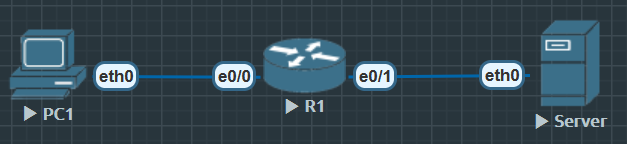
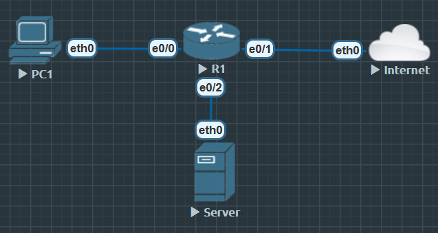

# ZBF 与 NAT 联动

- 内网用户几乎总是通过 NAT 出口访问 Internet，同时还要经过防火墙策略检查
- 如果 NAT 与 ZBF 配置不协调，会出现“地址转换成功但流量被丢弃”
- 或“防火墙放行但 NAT 不生效”的问题

______________________________________________________________
掌握 NAT 与 ZBF 的关系：流量是先 NAT 还是先防火墙检查？

实验 Inside NAT 出网 + ZBF 检查：内网用户通过 NAT 转换后访问公网。

理解 常见问题：为什么 NAT 后回包能通过？如何排错？
_______________________________________________________________

## 思路

1. NAT 顺序
    1) 流量从 Inside → Outside:
        - 先进行 **ZBF** 检查, 再做 **NAT** 转换
    2) 流量从Outside → Inside:
        - 先进行 **NAT** 还原, 再做 **ZBF** 检查

    **ZBF 看到的始终是内部地址，而不是转换后的公网地址。**

2. 配置思路
    1) 内网(Inside Zone) → 外网(Ouside Zone)
        - 允许 TCP/ICMP 出口 (我的EVE_NG限制没有HTTP)
        - NAT 允许转为公网地址
    2) OZ → IZ
        - 默认丢弃(除非有返回流量)

3. 常见问题
    1) 如果只做 NAT 而没做 Zone-pair inspect：NAT 成功但被防火墙丢弃。
    2) 如果只做 Zone-pair 而没做 NAT：流量通过检查但无法访问公网。
    3) 所以必须两者配合。


### 配置





```
R1(config)#int e0/0
R1(config-if)#ip add 10.1.1.254 255.255.255.0
R1(config-if)#no shu

R1(config)#int e0/1
R1(config-if)#ip add 200.1.1.1 255.255.255.0
R1(config-if)#no shu

R1(config)#zone security INSIDE
R1(config)#zone security OUTSIDE

R1(config)#int e0/0
R1(config-if)#zone-member security INSIDE

R1(config)#int e0/1
R1(config-if)#zone-member security OUTSIDE

R1(config)#ip access-list standard NAT_INSIDE
R1(config-std-nacl)#permit 10.1.1.0 0.0.0.255

R1(config)#ip nat source list NAT_INSIDE interface e0/1 overload

R1(config)# int e0/0
R1(config-if)#ip nat inside

R1(config)#int e0/1
R1(config-if)#ip nat outside

R1(config)#class-map type inspect match-any CM_IN_TO_OUT
R1(config-cmap)#match protocol icmp
R1(config-cmap)#match protocol tcp

R1(config)#policy-map type inspect PM_IN_TO_OUT
R1(config-pmap)#class type inspect CM_IN_TO_OUT
R1(config-pmap-c)#inspect
R1(config-pmap)#class class-default
R1(config-pmap-c)#drop

R1(config)#zone-pair security ZP_IN_TO_OUT source INSIDE destination OUTSIDE
R1(config-sec-zone-pair)#service-policy type inspect PM_IN_TO_OUT
```

#### 进阶

R1 e0/0（INSIDE）：10.1.1.254/24

R1 e0/1（OUTSIDE）：200.1.1.1/24（公网口）

R1 e0/2（DMZ）：172.16.10.1/24

PC1：10.1.1.10/24，GW 10.1.1.254

DMZ Server：172.16.10.10/24，GW 172.16.10.1

公网映射给 DMZ Server：200.1.1.100（静态一对一）





```
# 设置 zone 

R1(config)#zone security INSIDE
R1(config)#zone security OUTSIDE
R1(config)#zone security DMZ

# 基本设置以及 zone-member

R1(config)#int e0/0
R1(config-if)#ip address 10.1.1.254 255.255.255.0
R1(config-if)#no shu
R1(config-if)#zone-member security INSIDE
R1(config-if)#ip nat insde

R1(config)#int e0/1
R1(config-if)#ip address 200.1.1.1 255.255.255.0
R1(config-if)#no shu
R1(config-if)#zone-member security OUTSIDE
R1(config-if)#ip nat outside

R1(config)#int e0/2
R1(config-if)#ip add 172.16.10.1 255.255.255.0
R1(config-if)#no shu
R1(config-if)#zone-member security DMZ
R1(config-if)#ip nat insde

# 设置NAT

R1(config)#ip access-list standard IP_PAT
R1(config-std-nacl)#permit 10.1.1.0 0.0.0.255

R1(config)#ip nat source list IP_PAT interface e0/1 overload

R1(config)#ip nat inside source static 172.16.10.10 200.1.1.100

# 设置 class-map

R1(config)#class-map type inspect match-any CM_IN_TO_OUT
R1(config-cmap)#match protocol icmp
R1(config-cmap)#match protocol tcp

R1(config)#class-map type inspect CM_DMZ_TO_OUT
R1(config-cmap)#match protocol tcp

R1(config)#class-map type inspect match-any CM_OUT_TO_IN
R1(config-cmap)#match protocol icmp
R1(config-cmap)#match protocol tcp

R1(config)#class-map type inspect match-any CM_OUT_TO_DMZ
R1(config-cmap)#match protocol icmp
R1(config-cmap)#match protocol tcp

# 设置 Policy-map

R1(config)#policy-map type inspect PM_IN_TO_OUT
R1(config-pmap)#class type inspect CM_IN_TO_OUT
R1(config-pmap-c)#inspect

R1(config-pmap)#class class-default
R1(config-pmap-c)#drop

R1(config)#policy-map type inspect PM_DMZ_TO_OUT
R1(config-pmap)#class type inspect CM_DMZ_TO_OUT
R1(config-pmap-c)#inspect

R1(config-pmap)#class class-default
R1(config-pmap-c)#drop

R1(config)#policy-map type inspect PM_OUT_TO_IN
R1(config-pmap)#class type inspect CM_OUT_TO_IN
R1(config-pmap-c)#inspect

R1(config-pmap)#class class-default
R1(config-pmap-c)#drop

R1(config)#policy-map type inspect PM_OUT_TO_DMZ
R1(config-pmap)#class type inspect CM_OUT_TO_DMZ
R1(config-pmap-c)#inspect

R1(config-pmap)#class class-default
R1(config-pmap-c)#drop

# 设置 zone-pair

R1(config)#zone-pair security ZP_IN_TO_OUT source INSIDE destination OUTSIDE
R1(config-sec-zone-pair)#service-policy type inspect PM_IN_TO_OUT

R1(config)#zone-pair security ZP_DMZ_TO_OUT source DMZ destination OUTSIDE
R1(config-sec-zone-pair)#service-policy type inspect PM_DMZ_TO_OUT

R1(config)#zone-pair security ZP_OUT_TO_IN source OUTSIDE destination INSIDE
R1(config-sec-zone-pair)#service-policy type inspect PM_OUT_TO_IN

R1(config)#zone-pair security ZP_OUT_TO_DMZ source OUTSIDE destination DMZ
R1(config-sec-zone-pair)#service-policy type inspect PM_OUT_TO_DMZ
```


##### 验证


`show ip nat translations`

```
R1#show ip nat translations
Pro Inside global      Inside local       Outside local      Outside global
--- 200.1.1.100        172.16.10.10       ---                ---
```


`show ip nat statistics`

```
R1#show ip nat statistics
Total active translations: 1 (1 static, 0 dynamic; 0 extended)
Peak translations: 1, occurred 00:09:55 ago
Outside interfaces:
  Ethernet0/1
Inside interfaces:
  Ethernet0/0, Ethernet0/2
Hits: 0  Misses: 0
CEF Translated packets: 0, CEF Punted packets: 0
Expired translations: 0
Dynamic mappings:
-- Outside Destination
[Id: 1] access-list IP_PAT interface Ethernet0/1 refcount 0

Total doors: 0
Appl doors: 0
Normal doors: 0
Queued Packets: 0
```


```
show zone security
show zone-pair security
show policy-map type inspect zone-pair sessions
show policy-map type inspect zone-pair statistics
```

###### 后记

这个 ZBF  的 outside to DMZ 放行范围很大. 放行所有 TCP 端口到 DMZ, 非常危险

建议改为 仅 80/443（必要时加 ICMP echo） 的匹配. 方法 1（用 L7 http/https）

1. 

```
no class-map type inspect match-any CM_OUT_TO_DMZ
class-map type inspect match-any CM_OUT_TO_DMZ
 match protocol http
 match protocol https

 // 如需允许外部 ping DMZ，另外加：
 // match protocol icmp
```

2. 

```
ip access-list extended OUT_TO_DMZ_WEB
 permit tcp any host 172.16.10.10 eq 80
 permit tcp any host 172.16.10.10 eq 443

// 可选 ICMP：
// permit icmp any host 172.16.10.10 echo

class-map type inspect match-any CM_OUT_TO_DMZ
 match access-group name OUT_TO_DMZ_WEB
```


INSIDE→OUTSIDE 的匹配建议细化

CM_IN_TO_OUT 匹配 icmp + tcp 也过于宽 建议按需要精细些

```
no class-map type inspect match-any CM_IN_TO_OUT
class-map type inspect match-any CM_IN_TO_OUT
 match protocol http
 match protocol https
 match protocol dns
 match protocol icmp
```


DMZ→OUTSIDE 只在需要时开放

已配置 PM_DMZ_TO_OUT 为 inspect tcp 如果 DMZ 服务器只提供对外服务 不需要主动上网

```
// 要么删掉整条 zone-pair：
no zone-pair security ZP_DMZ_TO_OUT

// 要么把匹配收紧到 http/https/dns
no class-map type inspect CM_DMZ_TO_OUT

class-map type inspect match-any CM_DMZ_TO_OUT
 match protocol http
 match protocol https
 match protocol dns
```
