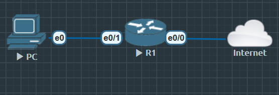

# HTTP、DNS、ICMP 允许，其余丢弃，结合 NAT


## 配置




```
R1(config)#zone security INSIDE
R1(config)#zone security OUTSIDE

R1(config)#int e0/0
R1(config-if)#zone-member security OUTSIDE

R1(config)#int e0/1
R1(config-if)#zone-member security INSIDE


R1(config)#class-map type inspect match-any CM_HTTP
R1(config-cmap)#match protocol http
R1(config-cmap)#match protocol https

R1(config)#class-map type inspect match-any CM_SYS
R1(config-cmap)#match protocol dns
R1(config-cmap)#match protocol icmp

R1(config)#policy-map type inspect PM_IN_TO_OUT
R1(config-pmap)#class type inspect CM_HTTP
R1(config-pmap-c)#inspect

R1(config-pmap)#class type inspect CM_SYS
R1(config-pmap-c)#inspect

R1(config-pmap)#class class-default
R1(config-pmap-c)#drop log

R1(config)#zone-pair security ZP_IN_TO_OUT source INSIDE destination OUTSIDE
R1(config-sec-zone-pair)#service-policy type inspect PM_IN_TO_OUT
```


### 常见排错命令


| 命令                                                | 功能说明              |             |
| ------------------------------------------------- | ----------------- | ----------- |
| `show zone security`                              | 查看已定义的 zone       |             |
| `show zone-member security`                       | 查看接口属于哪个 zone     |             |
| `show zone-pair security`                         | 查看 zone-pair 是否存在 |             |
| `show policy-map type inspect zone-pair sessions` | 查看会话状态            |             |
| `show policy-map type inspect`                    | 查看策略统计            |             |
| `show class-map type inspect`                     | 查看匹配协议情况          |             |
| `show ip access-lists`                            | 检查 NAT 或 ACL      |             |
| `show run                                         | sec zone`         | 查看完整 ZBF 配置 |


#### 典型问题

1. 无法上网（ping 8.8.8.8 失败）
- 检查 NAT：show ip nat translations
- 检查 ZBF：是否有匹配 HTTP/ICMP？
- 如果没有匹配 → class-default → drop log
    - %FW-6-DROP_PKT 提示可能是缺少对应协议检查。

2. 方向错误
    1. 如果配置了 zone-pair OUTSIDE→INSIDE 才能允许返回流量？
        - 不需要，inspect 自动允许反向流量。
    2. 但如果是 pass 动作 → 无状态，不会自动返回。

3. 无法建立 session
1. 检查是否匹配到 class-map：
    - `show policy-map type inspect zone-pair sessions`
    若为 0 → 说明匹配条件错误（协议或流量方向不对）。


##### 查看日志


`show logging | inc FW-`


