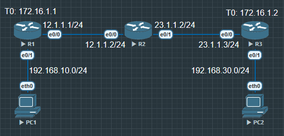
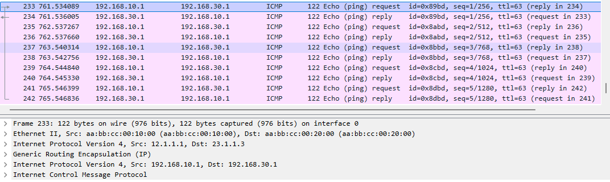
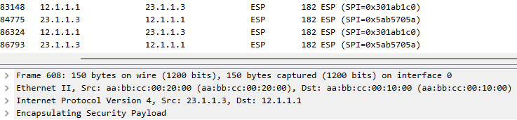

# GRE over IPsec 关系

| 层级    | 协议    | 功能                     | 谁封装在谁之内    |
| ----- | ----- | ---------------------- | ---------- |
| 第 1 层 | IPsec | 加密公网传输                 | 最外层（封装一切）  |
| 第 2 层 | GRE   | 封装私网路由流量（如 EIGRP、OSPF） | 被 IPsec 加密 |
| 第 3 层 | 原始报文  | LAN-to-LAN 数据          | 在 GRE 内部   |


**R1**

原始报文 → GRE 封装 → IPsec 加密 → 发往公网 (R3)

**R3**
解密 IPsec → 解封 GRE → 还原原始报文





`access-list 100 permit gre host 12.1.1.1 host 23.1.1.3` 所有从12.1.1.1 到 23.1.1.3 的 **GRE** 都要加密

IPsec 不关心 GRE 中装的是什么 (OSPF, EIGRP, ICMP ...)
GRE 也不关心是否被加密, **GRE/IPsec 流量的匹配优先级确实高于 NAT/PAT**


## 配置


**R1**

```
R1(config)#int e0/0
R1(config-if)#ip nat outside

R1(config)#int e0/1
R1(config-if)#ip nat inside

R1(config)#ip access-list standard IP_NAT
R1(config-std-nacl)#permit 192.168.10.0 0.0.0.255

R1(config)#ip nat inside source list IP_NAT interface e0/0 overload


R1(config)#int tunnel 0
R1(config-if)#ip address 172.16.1.1 255.255.255.0
R1(config-if)#tunnel source 12.1.1.1
R1(config-if)#tunnel destination 23.1.1.3

R1(config)#ip route 192.168.30.0 255.255.255.0 172.16.1.2
```

配置 [GRE](../../VPN/GRE.md)

```
R3(config)#int tunnel 0
R3(config-if)#ip address 172.16.1.2 255.255.255.0
R3(config-if)#tunnel source 23.1.1.3
R3(config-if)#tunnel destination 12.1.1.1

R3(config)#ip route 192.168.10.0 255.255.255.0 172.16.1.1
```

启用 GRE 后所有报文都是明文




配置 IPsec

**R1**

```
R1(config)#crypto isakmp policy 10
R1(config-isakmp)#encryption aes
R1(config-isakmp)#hash has
R1(config-isakmp)#hash sha
R1(config-isakmp)#authentication pre
R1(config-isakmp)#group 2
R1(config-isakmp)#lifetime 86400

R1(config)#crypto isakmp key ABC address 23.1.1.3

R1(config)#crypto ipsec transform-set TS esp-aes esp-sha-hmac
R1(cfg-crypto-trans)#mode tunnel

R1(config)#access-list 100 permit gre host 12.1.1.1 host 23.1.1.3

R1(config)#crypto map VPN 10 ipsec-isakmp
R1(config-crypto-map)#set peer 23.1.1.3
R1(config-crypto-map)#set transform-set TS
R1(config-crypto-map)#match address 100

R1(config)#int e0/0
R1(config-if)#crypto map VPN
```


**R3**

```
R3(config)#crypto isakmp policy 10
R3(config-isakmp)#encryption aes
R3(config-isakmp)#hash sha
R3(config-isakmp)#authentication pre-share
R3(config-isakmp)#group 2
R3(config-isakmp)#lifetime 86400

R3(config)#crypto isakmp key ABC address 12.1.1.1

R3(config)#crypto ipsec transform-set TS esp-aes esp-sha-hmac
R3(cfg-crypto-trans)#mode tunnel

R3(config)#access-list 100 permit gre host 23.1.1.3 host 12.1.1.1


R3(config)#crypto map VPN 10 ipsec-isakmp
R3(config-crypto-map)#set peer 12.1.1.1
R3(config-crypto-map)#set transform-set TS
R3(config-crypto-map)#match address 100

R3(config)#int e0/0
R3(config-if)#crypto map VPN
```

配置 IPsec 后, 所有报文都被加密. 只能看到公网的源和目的




### 验证


| 检查方式 | 命令                           | 成功标志            |
| ---- | ---------------------------- | --------------- |
| 路由表  | `show ip route`              | 出口为 `Tunnel0`   |
| 隧道状态 | `show int tunnel0`           | up/up 且计数递增     |
| 加密统计 | `show crypto ipsec sa`       | `#pkts` 持续增加    |
| 加密封装 | Wireshark                    | 看到 `ESP` 协议     |
| 会话状态 | `show crypto session detail` | 状态为 `UP-ACTIVE` |
